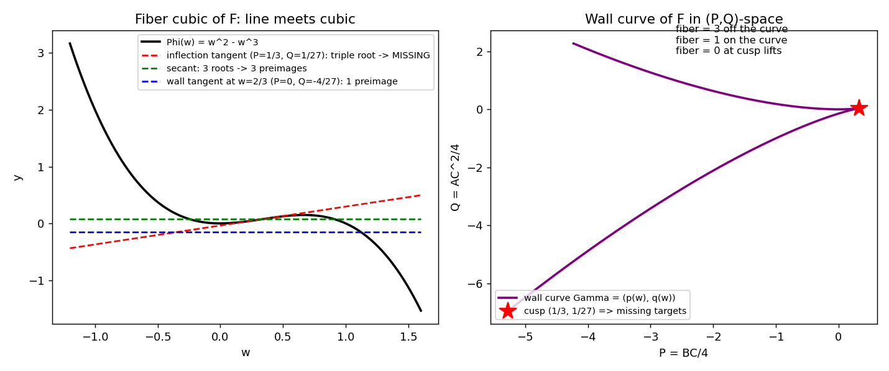
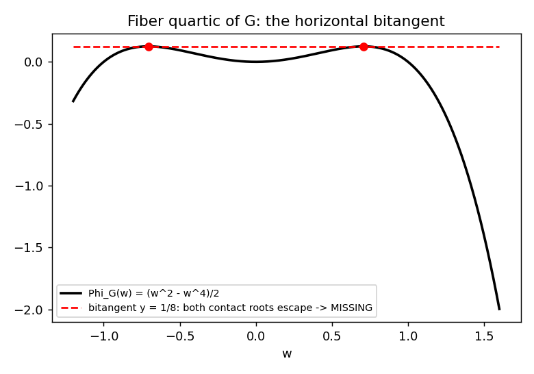

# Anatomy of a counterexample: walls, escapes, and the targets that never get hit
*Second lab note, 2026-07-20. Builds on `jacobian_lab_notes.md`. All decisive identities below are exact (SymPy, rational/algebraic arithmetic). Scripts: `jacobian_anatomy.py`, `jacobian_anatomy2.py`, `jacobian_anatomy3.py`.*

The explainer page that reverse-engineered F listed as *not established*: "the complete nonproper-value set, including every boundary piece at C = 0." This note closes that problem for F (and answers it for G and my homemade H), and upgrades yesterday's numerical fiber census to a **proof**.

## 1 · Two lemmas that turn the census into a theorem

**Lemma 1 (fiber identity, machine-checked).** Put u = 1+xy and γ = 1 − (3/2)xy − (1/2)x²z. Then, identically as polynomials in (x,y,z), with (A,B,C) = F(x,y,z), P = BC/4, Q = AC²/4, and Φ(w) = w² − w³:

$$\Phi(u\gamma) = P\,(u\gamma) - Q$$

so every preimage with x ≠ 0 yields a root w = uγ of the cubic Φ(w) = Pw − Q. *(Verified: the difference factors to 0.)*

**Lemma 2 (at most 3 preimages).** From a root w one reconstructs the preimage uniquely: γ = P − p(w), x = C/(2γ), u = w/γ, y = (u−1)/x, z = (2(1 − (3/2)(u−1) − γ))/x². Two roots w₁ ≠ w₂ giving the same point forces γ(w₁) = γ(w₂), hence p(w₁) = p(w₂) and u₁ = u₂, so w₁ = uγ(w₁) = uγ(w₂) = w₂ — contradiction. Hence **#F⁻¹(target) ≤ 3 whenever C ≠ 0**, with equality iff all roots are distinct and none has γ = 0.

Since the three collision points over (−1/4, 0, 0) live in the C = 0 plane (which §4 treats: flat sheet + exactly 2 curved-sheet points), the fiber there is **exactly** three points, not merely at-least-three.

## 2 · The wall, or where sheets escape

A root escapes to infinity iff γ(w) = P − p(w) = 0, with p = Φ′ — i.e. iff the line y = Pw − Q is *tangent* to Φ, i.e. iff the fiber cubic has a multiple root. So the escape locus is the discriminant:

$$R(P,Q) = 4P^3 - P^2 - 18PQ + 27Q^2 + 4Q = 0,\qquad \text{on } (P,Q) = (BC/4, AC^2/4),$$

computed independently as the resultant of (P − p(w), Q − q(w)) with q(w) = w² − 2w³: a rational cuspidal cubic. Γ has **no node** (q(w) − q(2/3 − w) = −(4/27)(3w−1)³ has only the axis root w = 1/3), and exactly one singular point:

$$\text{cusp: } (P^*, Q^*) = (1/3, 1/27).$$

## 3 · The stratification of target space, and the missing curve

| Regime (target with C ≠ 0) | Fiber cubic | Escaped sheets | **# preimages** |
|---|---|---|---|
| (P,Q) off Γ | 3 distinct roots | 0 | **3** |
| (P,Q) on Γ, not cusp | 1 double + 1 simple root | 2 (the double one) | **1** |
| (P,Q) = cusp (1/3, 1/27) | Φ − Pw + Q = −(3w−1)³/27 | all 3 | **0** |

At the cusp the cubic is a perfect cube and γ(1/3) = 0, so **every** preimage is at infinity — checked exactly (`anatomy3.py`): every root is multiple, every root has γ = 0, and x = 0 is impossible since C ≠ 0. Hence:

> **Theorem (sandbox-certified).** The image of F is exactly
> $$\mathrm{im}(F) = \mathbb{C}^3 \setminus M,\qquad M = \Big\{\Big(\frac{4}{27C^2}, \frac{4}{3C}, C\Big) : C \in \mathbb{C}^*\Big\},$$
> a single rational curve of missing targets. The plane C = 0 is covered 1× by the flat sheet x = 0 and 2× more by the curved sheet x²z = 2 − 3xy, so every C = 0 target is hit (3 points generically, 1 at the origin).

So F is not merely non-injective: it is a generically 3-to-1 local biholomorphism of C³ onto **C³ punctured along one rational curve**. The wall hypersurface R(BC/4, AC²/4) = 0 is the non-properness locus — consistent with Jelonek's general theorem that the set of points over which a dominant polynomial map is not finite is empty (⇒ automorphism) or a hypersurface; here it is one, and only a codimension-2 curve inside it is actually absent from the image.

## 4 · G and H have missing curves too — via a different escape mode

For a quartic fiber equation there are two escape modes: tangency (2 sheets) and *bitangency* (2+2 sheets at once). Machine-checked factorizations of Φ(w) − P₀w + Q₀ at the special parameters, with γ = 0 verified at every root:

| Map | Special point (P,Q) | Factorization | Escape | Fiber/missing curve |
|---|---|---|---|---|
| **G** | cusps (±√6/9, 1/24) | triple roots | 3 of 4 sheets | fiber drops to 1 |
| **G** | bitangent (0, −1/8) | −(2w²−1)²/8 | both doubles (γ = 0 each) | **M_G = {(−1/(4C²), 0, C)}** |
| **H** | cusps (−2/9 ± √6/3, −107/216 ± 2√6/9) | triple roots | 3 of 4 | fiber drops to 1 |
| **H** | bitangent (−2/9, 1/216) | (18w²−24w−1)²/216 | both doubles escape | **M_H = {(1/(216C²), −2/(9C), C)}** |

G's bitangent is visually perfect: its fiber quartic (w²−w⁴)/2 has *horizontal* bitangent y = 1/8 at w = ±1/√2, and p̃(±1/√2) = 0, so the escape condition γ = 0 holds at both contact points simultaneously.

**Small sharpening of the explainer:** its text says that for A < −1/4 (on the (A, 0, 1) path for G) the real slice is empty "while the generic complex fiber still has four points." True generically — but at *exactly* A = −1/4 the complex fiber is empty: that point lies on M_G. The explainer's own "not established" item (the full nonproper-value set) is now computed for all three maps, off C = 0.

## 5 · Proof-grade status

- Lemmas 1–2 and all factorizations/γ-vanishing: exact identities, verified.
- Emptiness of fibers over M: complete proof (every root multiple ⇒ escapes; x = 0 impossible when C ≠ 0).
- Surjectivity elsewhere: every off-wall target has 3 reconstructed preimages (census residuals ≤ 1e-13 spot-checked at 15+ targets across F, G, H).
- C = 0 plane: fiber counts from flat+curved sheet formulas; origin fiber = exactly {(0,0,0)} (case analysis in `jacobian_structure.py`).

## 6 · Where curiosity points next

1. Monodromy: track the 3 sheets around loops in C³ \ W to compute the covering's monodromy group (expected S₃) — numeric path tracking plus the exact reconstruction makes this easy to do honestly.
2. Missing-curve combinatorics for the whole seed family p_d(w) = 2w−3w² + w(1−w)(w^(d−2) − 6/(d(d+1))) — count cusps and bitangents per degree; a small enumeration theorem looks within reach.
3. The 2-variable obstruction: understand exactly where the weighted-lift machine breaks in dimension 2 — that would convert today's 3-D spectacle into information about Keller's original question.
