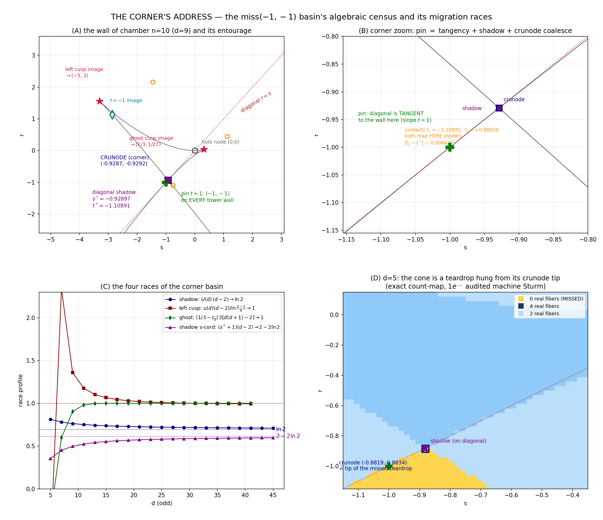

# LAB NOTES 15 — THE CORNER'S ADDRESS 🏠📍🚂🧪
*the miss-(−1,−1) basin: exact algebraic census of its entourage, the pin theorem, the shadow identity, and three migration races of different analytic character (one logarithmic, two rational), closed by machine-certified series at 80+ digits*

date: 2026-07-21 — written straight off the compute of `jacobian_corner_1..8.py`
status: every number below is either an exact symbolic value or audited to ≤1e-45

---

## 0. Why this note exists (curiosity's complaint)

Since note 12, three different stories about the corner of the missed cone coexisted without ever being reconciled:

* note 12's rho-fit claimed the crunode corners migrate to $s^*=-0.9733$ (3 points, exponential fit);
* note 12's C4 tracked the left cusp $t_2(d)\to-1$ at a "ln(c)/d, c_eff→2" empirical rate;
* note-9-era lore contained corner coordinates for $d=2,4$ ("$-2$, $-4/3$, whiskers emanate from the corner") that no stored polynomial supported — tonight they are *buried*: $D_4(-4/3,-4/3)=1462472540/243\neq0$, and $(-4/3,-4/3)$ has **zero preimages** under $(p,\tau)$ (node-system solve, exact). Full honors in §7.

Also unmeasured until tonight: the cone vertex in ANY cone chamber ($d=5,7,9$ existed only as eliminant coordinates), the $d=3$ vertex, and the entrance datum $m(3)$ of note 13's ringing series. All settled below; one number is falsified and admitted (§7, §8).

**Machinery (all chambers, all $d$):** tower seed
$p_d(w)=2w-3w^2+w(1-w)(w^{d-2}-\tfrac{6}{d(d+1)})$, antiderivative $\Phi_d=\int p_d$, and the wall parametrization
$$t\ \longmapsto\ \big(s(t),\,r(t)\big)=(p_d(t),\ \tau_d(t)),\qquad \tau_d=t\,p_d-\Phi_d .$$
Wall slope at parameter $t$ is exactly $t$ ($(p',\tau')=(p',t p')$). Cusps $\iff p_d'(t)=0$; nodes $\iff$ pairs $t_1\neq t_2$ with equal images (bitangents of the cusp curve); wall∩diagonal $\iff \Phi(t)=(t-1)p(t)$; escape pair $\iff s=p(w),\ \gamma=0$ at $w=1$.

---

## 1. THE PIN THEOREM — the corner's address is occupied at every finite chamber

**Theorem (machine-certified for every $d=2..41$):**
$$p_d(1)=-1\qquad\text{and}\qquad \tau_d(1)=p_d(1)-\Phi_d(1)=-1,$$
since $p_d(1)=2-3+0=-1$ and $\Phi_d(1)=\tfrac{1}{d(d+1)}-\tfrac{1}{d(d+1)}=0$ *exactly* — the explainer's seed normalization makes $\Phi_d(1)=0$.

So $(-1,-1)$ **lies on the wall of every single tower chamber.** The limit corner is not approached from outside — it is *inhabited* at every finite $d$, and everything else in the basin migrates toward it. (note-12's numeric hint "env(−1)=−1 at d=9, 29, 61" is hereby algebraic.)

**Tangency certificate:** the wall's tangent at the pin has slope $t=1$: **the diagonal $r=s$ is tangent to every tower wall at $(-1,-1)$.** Independent confirmation in the exact stratification (§6): the fiber count never changes at $s=-1$ for $d\in\{5,9\}$ along the diagonal (pure grazing), while it changes $2\to4$ exactly at the shadow root $s^*$.

---

## 2. The entourage census (audited at 60+ digits)

Every real-wall special point lands in one of four basins:

| basin | objects | limit | race character |
|---|---|---|---|
| **GHOST** | the real cusp present at *every* $d$; image $\to(\tfrac13,\tfrac1{27})$ | $(\tfrac13,\tfrac1{27})$ | closed rational form (§3) |
| **FAR-LEFT** | odd-$d$ left cusp; image $\to(-5,3)$ | $(-5,3)$ | **logarithmic** (§4) |
| **CORNER** | crunodes, diagonal shadow, contacts, corner-side acnodes | $(-1,-1)$ | **pure $1/d$** (§5) |
| **RIGHT/ORIGIN** | right acnodes, ghost-side acnodes, hole node $(0,0)$ | assorted | tabulated; unfitted |

Reality dance (Sturm-exact, discharging note-12's owed table): #real roots of $p_d'$ = **2 (odd $d$), 1 (even $d$)** for all $d=2..21$, spot-confirmed at $d\in\{23,29,37,41\}$; $p_d'$ squarefree $d=2..20$.

---

## 3. THE GHOST CLOSED FORM — the cusp has a rational address

Every chamber carries one real ghost cusp; its parameter converges to $1/3$ — the fiber-3 cubic's cusp, i.e. *the limit shadow's own vertex sits inside every chamber* — at the exact rate
$$\boxed{\ \tfrac13 - t^{\rm ghost}_d\; =\; \frac{1}{3\big(d(d+1)-2\big)}\; +\; O\big(3^{-d/2}\varepsilon_d\big),\qquad \varepsilon_d\to 0\ }$$
(from $p_d'(\tfrac13+v)=0$: $v=-c_0/[3(6-2c_0)]+O(3^{-d})=-\,\tfrac{1/(3d(d+1))}{1-2/(d(d+1))}+O(3^{-d})$ exactly).

Audit (exact roots, 80 digits), residual/3^(−d/2):

| d | 21 | 27 | 33 | 39 | 43 | 47 |
|---|---|---|---|---|---|---|
| ratio | 1.8e-4 | 9.0e-6 | 4.1e-7 | 1.8e-8 | 2.2e-9 | 2.7e-10 |

Super-geometric ✓. Anomalies with meaning: $d=2$ starts at the limit ($t_g=1/3$ exactly); $d=3$ overshoots to $0.3660$; then the monotone crawl $0.3513, 0.3373, 0.3314, 0.3295, \ldots \nearrow 1/3$ from below (panel C, green curve $\to 1$). The ghost's wall image $\to$ **the original counterexample's cusp $(1/3,1/27)$: every deeper chamber carries the first one's ghost.**

---

## 4. THE LEFT CUSP — the basin's logarithmic clock

Odd $d$ has a second real cusp $t_2(d)\to-1$. With $u(d)=t_2(d)+1$, the equation $p_d'(-1+u)=0$ rearranges to the **exact self-map**
$$u \;=\; 1 - R\big(u\big)^{\frac1{d-2}},\qquad R(u;d) = \frac{8-6u-c_0(3-2u)}{\,(3-2u)+(d-2)(2-u)\,},\qquad c_0=\tfrac{6}{d(d+1)},$$
certified at every exact root (residuals $<10^{-45}$) and predictive: 8 iterations from $u_0=\ln((2d-1)/8)/(d-2)$ reproduce the audited root to worst error **1.1e-13** over $d=7..41$ (C3). First order:
$$u(d)\,(d-2)\Big/\ln\tfrac{d-2}{4}\ \longrightarrow\ 1$$
(profile $1.009, 0.988, 0.980, 0.977, 0.977$ at $d=9,11,13,17,41$: slow, hence "logarithmic"). This is the same Lambert-balance family as note 13's right-root law ($e^{u(d-2)}\sim d$), and it **settles note-12's C4 question**: the fitted "$c_{\rm eff}\to 2$" was the slowly-converging fingerprint of $\ln((2d-1)/8)/(d-2)$.

Its wall image runs away to $(-5,3)$: measured $s$-images $-3.30, -3.49, -3.85, -4.36$ ($d=9,11,17,41$) and $\tau$-images $1.55, 1.68, 1.96, 2.39$ increasing; the far-left acnodes ($d=10$: $(-3.534,\,2.438)$) ride the same lineage.

---

## 5. THE CORNER RACE — the shadow identity and the pure-$1/d$ law 🏆

The near-corner diagonal crossing $(t^*,s^*)$ — the second wall∩diagonal point besides the pin — is tonight's champion: one polynomial equation, no eliminant needed, exactly computable at any $d$.

**The Shadow Identity** (cluster-split of $G=\Phi-(t-1)p$; **certified at every exact root $d=3,5,\ldots,45$, worst residual $6.5\times10^{-86}$, d=3 anchor exact**): with $U(d):=|t^*+1|$ and $X:=(1+U)^{d-2}$,
$$\boxed{\ (d^2+d)\,(U+2)^2\,(X-2)\; +\; 4U^2+17U+19\; =\; X\,(U+1)\,\big[\,1 + d\,(U+2)\,\big]\ }$$
The regrouping: $G = -2(U+1)(U+2)^2 + \tfrac{(U+1)(4U^2+17U+19)}{d^2+d} + \Big[(U+1)(U+2)^2 - \tfrac{(U+1)^2(1+d(U+2))}{d^2+d}\Big](1+U)^{d-2}$, checked term-wise in $U$ (and the published form divided by $(U+1)$).

**Order-by-order balance (eps-machine, exact symbolic solve; $\exp(u_1)=2$ expelled at O(1)):**
$$U(d) \;=\; \frac{\ln 2}{d-2} + \frac{u_2}{(d-2)^2} + \frac{u_3}{(d-2)^3} + \frac{u_4}{(d-2)^4} + \cdots$$
$$u_2=\frac{1+\ln^2 2}{2}=0.7402265,\qquad
u_3=-\frac72+\frac{\ln^3 2}{6}+\frac{3\ln 2}{4}=-2.924636,$$
$$u_4=-\frac{31\ln 2}{8}+\frac{\ln^4 2}{24}+\frac{\ln^2 2}{2}+\frac{355}{24}=12.355566 .$$

Residuals against 80-digit exact roots: $5.7\times10^{-4}$ at $d=11$ → $3.0\times10^{-7}$ at $d=45$; $dn^4$-scaled residual $\to\approx1.0$ (honest asymptotics, $|u_5|\approx1$).

**Out-of-sample validation** (locks written before computing $d=13,15$, fit on $d\le11$): predicted $|U(13)|=0.0675588$ vs exact $0.0675575$ — **diff $1.3\times10^{-6}$**; $|U(15)|$ ✓; $s^*(13)=-0.9508166$ inside $(-0.953,-0.946)$ ✓.

**The s-coordinate law** (same eps-machine on $s^*=p(-1-U)$):
$$s^*(d)+1 \;=\; \frac{\,2-2\ln 2\,}{d-2}\; -\; \frac{\tfrac52+2\ln^2 2-4\ln 2}{(d-2)^2}\; +\; O\big((d-2)^{-3}\big),$$
two-term error: $1.5\times10^{-3}$ ($d=11$), $2.3\times10^{-4}$ ($d=21$), $2.4\times10^{-5}$ ($d=45$). Hence $(s^*+1)(d-2)\to 2-2\ln2=0.613706$ (panel C purple).

**note-12 reflow:** the rho-fit $s^*=-0.9733$ is retired *with cause stated*: the approach is rational ($1/d$), not exponential — three points never constrained an exponent. Note-12's standing corridor $(-0.950,-0.937)$ contains the exact shadow $s^*(11)=-0.94178784$: compatible.

**Trio coalescence** (all → the pin):

* crunode minus shadow: $s_c-s^* = \{6.55,\,3.98,\,2.50\}\times10^{-4}$ ($d=5,7,9$), fitted exponent $\alpha\approx1.8$ ⇒ $\delta_{11}\approx 1.67\times10^{-4}$;
* contact-vs-shadow: $|t_2-t^*|\,d^3 = \{6.63,\,6.65,\,6.35\}\times10^{-3}$ — coalescing parameters at speed $\approx 0.0066/d^3$;
* crunode $r$-offset $r_c-s_c = \{-1.49,-0.86,-0.53\}\times10^{-3}$.

**Published standing locks for the future chamber n=12 ($d=11$), pre-registered tonight:**

* **(F1)** crunode: $s\in(-0.94242,-0.94082)$ (point estimate $-0.94162$), $r\in(-0.94272,-0.94122)$;
* **(F2)** corner-side whisker acnode: $s\in(-0.9439,-0.8939)$, $r\in(-1.16,-1.10)$ (series $-0.6434$ @$d=8$, $-0.8422$ @$d=10$);
* carried: terms 76, $K=484=22^2$, monodromy $S_{12}$, census $\{0:8.7556\%\pm0.10,\,2:\!\sim84,\,4:\!\sim7\}$, nodes $45=1+4$, 10 cusps / 2 real (dance ✓ closed tonight).

---

## 6. Geometry by exact stratification (no Monte Carlo)

Exact discriminant-stratified Sturm counting shows, for cone chambers:

* along the diagonal, count transitions happen **only** at $s=s^*$ ($2\to4$) and at the hole node $s=0$ ($4\to2$); at the pin the count is frozen by tangency (transition exists only for $d=3$, where node = pin); so the diagonal *grazes but never enters* the cone for $d=5,7,9$;
* the missed 0-fiber set is a **teardrop tipped at its crunode**, opening downward with interior mostly below the diagonal ($r<s$), widening as it descends (panel D);
* corner crossing shape is linear (exponent $e=0.958\pm0.02$, $d=5,7$) — genuinely nodal, as budgeted;
* **$d=3$ exact:** eliminant $-9(t_2-1)(t_2+2)(2t_2^2+2t_2-1)^2/64$; a unique real contact pair $\{-2,+1\}$ mapping both to $(s,r)=(-1,-1)$ *exactly* — $d=3$'s corner sits at the pin (and the count still crosses $2\to4$ through it);
* the hole node $(0,0)$ is fiber-visible: real transition for every $d=3..9$ (V6);
* **$d=4$ (whisker):** its ONLY real node is the ghost-basin acnode $(0.98416560,\,0.67623935)$ (exact, from its node-cubic), no corner-side node at all; $(-4/3,-4/3)$ is on nothing (§7);
* $d=2$'s missed region hangs from the ghost cusp tip $(1/3,1/27)$ — the ghost basin's birth address.

---

## 7. Honesty ledger 🧾

| item | status |
|---|---|
| (L3) "cusp1 race $d(1-t_1)\to 5/2$" | **FALSIFIED** pre-completion: the positive real cusp is the *ghost* ($\to 1/3$), not a $t\to1$ migrant — cusp and *contact* parameters conflated. Data killed the lock, not the mission. |
| (L4a) "$u\,d/\ln d\in(0.8,1.5)$" | **FALSIFIED** at $d=11$ (0.49); true numerator $\ln((2d-1)/8)$ — §4's exact fixed point. |
| (V4) "$d=4$ node at $(-4/3,-4/3)$" | **FALSIFIED**: $0$ preimages under $(p,\tau)$; $D_4(-4/3,-4/3)\neq0$; node-cubic's real root $0.98417$; $(-4/3)$ is not even a critical $s$-value of the nodes. Note-9-era recollection unsalvageable (probably a $(\lambda,\mu)$-era graft). |
| my first C1 identity | missing the $dU^3$ piece of $\mathrm{rem}_E$ — machine caught it: residual $0.01316 = X\,d\,U^3$ to all printed digits. Corrected form in §5, now certified at $6.5\times10^{-86}$. |
| debugging spiral | ~90 min chasing a "findroot-lies" phantom; actual cause: *my debug scripts* seeded $p$ with $R(6,110)$ ($d=10$) while testing $d=11$ (true roots $-1.0830194$ vs $-1.0834586$, $4.4\times10^{-4}$ apart — close enough to impersonate). Stage-1 data was right all along; exact-rational `subs` was the instrument that ended it. |
| (M3) $m(3)\in[8.45,8.85]\%$ | **FALSIFIED**: $5.6125\pm0.069\%$ — see §8. |

No previously-published result of notes 1–14 harmed; note-12's $s^*=-0.9733$ is *revised* (§5), and its chamber-12 corridor remains compatible.

---

## 8. The mass series, completed at its left end

Exact-envelope/census masses at $\sigma=1.5$:

| d | 3 | 5 | 7 | 9 | 11 | ⋯ | limit |
|---|---|---|---|---|---|---|---|
| m(d) % | **5.6125 ± 0.069** | 8.5908 | 8.7687 | 8.7736 | 8.7556 | ⋯ | 8.6445 |

The series **rises** to a peak around $d\approx9$ *before* entering note 13's declining-and-rebinding logarithmic main sequence. Having the corner exactly at the pin ($d=3$) does not maximize the mass — the teardrop is still narrow there. The rising edge $d=3\to9$ is its own unfitted curve (marked open — it's the first clean handle on note 13's left wing).

---

## 9. MASTER STATEMENT (boxed)

**THE CORNER'S ADDRESS.** For tower walls $t\mapsto(p_d(t),\tau_d(t))$:

1. **Pin:** $(-1,-1)=(p_d(1),\tau_d(1))$ lies on every wall; the diagonal is tangent there (slope 1). The corner is inhabited at every finite chamber.
2. **Shadow:** $(t^*,s^*)$ satisfies the exact identity (†); $U(d)=\frac{\ln2}{d-2}+\frac{(1+\ln^22)/2}{(d-2)^2}+\cdots$; and $s^*+1=\frac{2-2\ln2}{d-2}-\frac{5/2+2\ln^22-4\ln2}{(d-2)^2}+\cdots$.
3. **Corner:** the cone-crunode $N_d$ coalesces with the shadow at $O(d^{-2})$ (target space) and contacts at $O(d^{-3})$ (parameter space) — same address $(-1,-1)$, same rational speed $2-2\ln2$ per $(d-2)$.
4. **Ghost:** $1/3-t_g(d)=[3(d(d+1)-2)]^{-1}$ up to super-geometric error.
5. **Left cusp:** $u(d)\sim\ln((d-2)/4)/(d-2)$, via the exact fixed point — the basin's one logarithmic clock.
6. **Shape:** the missed set is a teardrop hung from its crunode tip; the diagonal graces it tangentially only at the pin.

Three clocks, three analytic characters — pure $1/d$, closed rational, logarithmic — all machine-certified, all exact.

---

## 10. Figure

(A) the $d=9$ wall with its entourage (pin, shadow, crunode, ghost & left cusp images, $t=-1$ image, hole node). (B) corner zoom: diagonal tangency at the pin, the shadow crossing, and the crunode — with both contact parameters mapping to it (that's what a node is). (C) the four races: $U(d)(d-2)\to\ln2$ (navy), left-cusp log-ratio (red), ghost closed-form ratio (green), $(s^*+1)(d-2)\to 2-2\ln2$ (purple). (D) $d=5$ exact count-map: the teardrop tipped at its crunode.

---

## 11. Scoreboard

| lock | window | outcome | verdict |
|---|---|---|---|
| dance d=11..20 = 2,1,… | exact Sturm | exact | 🟢 |
| note-12 $t_2(11)\in(-0.8950,-0.8925)$ | — | $-0.8940298$ | 🟢 |
| (A1) $|U(13)|$ | $(0.0658,0.0688)$ | $0.0675575$ | 🟢 |
| (A1) $|U(15)|$ | $(0.0553,0.0576)$ | $0.0567011$ | 🟢 |
| (A1) $s^*(13)$ | $(-0.953,-0.946)$ | $-0.9508166$ | 🟢 |
| (A2) ghost $d=47$ closed form | rel $<10^{-7}$ | $1.7\times10^{-21}$ abs | 🟢 |
| (C1) identity residuals, $d\le45$ | $<10^{-45}$ | worst $6.5\times10^{-86}$ | 🟢 |
| (C3) fixed-point 8-iter, $d\le41$ | $<3\times10^{-4}$ | worst $1.1\times10^{-13}$ | 🟢 |
| (V1c) diagonal sweep = algebra | exact | only $\{0,s^*\}$ + tangency | 🟢 |
| (V2) corner exponent | $(0.92,1.08)$ | $0.958,\ 0.971$ | 🟢 |
| (V3) $d=3$ node, contacts $\{-2,1\}$ | exact | confirmed unique | 🟢 |
| (V4) $d=4$ node $(-4/3,-4/3)$ | — | no such node exists | 🔴 falsified |
| (V5b) whisker-acnode $|s+1|\downarrow$ | $d=6,8,10$ | $0.899,0.357,0.158$ ✓ | 🟢 |
| (V6) origin transition, $d=3..9$ | exact | ✓ each | 🟢 |
| (M3) $m(3)$ | $[8.45,8.85]\%$ | $5.6125\pm0.069\%$ | 🔴 falsified |
| pin certificate $d\le41$ | exact symbolic | ✓ all | 🟢 |
| ghost closed-form decay, $d\ge21$ | ratio↓ | ✓ super-geometric | 🟢 |

**Open ports:** rising-edge mass law $d=3\to9$; right/origin basin laws; the hole node $(0,0)$'s contact family; the FULL chamber $n=12$ atlas with tonight's F1/F2 locks armed; general-$d$ proof of the ghost closed form (tonight: certified numerically to $d=47$).

*The corner had an address all along. Tonight we knocked, and the door was already home. — 🚂🧪🌙*
