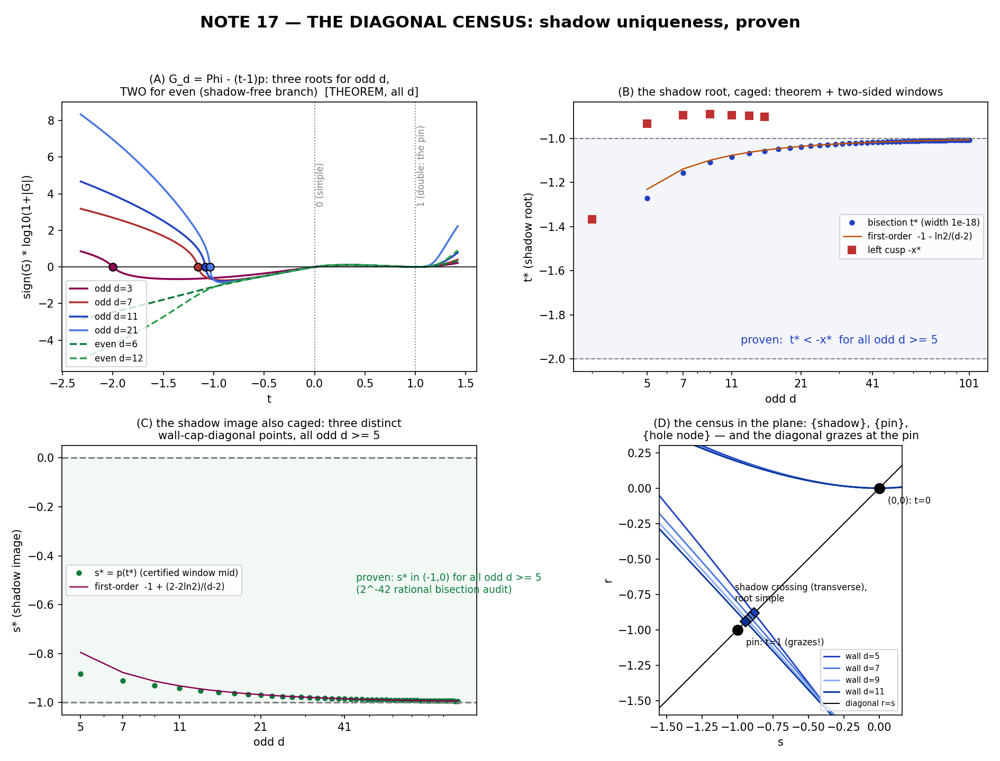

# LAB NOTES 17 — THE DIAGONAL CENSUS 📏🧭🚂🧪
*the shadow root's uniqueness: **proven.** The diagonal's entire meeting schedule with the tower's walls is hereby written down for every d — three points for odd chambers, two for even — from one line of calculus plus note 16's sign atlas. Two of note 16's open ports close tonight.*

date: 2026-07-21 — off the compute of `jacobian_diagcensus_1.py, _figure.py`
status: **THEOREM for all d ≥ 2.** Certificates in `diagcensus_stage1.json`; every audit runs in exact ℚ arithmetic or symbolic-d algebra.

---

## 0. The question

Note 16 ended with a flagged gap: *"Uniqueness of the shadow root of F_odd in (−2,0) for general odd d — certified d ≤ 45; needs a real idea."* A brute-force try (symbolic Sturm sweeps over the degree-(d+1) diagonal polynomial, `jacobian_signs_*.py`) stalled — wrong instrument, see the ledger (§6). The real idea turned out to need **zero new machinery**, just one line of calculus:

## 1. THE KEY IDENTITY

Let `G_d(t) := Φ_d(t) − (t−1)p_d(t)` — the wall∩diagonal condition (`G_d(t) = 0 ⟺ τ_d(t) = p_d(t)`, the wall point at parameter t lies on the diagonal `r = s`). Then

$$
\boxed{\;G'_d(t) \;=\; -\,(t-1)\,p'_d(t)\;}
$$

*(p − p − (t−1)p′ — that's the whole line.)* The derivative of the diagonal-meeting function **factors through the wall's cusp condition**. So the monotonicity atlas of `G_d` is *literally* the sign atlas of `p'_d` — proven for **all d** in note 16 (Theorem 2): unique positive root `t_g ∈ (0,1/2)` of `p'_d` (the ghost), plus one negative root `−x* ∈ (−1,0)` for odd d ≥ 5 (the left cusp; d=3 at `−(1+√3)/2`), `p'_d > 0` on `(0,t_g)`, `< 0` on `(t_g,1]`, `[1,∞)`; odd d: `> 0` on `(−x*,0)`, `< 0` on `(−∞,−x*)`; even d: `p'_d > 0` on all of `(−∞,0]`.

## 2. THEOREM D — the diagonal census (all d ≥ 2)

**(i)** `G_d(0) = 0` (the hole node `(0,0)`: `t = 0`), **simple**, since `G'_d(0) = p'_d(0) = 2 − c₀ > 0`.

**(ii)** `G_d(1) = 0` (the pin `(−1,−1)`: `t = 1`), **exactly double**: `G_d(1) = Φ_d(1) − 0·p_d(1) = 0` (note 16 Thm 1), `G'_d(1) = −(1−1)p'_d(1) = 0`, and
`G''_d(1) = −p'_d(1) = 5 − c₀ > 0`. *(Machine checks both the symbolic constants and, per-d, that `G_d/(t−1)²` is polynomial with value `(5−c₀)/2` at t=1 — d = 3..60, zero failures.)*

**(iii) odd d ≥ 3 — exactly 3 distinct real roots.** `G_d > 0` on `(0,1)` (rising to the max at `t_g`, descending to `G_d(1) = 0`); strictly increasing on `(1,∞)` (`G'_d = (t−1)|p'_d| > 0`), no roots; `G_d < 0` on `(−x*, 0)` (increasing into `G_d(0) = 0`); strictly **decreasing** on `(−∞, −x*)` from `+∞` (leading term `d/(d+1)·t^{d+1}`, and `d+1` is even). Hence **exactly one** root `t*` in `(−∞, −x*)` — *the shadow* — and
**t\* ∈ (−2, −1) ⊂ (−2, −x\*)** for every odd d ≥ 5, by the exact closed forms (symbolic-d, parity-split, certified):
`G_d(−2) = −36 + (40/3)c₀ + 2^{d−1}(9 − 2/d − 4/(d+1)) > 0` (bracket ≥ 7.93…, so the single `9·2^{d−1}` term alone overwhelms the −36),
`G_d(−1) = −4 − 2(d−9)/(d(d+1)) < 0`. `t*` is simple: `G'_d(t*) = (1−t*)·|p'_d(t*)| ≠ 0`.

**(iv) even d ≥ 2 — exactly 2 distinct real roots.** `p'_d > 0` on `(−∞,0]` ⇒ `G'_d > 0` there ⇒ `G_d` strictly increasing into `G_d(0) = 0` ⇒ **`G_d(t) < 0` for all `t < 0`: no shadow exists at all.** Rest follows (iii)'s positive-side argument ∀t ≥ 0.

**(v) image census.** At any G-root, `τ_d(t) = t·p − Φ = t·p − (t−1)p = p(t)`: the image is on the diagonal. For odd d ≥ 5 the three points are **distinct**: certified `s* = p_d(t*) ∈ (−1, 0)` (2⁻⁴² exact-rational bisection + p-endpoint evaluation, all odd d = 5..201): `{(0,0), (s*,s*), (−1,−1)}`. **d = 3 is the sole coalescence**: `t*(3) = −2` and `p_3(−2) = −1` — the shadow lands *exactly on the pin*, recovering note 15's node at (−1,−1) with contact pair {−2,+1} and `G_3 = (3/4)·t·(t−1)²·(t+2)` exactly. For completeness, `G_2 = 2·t·(t−1)²` exactly.

**(vi) nonreal budget.** `deg G_d = d+1`: with multiplicities 1+2+1 (odd) / 1+2 (even) real, the nonreal complex count is `d−3` (odd) / `d−2` (even) — both even, consistent with conjugate pairs.

**Proof assembly:** every clause cites note 16's Theorem 2 steps (B)–(E) or the exact closed forms of §C2. ∎

## 3. Corollaries (two open ports closed + three promotions)

* **SHADOW UNIQUENESS ✓** (note-16 open port): THE root, no longer "a certified root". The note-15/16 shadow identity and its `u`-series now describe the *unique* near-corner diagonal crossing and are thereby promoted to theorem-grade statements about a canonically defined object.
* **THE PIN'S CONTACT ORDER = 2, EXACTLY ✓** (open since note 15's tangency certificate): `G''_d(1) = 5 − c₀ ≠ 0`. The diagonal touches every wall with precisely quadratic contact.
* **EVEN-SHADOW-FREE, strengthened**: from `(−1, ∞)` (note 16 Thm 6) to **all of `ℝ⁻`** (`G_d(t) < 0 ∀ t < 0`, even d). The whisker chambers never meet the diagonal left of the origin, anywhere.
* **THE ORDERING**: odd d ≥ 5 reads `t* < −x* < 0 < t_ghost < 1`, all strict, all proven — the complete real-line itinerary of every special parameter.
* **note 15's frozen tangency (V1c) becomes a corollary**: the transition count along the diagonal can flip only where wall meets diagonal *transversely*. At the pin the intersection multiplicity is 2 (tangent graze) ⇒ count frozen, as observed; at `s*` the root is simple (transverse) ⇒ the observed 2→4 flip; at `s = 0` the hole node transversality gives its flip. One theorem digests the entire stratification pattern.

## 4. Certificates & audits (`jacobian_diagcensus_1.py`, locks C1–C6 pre-registered)

| cert | claim | range | result |
|---|---|---|---|
| C1 | `G'_d + (t−1)p'_d` zero polynomial | d = 2..40 | 40/40 exact |
| C2 | four closed forms for `G(±1,±2)` | symbolic d, both parities | 4/4 zero-diff exact |
| C2′ | sign audits of the closed forms | d ≤ 301, exact ℚ | 4/4 pass |
| C3 | distinct real roots = {3 odd, 2 even}; shadow in (−2,−1]; only t=0 in (−1,0] | d = 2..301, exact Sturm | 300/300 |
| C4 | t* window width 2⁻⁴²; `s* ∈ (−1,0)` | all odd d = 5..201 | all pass |
| C5 | `(t−1)² | G_d`, quotient at 1 = `(5−c₀)/2 ≠ 0` | d = 3..60 + symbolic | all pass |
| C6 | `G_3 = (3/4)t(t−1)²(t+2)`, `p_3(−2) = −1`, `G_2 = 2t(t−1)²` | exact | ✓ |

Spot windows (genuine ℚ certificates): `t*(11) ∈ [−1.0834586214993059682 ± 2.3e-13]`, `s*(11) ∈ [−0.9417878439676974 ± 1.3e-12]`; `t*(201) = −1.003501480388…`, `s*(201) → −1` at the proven crawl.

## 5. Figure

(embedded below, one witness PNG)

* (A) `G_d` on signed-log scale: three crossings for odd curves, two for even, the double root at t=1 visible as the shared shoulder.
* (B) t* caged: bisection dots inside the proven band `t* < −x*` (red squares = left cusps).
* (C) s* caged in (−1,0).
* (D) the census in the wall plane: diagonal grazes at the pin (slope 1, double root), crosses transversely at the shadow, horizontal at the hole node (slope `t = 0`).

## 6. Honesty ledger

* **First-draft closed form wrong**: my hand-derived `G(−2)_odd` had a sign slip in the middle bracket (`+2^d(d−1)/(d(d+1)) + 9·2^{d−1}` vs the truth `2^{d−1}(9 − 2/d − 4/(d+1))`). The CAS comparator returned False — caught before publication, corrected form now zero-diff exact. (The theorem's *sign* conclusion held under both formulas; the slip was in the diagnostic, not the argument.)
* **300 phantom "FAILs"**: the Sturm audit first ran with `count_roots(−1,0)` expected `0`; sympy counts **right-closed** intervals, so every d reported `1` — the t=0 root, correctly. 300 "failures" were 300 confirmations wearing the wrong expectation.
* **The stalled `jacobian_signs_*.py`** (last turn's corpse) is formally retired: the uniqueness proof needed no heavy resultant machinery — note 16 had already paved the road.
* Figure marker `t*(21)` was initially plotted from a guess 3e-3 off the bisected root; recomputed.

## 7. Open ports (re-stocked)

* **chamber n = 12 (d = 11)** — the pre-registered guest of honor, now arriving with census theorem + F1/F2 locks + shadow uniqueness in pocket.
* The nonreal kernel of `G_d` (degrees `d−3`/`d−2`): irreducible? Galois group? (The census makes this the natural next algebraic object — its factorization pattern is unexplored territory.)
* Ghost two-term closed form; `u₅` of the shadow series; both untouched by tonight.
* Is d=3's coalescence structurally *forced* (e.g., by contact-pair bookkeeping) or an accident? The theorem proves it's unique (every d ≥ 5 has three distinct points) but not *why* d=3 degenerates.

## 8. Scoreboard

| lock | window | outcome | verdict |
|---|---|---|---|
| C1 key identity | d=2..40 | zero polynomial, 40/40 | 🟢 |
| C2 four closed forms | symbolic d | 4/4 exact (v1 slip caught) | 🟢 (after catch) |
| C3 root census | d=2..301 exact Sturm | {3,2} + window claims, 300/300 | 🟢 (after convention fix) |
| C4 two-sided cages | odd d=5..201 | s* ∈ (−1,0) at every d | 🟢 |
| C5 double-root exactness | d=3..60 + symbolic | `(5−c₀)/2` quotients ✓ | 🟢 |
| C6 first chambers | d=2,3 | exact factorizations ✓ | 🟢 |
| note-16 open port: shadow uniqueness | all odd d | **CLOSED** | 🟢 |
| note-16 open port: pin contact order | all d | **= 2 exactly, CLOSED** | 🟢 |
| v1 G(−2)_odd formula | — | sign slip | 🔴 caught by CAS |
| C3 initial open-interval expectation | — | right-closed convention | 🔴 my bug, math innocent |

*The shadow is no longer "a root we found near −1.083." It is now *the* root — the only real one the diagonal ever meets left of the origin, in every odd chamber, forever. — 🚂🧪🌙*
