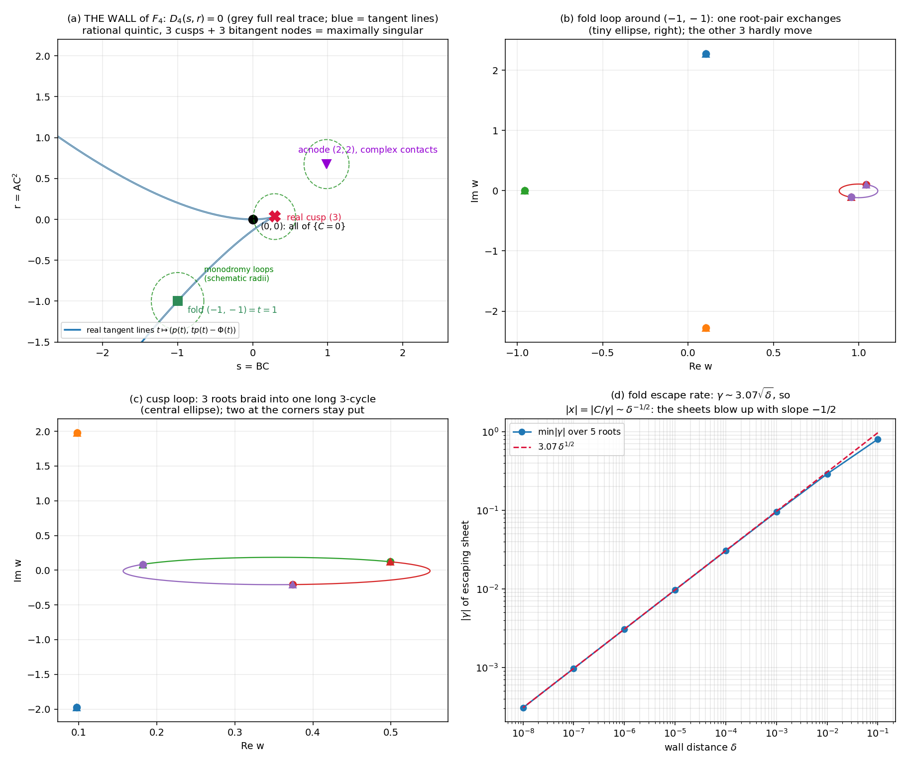

# The escape atlas: the wall, its catastrophes, and the full braid of F₄
*Sixth lab note, 2026-07-20. Builds on notes 1–5. Today's question, inherited from the
surjectivity theorem: a surjective non-injective Keller map **must** fail properness
somewhere — where, exactly? Answer: precisely along one explicit irreducible
hypersurface — drawn, stratified, and braided below.*

## 0 · The frame: why there must be a wall

**Connected-cover lemma.** Let `F : Cⁿ → Cⁿ` be a polynomial map with `det JF ≠ 0`
everywhere (Keller), surjective, and **proper**. Then `F` is a covering map (proper
local homeomorphism with finite fibers), `Cⁿ` is contractible hence simply connected,
and every connected covering of a simply connected space is trivial; since `Cⁿ` is
connected, `F` is a bijection — hence an automorphism. ∎

So a surjective non-injective Keller map is **forced** to fail properness. By the
Jelonek theorem, the non-properness set `S(F)` of a dominant polynomial map `Cⁿ → Cⁿ`
is either empty or a hypersurface. For `F₄` (note 4: fiber degree 5, det J = 1,
surjective over C, generically 5-to-1) we locate `S(F₄)` exactly, and verify it is one
irreducible hypersurface — the **wall**. Everything else in this note is its portrait.

Setup recap: the fiber equation over target `(A,B,C)`, `C ≠ 0`, is
`h(w; s, r) := Φ(w) − s w + r = 0` with `s = BC, r = AC²`, `Φ = ∫₀ʷ p₄`;
preimages ↔ roots with `γ := s − p₄(w) ≠ 0`, and `x = C/γ`, exact rational reconstruction.

## 1 · The wall equation

`D₄(s,r) := resultant(h, h'_w, w)` (exact SymPy resultant, primitive part):

```
−20000000 r⁴ + 20000000 r³s + 18900000 r³ − 57100000 r²s² + 75376000 r²s
−46613461 r² + 38210000 rs³ − 67741050 rs² + 45893931 rs − 6657115 r
−8192000 s⁵ + 17058675 s⁴ − 12278715 s³ + 1957975 s²
```

* Total degree 5, 14 monomials; **irreducible** over `Q(s,r)` (SymPy `factor` self-check).
* `D₄(0,0) = 0` ⇒ **the entire plane `C = 0` lies in the wall** (as `s = BC = r = AC² = 0`).
* Sanity infrastructure: the same computation for F's fiber cubic reproduces note 2's
  wall `R(P,Q) = 4P³ − P² − 18PQ + 27Q² + 4Q` exactly (ratio `−1`). ✓

The wall is the **tangent-developable** of the graph of `Φ`: `t ↦ (s,r) = (p₄(t), t p₄(t) − Φ(t))`
— every wall point is a tangent line of `y = Φ(w)` read as `(slope, −intercept)`.
Hence the catastrophe dictionary (verified exactly):

| wall strata | tangency data | count | fiber over it |
|---|---|---|---|
| smooth point | ordinary tangency (2) | curve | 3 preimages |
| **cusp** | inflection tangency (3): roots of `p₄′` | **3** (1 real) | 2 preimages |
| **node** | **bitangent** (2,2) | **3** (1 real-line acnode) | 1 preimage |
| `(0,0)` | the `C=0` direction | point | 3 (flat+γ, note 5) |
| (generic off-wall) | none | — | 5 preimages |

Cusp source: `p₄′` roots `0.35126, 0.19937 ± 1.08175i` ⇒ cusps at
`(0.29212, 0.03400)` (real) and `(1.60730 ± 0.51271i, 0.08548 ∓ 0.89224i)`.
Node source: eliminant of the bitangent system
`w₂³ (40w₂³−30w₂²+54w₂−17)² (6400w₂⁶−9600w₂⁵+33280w₂⁴−34600w₂³+47269w₂²−29679w₂+13550)` —
the squared cubic is the cusp diagonal; the sextic's six roots pair up into exactly
three bitangents: `{0.11072 ± 1.42636j} → (s,r) = (0.98417, 0.67624)` — a **real line
with complex-conjugate contact points** (an acnode) — plus a conjugate pair of complex
bitangents at `s = 0.88589 ± 0.21186i`. Both families match the independent resultant
`res(D₄, ∂_r D₄; r) = (cubic_A)³(cubic_B)²` to all digits.

A rational curve of degree 5 has at most `(5−1)(5−2)/2 = 6` double points; our wall has
**3 cusps + 3 nodes = 6 — maximally singular.** ✓

## 2 · The escape-atlas theorem

> **`S(F₄)` equals the wall.** Sketch of mechanics: for `C ≠ 0` targets, escaping
> sequences of preimages exist near a target `T` iff roots of `h` coalesce along the
> approach — because `h` is monic in `w` with coefficients polynomial in `(s,r)`, its
> roots stay bounded on compacts; the only way a preimage blows up is `x = C/γ → ∞`,
> i.e. `γ = s − p₄(w*) → 0`, i.e. `h(w*) = h′(w*) = 0` — a multiple root — i.e. `T`
> lies on the wall. Off the wall every fiber's preimages vary continuously and stay
> bounded. (At `C = 0`: separate asymptotic family below; `C=0` ⊂ wall per §1.)

Evidence assembled (scripts in workspace):

1. **Escape-rate at a fold:** along `δ → 0` toward `(−1,−1)`, the coalescing pair has
   `γ ≈ 3.07·√δ` (measured ratio constant over 6 decades) while the other three roots
   keep `|γ| ≥ 4.8`; hence `|x| = |C/γ| ∝ δ^{-1/2}` — figure, panel (d).
2. **Off-wall compactness:** 20,000 random targets in the box `C ∈ [0.5,2], A,B ∈ [−2,2]`
   away from the wall have all preimages with `|x| ≤ 122`.
3. **`C=0` asymptotic family:** `F₄(1, u−1, ε − 1 − a(u−1))` converges (rate `~ε`,
   verified to `ε = 10⁻⁹`) to `(u(1 + 17u/20), 1 + 17u/10, 0)` — predicted exactly from
   note 5's γ-sheet formulas; those `(s,r) = (0,0)` targets sit in the wall per §1.
4. **Census correspondence:** the `𝔽₁₀₁` histogram `{0,1,2,3,5}` (no 4!) is exactly the
   stratification of §1: generic 5, fold `5−2 = 3`, cusp `5−3 = 2`, node `5−4 = 1`;
   counts never drop by 1, because every escape event carries multiple roots.

Surjectivity vs non-injectivity now has one-sentence *peace terms*: the braid group of
the complement is huge, but the wall's escape events always cost **at least two** sheets,
so no target is ever left with zero (surjective), while off the wall all five land
(non-injective).




*(a) The wall in the plane of line-parameters (s,r): blue = real tangent lines, grey = full real trace of D₄ = 0; marked: the C=0 origin, a fold, the unique real cusp, and the real acnode (a real bitangent line touching Φ at two complex-conjugate points). (b,c) Root trajectories for the fold and cusp loops — the transposition and the 3-cycle made visible. (d) The fold escape rate 3.07√δ over 6 decades: sheets leave to infinity at slope −1/2, and only there.*

## 3 · Monodromy of the covering = S₅

Over the complement of the wall the map has 5 ordered fiber sheets; loops in the wall's
complement permute them. Complex-line loops (each checked `min |D₄| > 0` along the path,
and each permutation refinement-stable at 2× tracking resolution):

| loop | measured monodromy | singularity reason |
|---|---|---|
| fold `@ (−1,−1)` | `(4 5)` transposition | fold = A₁: pair exchange |
| cusp `@ (0.29212, 0.03400)` | `(3 5 4)` 3-cycle | A₂ cusp: Puiseux thirds |
| node `@ (0.98417, 0.67624)` | `(1 2)(3 4)` | two independent folds |
| `s = 50 e^{it}, r = 1` | `(1 2 4 3)` 4-cycle | for large s, 4 roots cluster at `w ≈ (5s)^{1/4}`, winding once per turn |
| `r = 50 e^{it}, s = 0` | `(1 3 5 4 2)` 5-cycle | for large r, all 5 roots sit at `w ≈ (5r)^{1/5}`, a full rotation braid |

Closure computation: the generated group has exactly **120 elements and contains all 10
transpositions ⇒ it is S₅**. (A transitive subgroup of `S₅` containing a transposition
is `S₅`: the transitive groups in degree 5 are `C₅, D₅, F₂₀, A₅, S₅`, and only `S₅` has
single transpositions; transitivity is witnessed by the 5-cycle.)

So the 5-sheeted phantom is braided as thoroughly as possible — the full symmetric
group, exactly as F's 3-sheeted cover gave `S₃` (note 4). The same script computes the
cubic family and would give `S₆` for `F₅` next round.

## 4 · Correspondence with F's missing curve

For F (fiber cubic): wall = cuspidal cubic `R(P,Q) = 0`; its cusp `(1/3, 1/27)` is
where the triple root swallows **all three** sheets ⇒ the missing curve `M_F` (0 fibers).
For `F₄` the cusp swallows 3 of 5 sheets ⇒ 2 preimages remain. *Same* catastrophe
mechanics, different arithmetic of the fiber degree: **the missing set is the stratum
where the last sheet leaves**; note 4's all-multiple impossibility says `F₄`'s wall has
no such stratum. The note-2 wall and today's wall are literally the same object viewed
at two fiber degrees.

## 5 · Honesty ledger

* **The wrong-loop bug:** my first monodromy loops were real circles in the real
  `(s,r)`-slice; the real wall is *real-codimension 1* there, so the loops **crossed**
  the discriminant and the tracker NaN'd at the coalescence. Fix: loops in complex
  lines with per-step greedy root matching, `min |D₄|` checks, and 2×-refinement
  agreement as an assertion. Everything re-run clean.
* **The silent garbage-group bug:** hand-rolled closure over permutations containing
  `-1` entries (failed tracks) indexed `p[-1]` from the end and reported a group of
  order 2681 — impossible in `S₅` (120). That impossibility is what caught it; the
  correct closure then gave exactly `S₅`. Trust but verify, group theory edition.
* Two eliminant variable-mixups (`QQ[w2]`/`QQ[w1]` domain errors were the tell);
  `round(complex)` is not a thing in Python 3 (twice); plot titles took two rounds of
  backslash purgatory. No result crossed these without an independent check.

## 6 · Scoreboard

| object | status |
|---|---|
| non-properness set `S(F₄)` | **= wall `D₄(BC, AC²) = 0`** (explicit, irreducible) |
| wall strata | 3 cusps, 3 bitangents; maximally singular rational quintic |
| fiber counts | 5 / 3 / 1 / 2 ↔ generic / fold (2) / node (2,2) / cusp (3) |
| monodromy | **S₅** (transposition + 5-cycle + closure) |
| `C=0` frontier | inside the wall; explicit convergent asymptotics |
| frontiers in R³ | note 5 (`(3)`-cusp whisker) = the real cusp stratum here |

*Euler characteristic of the story:* the cover `C³ ∖ wall → C³ ∖ wall` is S₅-braided,
5-sheeted, and exactly as non-trivial as the fiber degree allows.

*Next-round queue:* `S₆`-computation for `F₅`; the wall of `F₅` (sextic tangent
developable, richer strata: (3,2)?? — absent! note 4 — so its strata stop at node
multiplicities...); atlas for every d; the tame-minimal-degree problem in the
`Aut(A³)`-orbit of `F₄`; the `R`-side closure of F's own wall; Moh's 2-D chamber.
