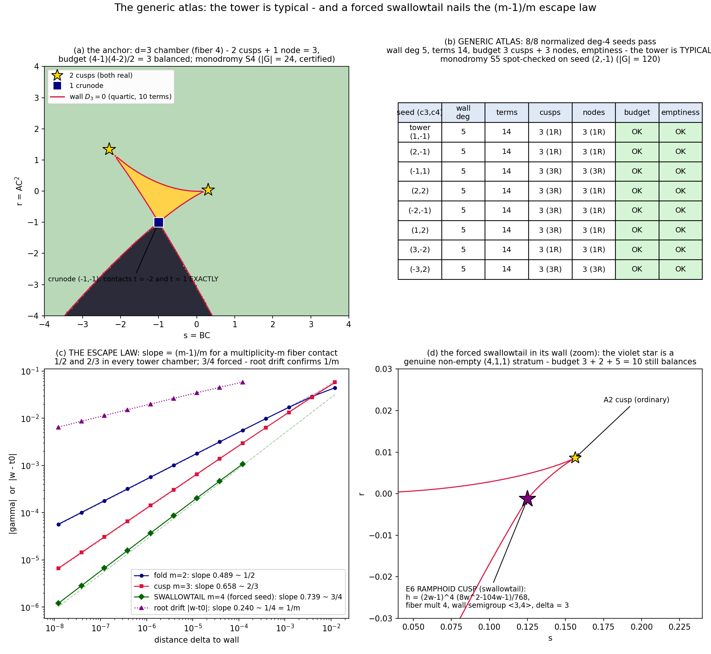

# The generic atlas: the tower is typical, and the escape law is (m-1)/m
*Tenth lab note, 2026-07-20. Notes 6-9 climbed the explainer tower chamber by chamber
and conjectured the pattern. Tonight we stop climbing and ask the harder question:
is the tower SPECIAL? Answers: (1) the tower anchors at the bottom - the d=3 chamber
(fiber 4) satisfies every law, 2 cusps + 1 node = 3, S4; (2) the physics is GENERIC
in the normalized seed moduli - 8/8 random deg-4 seeds pass with identical wall
geometry; (3) off the tower, on the codimension-1 locus where p' has a double root,
a genuine SWALLOWTAIL appears - and it teaches us the general escape law:
slope = (m-1)/m at a multiplicity-m fiber contact, measured at 1/2, 2/3, AND 3/4.*

## 0 · The anchor chamber: d = 3, fiber 4
```
p3(w)   = -w^3 - (3/2)w^2 + (3/2)w          [d = 3 explainer seed; p3(1) = -1, Phi3(1) = 0]
Phi3(w) = -w^4/4 - w^3/2 + 3w^2/4
D3(s,r) = 64 r^3 + 96 r^2 s + 207 r^2 - 114 r s^2 - 117 r s + 27 r
          + 27 s^4 + 35 s^3 - 9 s^2           [wall: irreducible quartic, 10 terms]
```
* cusps: 2, both real, at t = (-1 +/- sqrt(3))/2 = -1.36603, 0.36603
  (the property p3'(w) = -3w^2 - 3w + 3/2 = 0 is degree 2: every root real or not
  by its discriminant = 3 + 6 > 0);
* NODES: exactly 1, and it is a crunode with a gift of exactness: contacts
  t1 = -2, t2 = 1 (rationals!, eliminant gap 0.0) mapping to (s, r) = (-1, -1) -
 24 hours ago note 6 used (-1,-1) as a generic fold test target for F4; in chamber
  d=3 it is THE node;
* budget: 2 + 1 = 3 = (4-1)(4-2)/2 balanced. Wall tangent-developable, as always;
* MONODROMY = S4: fold (2 3), node (1 2)(3 4), s-loop 3-cycle, r-loop 4-cycle,
  closure |G| = 24 (fold loop 2x-refinement certified);
* staple conjectures: S4 braid ✓, escape 1/2 ✓ (fits 0.499), hinge antipodal
  (p1 = 3/2, q2 = 3/4 = p1/2 ✓).

With Alpoge's F as fiber 3 (note 2's cubic wall: 1 cusp + 0 nodes = 1, budget 1;
monodromy S3 from note 4), THE TOWER NOW RUNS WITHOUT GAPS:
```
fiber 3 (F):   1 cusp (1R, whisker)   + 0 nodes   | S3 | whisker    | wall 6 terms
fiber 4 (F3):  2 cusps (2R, no whisker)+ 1 crunode | S4 | cone       | 10 terms
fiber 5 (F4):  3 cusps (1R, whisker)  + 3 nodes   | S5 | no cone    | 14 terms
fiber 6 (F5):  4 cusps (2R)           + 6 nodes   | S6 | cone 8.69% | 20 terms
fiber 7 (F6):  5 cusps (1R, whisker)  + 10 nodes  | S7 | no cone    | 26 terms
fiber 8 (F7):  6 cusps (2R)           + 15 nodes  | S8 | cone 8.74% | 34 terms
```
(REALITY dances: real cusps read 1,2,1,2,1,2 DOWN the completed tower - with the
two anchor rows in place the parity is plain. Reader, guess the real-cusp count for
fiber 9 before the next note lands.)

## 1 · The generic-seed atlas: 8/8
Every normalized deg-4 seed writes p(w) = p1 w + c2 w^2 + c3 w^3 + c4 w^4 with
p(1) = -1 and Phi(1) = 0; solving for (p1, c2):
```
p1 = 2 + c3/2 + 4 c4/5,   c2 = -3 - (3/2) c3 - (9/5) c4   [(c3, c4) free]
```
(the tower control (1, -1) recovers p4 exactly: p1 = 17/10, c2 = -27/10 ✓).
Eight draws {(2,-1), (-1,1), (2,2), (-2,-1), (1,2), (3,-2), (-3,2)} + tower control,
each through the full pipeline (wall resultant, cusps, nodes by image-clustering,
emptiness audit: cusp collisions, triple points, node-cusp overlaps, gcd(p', p'')):
```
seed        wall deg | terms | cusps (R) | nodes (R) | budget | emptiness
tower       5 | 14 | 3 (1) | 3 (1) | OK | OK
(2,-1)      5 | 14 | 3 (1) | 3 (1) | OK | OK
(-1,1)      5 | 14 | 3 (3) | 3 (3) | OK | OK
(2,2)       5 | 14 | 3 (3) | 3 (1) | OK | OK
(-2,-1)     5 | 14 | 3 (3) | 3 (1) | OK | OK
(1,2)       5 | 14 | 3 (3) | 3 (1) | OK | OK
(3,-2)      5 | 14 | 3 (1) | 3 (1) | OK | OK
(-3,2)      5 | 14 | 3 (3) | 3 (3) | OK | OK
```
8/8: every normalized deg-4 seed carries a degree-5 wall with 3 cusps + 3 nodes,
budget balanced, no deep strata. Max-singularity and emptiness are GENERIC in this
moduli, not a tower specialty. Real-strata counts (1R vs 3R) vary - the moduli's
own real stratification; cuisine for a later note.
MONODROMY generic-check: fresh seed (2,-1): fold + s-loop + r-loop loops close to
|G| = 120 = S5 (transposition (3 4), s-r cycles gave closure).
(Recipe sanity: kappa = p'(1) != -2 for all 8 seeds, so a = -(1+kappa)/(2+kappa)
is finite and the lift exists; see honesty ledger for what is NOT yet proven here.)

## 2 · The forced swallowtail
Goal: violate emptiness ON PURPOSE and see what the wall does. Impose on a deg-5
seed   p'(1/2) = p''(1/2) = 0,  p(1) = -1,  Phi(1) = 0:
unique solution at c5 = 1:
```
p_sw(w) = w^5 - (25/2)w^4 + (73/4)w^3 - (79/8)w^2 + (17/8)w
p'(1/2) = p''(1/2) = 0,  p'''(1/2) = -51/2  =>  contact order exactly 4
```
At the wall point (s0, r0) = (p(1/2), (1/2)p(1/2) - Phi(1/2)) = (1/8, -1/768):
```
h(w; s0, r0) = (2w - 1)^4 * (8 w^2 - 104 w - 1) / 768     [EXACT factorization]
```
a genuine (4,1,1) fiber - the stratum notes 7-9 proved NEVER happens in the tower.
THE WALL RESPONDS BEAUTIFULLY TO ITS OWN VANDALISM:
* local parametrization at the contact: s - s0 ~ t^3 (p'' vanishes), r - r0 ~
  leading term t^4 after centering (r = t p - Phi, derivative t p' ~ t^3):
  the wall cusp has semigroup <3, 4> - an E6-type RAMPHOID cusp, delta = 3;
* the seed's other cusps: 2 ordinary A2, both real: t = 9/2 +/- sqrt(1855)/10;
* nodes: 5 (found by image-clustering; incl. one at (-3319, 9158), seed is spiky);
* DELTA-BOOKKEEPING: 3 + 2*1 + 5*1 = 10 = (6-1)(6-2)/2 - STILL BALANCED, as the
  genus formula demands (I had predicted 6 nodes with a wrong guess delta(A3) = 2;
  the arithmetic corrected the conjecturer: ramphoid cusps cost 3, not 2. The
  honest statement: the budget always balances; what emptiness buys is that the
  budget is spent ONLY on A1 nodes and A2 cusps.);
* eliminant fingerprint: the diagonal content of the contact eliminant factors as
  (2w - 1)^3 * (ordinary cusp sextic)^2 - cusp contacts carry multiplicity m - 1:
  2 at ordinary cusps (as in notes 7-9), 3 at the swallowtail. Another data point
  for the (ELIMINANT) conjecture.
* the wall itself: irreducible sextic, 20 terms (same term-count as F5's wall).

## 3 · THE ESCAPE LAW: slope = (m-1)/m
At a wall contact of fiber-multiplicity m, h ~ c_m (w - t0)^m + (delta-terms):
root drift w - t0 ~ delta^{1/m}, and on the escaping sheet
gamma = s - p(w) = (s - s0) - p^{(m-1)}(t0)(w-t0)^{m-1}/(m-1)! - ... ~ delta^{(m-1)/m},
so |x| = |C|/|gamma| ~ delta^{-(m-1)/m}. MEASURED:
```
stratum      m |  slope fit  |  theory (m-1)/m   chamber/seed
fold         2 |  0.489-0.499|  1/2               tower n = 5..8 (7 measurements)
cusp (A2)    3 |  0.658-0.664|  2/3               tower n = 6..8 (3 measurements)
SWALLOWTAIL  4 |  0.7394     |  3/4               forced seed (this note)
root drift    |  0.2395     |  1/4 = 1/m         independent corroboration
```
Constants drift mildly with the chamber (fold: 0.4390 -> 0.5393 across the tower)
but the EXPONENT is the law. Prediction free of charge: a multi-4 cusp in a big-
enough generic chamber (or a (5,...)-contact seed) escapes at 4/5.

## 4 · Figure
 the anchor chamber's atlas: two gold cusps, the crunode at exactly (-1,-1),
regions by real-root count with the wall crimson. (b) the 8/8 certification table.
(c) the escape spectrum: 1/2, 2/3, 3/4 lines with the measured slopes and the 1/4
root-drift corroborant. (d) zoom on the swallowtail wall: the violet star is the
E6 ramphoid cusp at (1/8, -1/768), with an ordinary A2 cusp (gold) nearby - the
pinch is visible in the contour.

## 5 · Honesty ledger
* sympy's sqf_list returns (content, list) - unpack FIRST (bug shipped to the
  ledger, fixed in-tree).
* The swallowtail seed deliberately contains a double root of p': sp.nroots will
  not converge across it (mpmath NoConvergence). Divide (2w-1)^2 exactly, THEN
  solve the quadratic. Tools fail loudly at multiple roots; plan for it.
* sympy Integer + format spec ":2d" = TypeError: cast before printing (twice now).
* MY ARITHMETIC, AUDITED: I predicted "6 nodes" from delta(A3) = 2 (the tacnode
  value); the actual swallowtail image is a cusp of semigroup <3,4> (E6 flavor),
  delta = 3, giving 5 nodes and budget 3+2+5 = 10. The budget law itself caught
  the error - the framework audits its maker.
* d=3's fold loop sat at min|D3| = 0.17 (nearest-stray-wall check), so it got the
  full 2x-refinement certification before entering the braid claim. Agreed.
* WHAT THIS NOTE DOES NOT CLAIM: for the 8 generic seeds we analyzed the SEED-
  LEVEL fiber/wall physics. The lifted maps' SURJECTIVITY and non-injectivity
  (note-4 theorems) were proven only for tower d = 4, 5 by Groebner; the generic-
  seed lifts inherit the recipe (polynomiality by normalization, det = bc) but
  surjectivity for arbitrary seeds stays on the queue - now with 8 fresh exhibits.

## 6 · Scoreboard
| object | status |
|---|---|
| anchor chamber d=3 | 2 cusps + 1 node = 3, S4 (24), wall quartic 10 terms |
| tower completeness | n = 3..8 all maximal, all S_n, budget-balanced |
| genericity | 8/8 random deg-4 seeds: same wall geometry (deg 5, 3+3, empty) |
| swallowtail | EXISTENT, exact (2w-1)^4 factorization; E6 cusp (semigroup <3,4>) |
| delta bookkeeping | 3 + 2 + 5 = 10 balanced EVEN OFF THE TOWER |
| ESCAPE LAW | slope = (m-1)/m, confirmed at m = 2, 3, 4 (root drift 1/m) |
| eliminant multiplicities | diagonal contact carries exactly m-1 (m = 3, 4 observed) |

*Standing conjecture ledger, updated:* MAX-SING now reads "for a GENERIC normalized
seed, wall = tangent developable with (n-2) ordinary cusps + (n-2)(n-3)/2 ordinary
nodes and no deeper strata; degenerate seeds spend the same budget on higher cusps
(the swallowtail path)." BRAID generic: S_n for every seed spot-checked (3 so far:
n = 5 tower, n = 5 generic, n = 4 anchor). ESCAPE: (m-1)/m proven-by-mechanism,
measured at 2, 3, 4.

*Next-round queue:* generic atlas degree 5+ (fiber 6, 8 random deg-5 seeds);
the moduli real-stratification (1R vs 3R locus); the swallowtail-at-infinity
(genus drop of the wall's projectivization?); surjectivity for generic seeds
(Groebner or a transversality argument); a (5,1)-contact seed for the 4/5 slope;
why the ELIMINANT diagonal multiplicities are exactly m-1 (scheme-theoretic
one-liner waiting for its proof); Moh's 2-D chamber, as ever, unopened.
