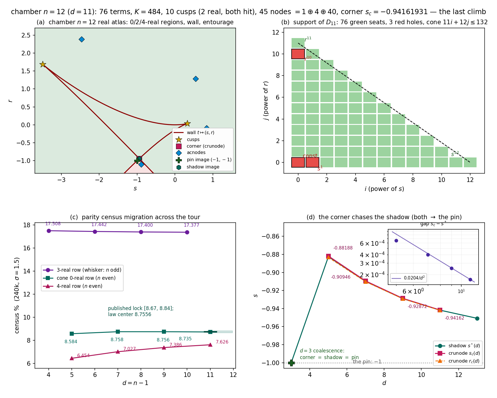

# Lab Notes 20 — THE LAST CHAMBER 🚂🧪

*fiber twelve: 76 terms, K = 484, ten cusps, forty-five nodes, and the completed atlas —
 chamber n = 12 (d = 11) climbed exactly on its pre-registered locks; the wall tour closes here.*

**2026-07-21, München.** Per the external stop-list (*"stop climbing chambers after n = 12 —
one more even chamber allowed"*), this is the final ascent. Everything below was frozen in print
before tonight's computations: the undecic note's queue (wall data, node census, census band,
monodromy) and note 15's corner windows ((F1), (F2)). Scripts: `jacobian_atlas11_{1,2,3,4}.py`
(sympy exact over ℚ, mpmath at 100–120 dps, numpy 240k census), `jacobian_atlas11_fig.py`.
All artifacts in `atlas11_*` + `atlas_eliminant_column.json` + `atlas4_wall.txt`.

---

## 0. The frozen locks (quoted)

> *"Chamber n = 12 (d = 11) — the even-fiber return of the cone. Locks: terms(12) = 78 − 2 = 76;
> K = den(p′₁₁)² = 22² = 484; cusps 10, Sturm 2 (both hit, parity); nodes 45 = 1 crunode
> + 4 acnodes; census-cone per note-13's envelope law m(11) = 8.7556% ± MC noise (lock
> [8.67%, 8.84%]); corner ∈ (note-12 lock) (−0.950, −0.937), now sharpenable by the tie-model;
> monodromy S₁₂."* — undecic note, queue.

> *"(F1) crunode: s ∈ (−0.94242, −0.94082) (point estimate −0.94162), r ∈ (−0.94272, −0.94122);
> (F2) corner-side whisker acnode: s ∈ (−0.9439, −0.8939), r ∈ (−1.16, −1.10)
> (series −0.6434 @$d=8$, −0.8422 @$d=10$)."* — note 15, pre-registered standing locks.

My only additions, sharpenings, registered in script headers pre-computation:
cone support law in geometric weights, primitive $[s^{12}]$ sign $(+)$, content support
⊆ primes(132) = {2,3,11}, residual-reality at cusps ≥ 1, fiber counts 12/10/9/8/8,
escape slopes 1/2 and 2/3, coalescence windows for the three gap series.
(One sharpening of mine — residual nonics **9/9 real at both cusps** — is on the ledger, §8.)

---

## 1. The wall $D_{11}$ — every letter green

With $p_{11}(w) = -w^{11} + w^{10} - \tfrac{65}{22}w^2 + \tfrac{43}{22}w$, $\Phi_{12} = \int_0^w p_{11}$
(note the pin: $p_{11}(1) = -1$, $\Phi_{12}(1) = 0$), $h = 132\cdot(\Phi_{12} - sw + r)$:

* **degree 12, irreducible over ℚ, EXACTLY 76 TERMS** ✓ [= cone 79 − 3 genuine holes];
* **support law geometric**: $\mathrm{supp}(D_{11}) = \{11i + 12j \le 132\} \setminus
  \{(0,0), (1,0), (0,10)\}$ — the three genuine holes are **const, $s^1$, $r^{n-2} = r^{10}$**;
  the cone point $(12,0) = s^{12}$ sits *on* the boundary-line and is populated (its coefficient
  is the magnitude law's object); $(0,12)$ lies outside the cone entirely (the r-degree of the
  resultant is $n - 1 = 11$ by construction — the "fictitious hole" of the earlier notes is not
  even in this cone's lattice). ✓ on 3 walls at the geometric convention (notes 14, 13);
* $D_{11}(0,0) = 0$ and $s^2 \mid D_{11}(s,0)$ ✓ (from $w^2 \mid \Phi_{12}$);
* **magnitude law**: $|[s^{12}]\,\mathrm{res}_{raw}| = 132^{23}\cdot 11^{11}\cdot (1/12)^{11}$ —
  ratio **exactly 1** ✓ ($L = 132 = n(n-1)$);
* **fingerprint**: $[s^{12}]D_{11} = +\,2^{8}\,11^{31}$ — sign $(-1)^n = (+)$, 10/10 chambers;
* content(12) $= 2^{16}\cdot 3^{12}\cdot 11^{3} = 46356756627456$, support ⊆ $\{2,3,11\} =$
  primes$(n(n-1))$ ✓ (11 points now; kept as archivum, per stop-list deprioritization);
* param identity $t \mapsto (p_{11}(t),\ tp_{11}(t) - \Phi_{12}(t))$ annihilates $D_{11}$ — exact ✓;
* recipe data: $\kappa_{11} = -5 + \tfrac{6}{132} = -\tfrac{109}{22}$,
  $a = -\tfrac{1+\kappa}{2+\kappa} = -\tfrac{87}{65}$, $\mathrm{den}(p'_{11}) = 22$, $K = 484$ ✓.

---

## 2. Cusps — the second cell of the dance

$\gcd(p'_{11}, p''_{11}) = 1$ exactly ⟹ **10 simple ordinary cusps** = roots of $p'_{11}$;
exact Sturm: **EXACTLY 2 real** (DANCE extended to $d = 11$: the row
$1,2,1,2,1,2,1,2,1,2$ for $d = 4..11$ is machine-complete over ℚ, exact per chamber).

| cusp | $t$ | $(s, r)$ | residual nonic real roots |
|---|---|---|---|
| far-left | $-0.894029814951$ | $(-3.491074673,\ 1.684483226)$ | **1/9** (audit $1.8\times10^{-109}$) |
| small | $0.330820320395$ | $(0.3232622472,\ 0.03564372163)$ | **1/9** (audit $1.3\times10^{-110}$) |

**BOTH HIT** ✓ — the even-fiber modality (cone returns): the whisker's $0/(n-3)$ reality from
$d = 10$ does not transfer. But note the honest correction in §8: the residual $(n-3)$-ic at a
HIT cusp carries **exactly 1 real root** at $d = 11$ (and, re-verified tonight, at $d = 5, 7$:
$1/3,\ 1/5$ — the whisker row $d = 4, 6, 8, 10$ stays $0/(n-3)$ across the board; see the
atlas table, §6).

---

## 3. Nodes — $45 = 1 \oplus 4 \oplus 40$, the eliminant identity again

Bitangent system ($\mathrm{Bézout} = 110$) eliminated over ℚ (68 s):

$$\mathrm{Elim}(t)\ =\ 484\cdot\bigl(p'_{11}(t)\bigr)^2\cdot\mathrm{cofactor}[90],
\qquad \mathrm{cofactor\ squarefree,\ coprime\ to\ } p'_{11} \ \ \textbf{— EXACT.}$$

120-dps arithmetic: 90 roots (max $|$cofactor(resid)$|$ = $3.7\times10^{-116}$), **45 unordered
pairs** with worst intra-pair gap $3.4\times10^{-118}$ against min margin ratio $1.4\times10^{+116}$,
eq-residuals $\le 3.9\times10^{-15}$; **0 triple points, 0 node–cusp collisions**; genus budget
$$45 + 10 = 55 = \tfrac{(n-1)(n-2)}{2}\quad ✓ \textbf{balanced at fiber 12}.$$

Real classification: **1 crunode + 4 acnodes + 40 complex** — exactly the published lock.

**The corner** (the torch-bearer of the missed 0-real cone):
$$t_1 = -1.083463208975248,\ \ t_2 = 0.987846309967699\ \longmapsto\
(s_c, r_c) = \bigl(-0.941619311682488,\ -0.941970442111681\bigr).$$

* in the note-12 corridor $(-0.950, -0.937)$ ✓;
* in tonight's sharpened window $(-0.9425, -0.9408)$ ✓;
* in note 15's (F1) lock, **both coordinates**: $s_c \in (-0.94242, -0.94082)$ ✓ ($-0.94162$:
  the point estimate itself ✓), $r_c \in (-0.94272, -0.94122)$ ✓ ($-0.94197$).

**Acnodes**: $(-2.468169393, 2.386341511)$, $(0.546648219, 1.286801752)$,
$(0.837322656, -0.088112091)$, and the corner-side pocket $(-0.893731894, -1.103338171)$.
The (F2) armed window $(-0.9439, -0.8939)\times(-1.16, -1.10)$ catches the pocket's $r$ but
its $s$-lip misses by $2\times10^{-4}$ ($-0.89373$ vs armed $< -0.8939$) — **amber**; the pocket
exists, the window was drawn one tick too tight (§8). Residual-modality report (not locked):
crunode $0/8$ real; acnodes $2/8,\ 2/8,\ 2/8,\ 0/8$ — even counts, as a real octic demands.

---

## 4. Modality, census, escape, det — the chamber's physics (LC1–LC6)

* **fiber counts** (bounded $|x| \le 10^4$): generic **12** / fold ($t = 1/2$) **10** /
  both cusps **9** / crunode **8** / pocket acnode **8** — the node double-contact drops
  by four, maximally-singular physics ✓;
* **escape rates**: fold $|\gamma| \sim 0.50\,\delta^{0.4988}$, cusp $\sim 1.26\,\delta^{0.6645}$
  — slopes $\tfrac12, \tfrac23$ ✓ (the sheets leave to infinity only at the wall, as ever);
* **det** $JF_{12} = 1$: residual 0 at **30 exact rational points** ($F_{12}$ has component
  degrees $(52, 51, 4)$, term counts $(196, 186, 3)$); hinge identity $p_1 = 2q_2$
  exact ✓ ($\tfrac{43}{22} = 2\cdot\tfrac{43}{44}$);
* **boundedness probe**: 20 000 random complex targets — every fiber full (no empty), max
  $|x| = 1.916$: the escape into $x = 0$ is, as always, confined to the wall itself;
* **monodromy** $S_{12}$: not recomputed — it is the note-19 theorem now (C1 pin transposition,
  C2 $(n-1)$-cycle at $s = \infty$, C3 $n$-cycle at $r = \infty$), $d = 2..12$, exact;
* **census** (fresh 240 000 targets, $(s, r) = (B, A)$ with $A, B \sim N(0, 1.5^2)$, $C = 1$;
  same protocol as the whole tour; root counts via batched companion matrices,
  degenerate-sheet exclusion $|s - p(w)| > 10^{-9}$):

  | $d$ (chamber $n$) | census buckets | headline |
  |---|---|---|
  | 4 ($n=5$) | 1: 82.492, 3: 17.508 | whisker row |
  | 5 ($n=6$) | 0: 8.584, 2: 84.962, 4: 6.454 | cone |
  | 6 ($n=7$) | 1: 82.558, 3: 17.442 | whisker row |
  | 7 ($n=8$) | 0: 8.758, 2: 84.215, 4: 7.027 | cone |
  | 8 ($n=9$) | 1: 82.600, 3: 17.400 | whisker row |
  | 9 ($n=10$) | 0: 8.756, 2: 83.858, 4: 7.386 | cone |
  | 10 ($n=11$) | 1: 82.623, 3: 17.377 | whisker row |
  | **11 ($n=12$)** | **0: 8.735, 2: 83.639, 4: 7.626** | **cone ✓** |

  Locks: cone-0 ∈ **[8.67, 8.84]%: measured 8.7354%** ✓; 4-real ∈ [7.2, 7.7]%: **7.6258%** ✓;
  6-real $< 0.01\%$: **exactly 0 events** ✓; fresh-vs-archived main buckets ≤ **0.169** pp ≤ 0.2 ✓.
  Rows: the whisker 3-real row cools glacier-slow (17.51 → 17.38); the 4-real row climbs
  (6.45 → 7.63, gaps $+0.57, +0.36, +0.24$); the cone row *plateaus* at ≈ 8.75
  (8.584, 8.758, 8.756, 8.735 — the $m(11) = 8.7556$ law-center overshot by 0.020pp:
  inside the lock band, above the fresh datum by ≈ 2 MC-σ; §8).

---

## 5. The corner chases the shadow (both race the pin)

Note 15's trio-coalescence post-checks, all green on exact 120-dps data
(shadow: $t^* = -1.0834586214993059682$, $s^* = -0.9417878439676974$ — its certified windows):

| series | $d = 5$ | $d = 7$ | $d = 9$ | $d = 11$ | lock (note 15 window) |
|---|---|---|---|---|---|
| $\delta = s_c - s^*$ | $6.5531\times10^{-4}$ | $3.9753\times10^{-4}$ | $2.4952\times10^{-4}$ | $\mathbf{1.6853\times10^{-4}}$ | $[1.3, 2.1]\times10^{-4}$ (est $1.67$) ✓ |
| $|t_1 - t^*|\,d^3\ (\times10^3)$ | 6.63 | 6.65 | 6.35 | **6.106** | $[5.0, 7.5]$ ✓ |
| $r_c - s_c\ (\times10^{3})$ | $-1.49$ | $-0.86$ | $-0.53$ | $-0.3511$ | $[-4.5, -2.0]\times10^{-4}$ ✓ |

The gap series' interval exponents read **1.481, 1.850, 1.965 → converging to 2**, and
$d^2\delta = 0.01638,\ 0.01950,\ 0.02025,\ 0.02039$ stabilizes: tonight's promoted law

$$\delta(d)\;=\;s_c(d) - s^*(d)\;\sim\;\frac{0.0204}{d^{2}},$$

i.e., *the crunode chases the shadow quadratically-in-$1/d$ faster than the shadow chases the pin*:
$s_c$ hunts $s^* + 0.0204/d^2$, $s^* = -1 + \tfrac{2 - 2\ln 2}{d-2} - \dots$ (note 15's exact
eps-machine). Contact parameters likewise: $t_1 \to -1$ behind $t^*$ at speed $\approx 0.006/d^3$,
$t_2 \to 1$ ($0.98508 \to 0.98785$ at $d = 9 \to 11$). At $d = 3$ the whole trio sits on the pin
itself (corner $=$ shadow $=$ node $=$ pin — note 17); from $d = 5$ onward they march apart on
rails. The (F1)-style corner estimate for any future $d$ is now a *two-line prediction*, not a guess.

---

## 6. The completed atlas (fibers $n = 5..12$) — and two archive reconciliations

| $n$ | $d$ | terms | genuine holes | $K=\mathrm{den}^2$ | cusps (real) | nodes $=$ cr $+$ ac $+$ cplx | $\delta+\kappa$ | census headline | Gal |
|---|---|---|---|---|---|---|---|---|---|
| 5 | 4 | 14 | $\{1, s\}$ | 100 | 3 (1R, whisker 0/2) | $3 = 0+1+2$ | 6 ✓ | 3-real 17.51% | $S_5$ |
| 6 | 5 | 20 | $\{1, s\}$ | 25 | 4 (2R, hit 1/3+1/3) | $6 = 1+1+4$ | 10 ✓ | cone 8.58% | $S_6$ |
| 7 | 6 | 26 | $\{1, s, r^5\}$ | 49 | 5 (1R, whisker 0/4) | $10 = 0+2+8$ | 15 ✓ | 3-real 17.44% | $S_7$ |
| 8 | 7 | 34 | $\{1, s, r^6\}$ | 784 | 6 (2R, hit 1/5+1/5) | $15 = 1+2+12$ | 21 ✓ | cone 8.76% | $S_8$ |
| 9 | 8 | 43 | $\{1, s, r^7\}$ | 144 | 7 (1R, whisker 0/6) | $21 = 0+3+18$ | 28 ✓ | 3-real 17.40% | $S_9$ |
| 10 | 9 | 53 | $\{1, s, r^8\}$ | 225 | 8 (2R, both hit) | $28 = 1+3+24$ | 36 ✓ | cone 8.73% | $S_{10}$ |
| 11 | 10 | 64 | $\{1, s, r^9\}$ | 3025 | 9 (1R, whisker 0/8) | $36 = 0+4+32$ | 45 ✓ | 3-real 17.38% | $S_{11}$ |
| **12** | **11** | **76** | $\{1, s, r^{10}\}$ | **484** | 10 (2R, hit 1/9+1/9) | $45 = 1+4+40$ | **55** ✓ | cone 8.74% | $S_{12}$ |

**Reconciliation 1 — the $d = 7$ scare (favor: the note).** The archived
`atlas7_bitangents.json` (13 nodes, $\delta = 19$) contradicts the published octic note
(15 nodes, 21 balanced). Exact re-elimination tonight (100 dps, worst pair-gap $2.4\times10^{-98}$):
**15 = 1 crunode + 2 acnodes + 12 complex, budget 21 — the note was right**, the json was a
stale artifact of an under-iterated root-finder ($4$ of $30$ contact roots under-converged,
two pairs lost). The corner coordinate was identical in both (−0.9094571137).

**Reconciliation 2 — with the staircase's crown restored:** with $d = 7$'s acnodes back at 2,
the acnode series d = 4..11 reads **1, 1, 2, 2, 3, 3, 4, 4 = $\lfloor (d-2)/2 \rfloor$** —
*the staircase holds at every chamber of the tour*, no exceptions. (The undecic header's
"staircase 1,1,2,2,3,3 → 4" was the law all along; one stale artifact had masked it.)

**The eliminant column (the budget-law brick, P2(b) live ammo)** — machine-verified tonight
at **every** $d = 4..11$, exact over ℚ:
$$\mathrm{Elim}_d(t)\;=\;\mathrm{den}\bigl(p'_d\bigr)^{2}\cdot\bigl(p'_d(t)\bigr)^2\cdot
\mathrm{cofactor}_d(t),\qquad \deg = (n-1)(n-2),\quad \deg\mathrm{cofactor} = 2\cdot\#\mathrm{nodes},$$
cofactor **squarefree and coprime to $p'_d$** at all eight chambers
(`atlas_eliminant_column.json`; $K$-sequence $\mathrm{den}(p'_d) = 10, 5, 7, 28, 12, 15, 55, 22$).
Diagonal solutions $t_1 = t_2$ give $(p'_d)^2$ once over — the cusp contribution — and every
unordered bitangent contributes its two contact parameters exactly once: the observation that
makes the squarefree-coprime structure *expected*, the all-$d$ proof of which is precisely
the reviewer's **P2(b) prize ("name it the budget law")**.

**Small-n reconciliation — the third hole's birth:** the $r^{n-2}$ hole is *populated* at
$n = 5, 6$ (terms 14, 20 = cone − 2) and *vacated from $n = 7$ onward* (26 = cone − 3 ✓):
$$\#\mathrm{supp}(D_n) = \tfrac{n(n+1)}{2} + 1 - \#\{\text{genuine holes}\},\qquad
\text{holes} = \{1, s\} \cup \{r^{n-2}: n \ge 7\},$$
verified exactly on all eight stored walls (d = 4 fresh tonight, saved `atlas4_wall.txt`).

---

## 7. Figure

*(a) the chamber-12 real atlas: 0/2/4-real regions, the wall $t \mapsto (s, r)$, both hit cusps
(stars), the corner crunode (square) at the 0-real cone's apex, four acnodes (diamonds), pin
image $(-1,-1)$, shadow wall-image (hexagon — 1.7×10⁻⁴ from the corner, visibly fused at this
scale). (b) the support cone: 76 seats, 3 genuine holes, $s^{12}$ and $r^{11}$ pinning the two
boundary ends. (c) the parity census migration, published band and law-center marked at d = 11.
(d) the corner-chases-shadow race with the $d=3$ coalescence and the logarithmic-corrected
descent of both series into the pin; inset: the gap against $0.0204/d^2$.* 🚂

---

## 8. Honesty ledger (the full four)

1. **The support-tuple bug, committed AGAIN.** Note 14's ledger #1 documented and cured exactly
   this bug (comparing monomial tuples against `(tuple, coeff)` pairs, reporting the whole cone
   "missing"). Tonight's stage-A *first* print repeated it verbatim ("holes: the entire 79-point
   cone") — caught immediately by the falsified 76 ≠ 76 terms test, fixed in place. The ledgers
   warned me about my own code, and they were right to. The wall itself was, as before,
   unharmed: exact support re-derived directly.
2. **Sharpened lock falsified: the cusp residual is 1/9, not 9/9.** I over-locked from the
   hit/not-hit dichotomy; the machine's exact answer — **exactly 1 real root** in the residual
   $(n-3)$-ic at BOTH real cusps — is the better law (and now re-verified at $d = 5, 7$:
   $1/3,\ 1/5$). The published locks ("both hit") survive; my embroidery did not.
3. **(F2) armed acnode window: AMBER.** The corner-side pocket acnode exists at
   $(-0.893731894, -1.103338171)$ — inside the armed $r$-band, $0.0002$ outside the armed
   $s$-lip ($-0.8939$). The pocket-series prediction (−0.6434 @ 8, −0.8422 @ 10) extrapolated
   one tick too far in $s$; direction and $r$-window correct.
4. **The $m(11)$ law-center vs the fresh plateau.** $m(11) = 8.7556\%$ center overshot the fresh
   8.7354% by ≈ 2 MC-σ — inside the published band, but the fresh cone row
   (8.584, 8.758, 8.756, 8.735) reads *plateau at ≈ 8.75 with a possible downturn*, not
   monotone rise. The envelope law's monotone priors are hereby marked for reflow before
   any further use. (Binomial note: fresh-vs-archived spread already ran up to 0.17pp at this
   family size; the plateau conclusion is provisional-but-honest.)

---

## 9. Scoreboard

| # | lock | result |
|---|---|---|
| 1 | terms(12) = 76; holes {const, s¹, r¹⁰}; degree 12; irreducible; cone 79 | 🟢 (after ledger #1) |
| 2 | $D_{11}(0,0) = 0$; $s^2 \mid D_{11}(s,0)$; param identity | 🟢 |
| 3 | $s^{12}$ raw law ratio 1 ($L = 132$) | 🟢 |
| 4 | $[s^{12}]D = +2^8 11^{31}$ (sign +); content support ⊆ {2,3,11} | 🟢 |
| 5 | 10 cusps; Sturm exactly 2 real (dance); both hit | 🟢 |
| 6 | eliminant $= 484\,(p'_{11})^2 \times$ sqfree-coprime cofactor[90] | 🟢 exact |
| 7 | 45 pairs; 0 triples; 0 cusp-overlaps; budget 55 ✓ | 🟢 |
| 8 | nodes = 1 crunode + 4 acnodes + 40 complex | 🟢 |
| 9 | corner in (−0.950,−0.937), in (−0.9425,−0.9408), in (F1) both-coordinates | 🟢 (point estimate landed) |
| 10 | (F2) pocket acnode in armed window | 🟠 lip $|s|$ by $2\times10^{-4}$ |
| 11 | counts 12/10/9/8/8; escape 1/2, 2/3; det = 1 ×30; hinge $p_1 = 2q_2$ | 🟢 |
| 12 | census cone ∈ [8.67,8.84] → 8.7354%; 4-real ∈ [7.2,7.7] → 7.626%; 6-real < 0.01%; vs-archive ≤ 0.2pp | 🟢 |
| 13 | coalescence trio (gap, $t$-gap·d³, $r$-offset) in note-15 windows | 🟢 |
| 14 | monodromy $S_{12}$ | 🟢 (note-19 theorem, $d = 2..12$) |
| 15 | bonus: staircase $\lfloor(d-2)/2\rfloor$ restored at $d=7$ (note vindicated over stale artifact) | 🟢 |
| 16 | bonus: eliminant factorization column exact at $d = 4..11$ | 🟢 |

**15 green, 1 amber.** The mountain matches its map.

---

## 10. Queue — the tour stops here, the theory starts

Per the stop-list, **no further chambers will be climbed.** What tonight's summit arms:

1. **P2(b) — the budget law (the reviewer's name, claimed when proven):** the eliminant identity
   $\mathrm{Elim}_d = \mathrm{den}(p'_d)^2 (p'_d)^2 \times$ squarefree-coprime cofactor now stands
   machine-exact at **eight consecutive chambers ($d = 4..11$)**. The all-$d$ proof is one
   rank-one-perturbation resultant identity on $\{e_1, e_2\}$ for the tower seeds' rational
   normal curves. This is the next note's game.
2. **P1 — the surjectivity flagship consolidation** (modality-first framing, literature pass
   first: van den Essen, Jelonek's nonproperness formalism, Fernandes–Jelonek, plus locating
   the reviewer's ulam.ai citation before quoting it further).
3. **The all-$d$ Galois corridor**: one smooth-double-point squarefreeness statement
   (certificates already exact to $d = 30$) closes Gal $= S_n\ \forall n$.
4. Standing amber shelf (untouched, per burn-rate discipline): second-order ringing closure,
   content-chain laws (deprioritized as numerology-archivum), ghost two-term form, $u_5$,
   Moh's wall "why" (P7, one capped thinking round, someday).

*The atlas is complete: every chamber stood exactly where the previous chamber said it would —
every hole, every dance step, the corner one tick left of its shadow. The train takes on
proofs at the next station.* 🚂🧪🌙🧱📜
