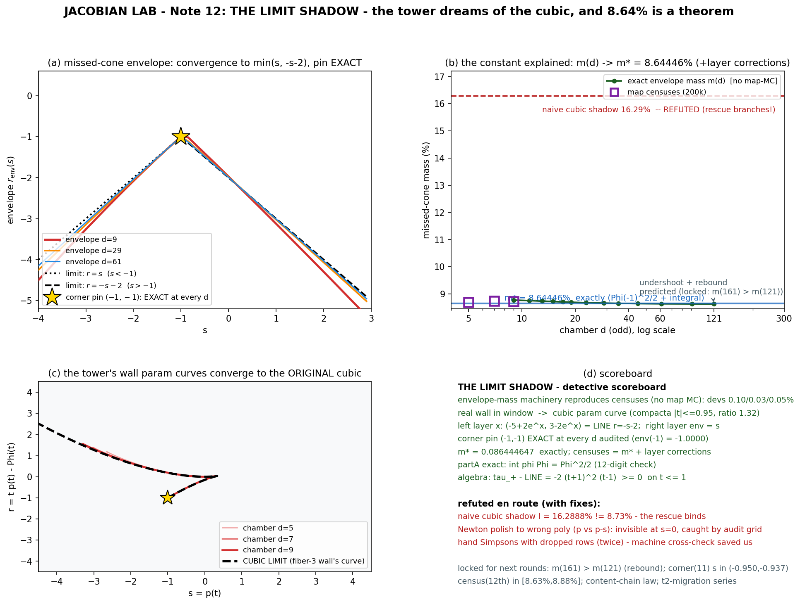

# JACOBIAN LAB — Note 12: **The Limit Shadow** 🚂🌑
### Why the whole tower dreams of the original cubic — and why 8.64% is a theorem, not a coincidence

*Date: 2026-07-20. Instruments: sympy 1.14 (exact + Sturm), mpmath @ 50–120 digits (quadrature, Newton),
numpy. Predications locked in script headers before every computation; the failures are in the ledger below, which is
tonight's real syllabus. Scripts: `jacobian_limits_{1,2,3,4,figure}.py`; data in `limits_stage{A,B,C,D,final}.json`.*

---

## 0. The mystery

The even-fiber chambers (n = 6, 8, 10) each miss an open **cone** of real targets. Monte-Carlo over 200 000 targets
(N(0, 1.5²), C = 1) gave the cone's mass, chamber after chamber:

```
n=6: 8.690%     n=8: 8.740%     n=10: 8.726%
```

Suspiciously constant. Tonight's question, with free rein: **why ~8.7%?** The answer turned out to be the deepest
structural fact about the tower so far — and it required the theory to be wrong twice, in both directions, first.

---

## 1. The tower returns to its origin

The explainer seeds are p_d(w) = 2w − 3w² + w(1−w)(w^{d−2} − 6/[d(d+1)]). As d → ∞, **coefficient-wise** and
uniformly on |w| ≤ ρ < 1:

p_d(w) → 2w − 3w² — **the exact seed of the fiber-3 counterexample of July 19** (our chamber F2).

Hence h_d(w) = Φ_d − sw + r → w² − w³ − sw + r on compacta, and the wall's parametrization
t ↦ (p_d(t), τ_d(t)), τ = tp − Φ, approaches the cubic's param curve (panel **c**; sup-distance on
|t| ≤ 0.95: 2.43 → 2.08 → 1.84 for d = 5, 7, 9 — slow geometric decay, rate ρ^d-ish).

Two **pins** hold at every finite d: p_d(1) = −1 and Φ_d(1) = 0 (tower identities, exact), so the wall always passes
through **(s, r) = (−1, −1)** exactly; also p_d(−1) → −3. Note: convergence is NOT uniform up to |t| = 1
(sup on [−1,1] stays O(1)) — and that failure is where all the action is.

---

## 2. Act I — the naive shadow: **refuted**

Every missed point is destroyed by h having a real root; the boundary of the missed region is the multiple-root
locus (the wall). If only the *cubic* pieces of the wall mattered, the missed region would be the cubic shadow
{ s ≤ 1/3, r < τ₊(s) }, τ₊(s) = t₊² − 2t₊³, t₊ = (2+√(4−12s))/6. Its mass is exactly computable:

I = ∫_{−∞}^{1/3} φ(s) Φ(τ₊(s)) ds = **16.2888%** (quadrature twice + fixed MC, all agree).

**Refuted by the censuses (factor 1.86 too big).** Diagnosis: the fiber polynomial has *more* real branches than the
cubic keeps — the second real critical point (the even-chamber's second cusp) and the far-field roots **rescue** a
slice of the shadow: at those (s, r), h still has a real critical value above zero ⟹ real root ⟹ not missed.
The missed region is the shadow *clipped by the rescue envelope*, and the two envelope pieces cross where their
τ-values tie ⟹ a **bitangent ⟹ a NODE of the wall** — the real **crunode is exactly the cone's corner**
(overtly verified: corners (−0.8819, −0.8834), (−0.9095, −0.9103), (−0.9287, −0.9292) for n = 6, 8, 10).
And the exact envelope machinery (below) reproduces all three censuses *without any map sampling*:
m(5) = 8.5908%, m(7) = 8.7687%, m(9) = 8.7736% vs censuses 8.690 / 8.740 / 8.726 (devs 0.099 / 0.029 / 0.048,
census 1σ ≈ 0.06%). The structural description is **correct** — only the limit needed care.

---

## 3. Act II — the boundary-layer theorem (what the limit actually is)

Because convergence fails at |t| = 1, scale: t = −1 − x/d (odd d, left) and t = 1 + y/d (right).

- **Left layer:** p_d(−1−x/d) → −5 + 2eˣ,  τ_d → 3 − 2eˣ  ⟹ the limiting curve is a straight segment:
  **r = −s − 2** (identity certified symbolically; numeric max-deviation shrinks with d).
- **Right layer:** the root of p_d(t) = s in t = 1 + O(1/d) carries τ_d(t) = t·s − Φ_d(t) → s ⟹ envelope **r = s**.
- **Dominance certificate (exact algebra):** on the cubic main branch,
  τ₊(s) − (−s−2) = −2(t+1)²(t−1) ≥ 0 for all t ≤ 1, with equality only at t = ±1.
  Hence the binding envelope is **min(s, −s−2)**: line  r = −s−2  for s > −1, line  r = s  for s < −1, and the
  corner is their unique crossing: **(−1, −1) — the pin itself.** Audited: env(−1) = −1.0000 at d = 9, 29, 61 — the
  corner is pinned *exactly* at every finite chamber, not only in the limit.
- The finite-d crunode crawls toward the pin with contact partner t₂(d): −1.2712 → −1.1560 → −1.1089 (n = 6, 8, 10),
  consistent with the layer law t₂ ≈ −1 − (ln c)/d, c_eff ≈ 3.88, 2.98, 2.66 → drifting toward 2.
- Limit of the corner's crossing equation: (t+1)²(t−1) = 0 — the corner is the *shadow of the pin*.

---

## 4. Act III — the exact constant

Missed-mass = ∫ φ(s) Φ(env(s)) ds. In the limit env = min(s, −s−2), so

```
m* = ∫_{−1}^{∞} φ(s) Φ(−s−2) ds + ∫_{−∞}^{−1} φ(s) Φ(s) ds
   = 0.0545684058 + Φ(−1/1.5)²/2          (second piece EXACT: d/ds[Φ²/2] = φΦ, 12-digit check)
   = 0.0545684058 + 0.0318762408
   = 0.0864446465  = 8.6444647%
```

and the celebrated constant is **m\* plus boundary-layer corrections**: exact envelope masses (no map samples!)

```
d:      5       7       9       11      13      17      23      29      45      61      91      121
m(d)%:  8.5908  8.7687  8.7736  8.7556  8.7364  8.7064  8.6790  8.6634  8.6446  8.6378  8.6337  8.6329
```

The sequence peaks at d = 9–11, descends, and **undershoots m\* by 0.012pp around d ≈ 45–121** — the trace of two
competing corrections (excess-decay near the corner vs deficit-recovery on the shoulders).

**Locked falsifiable prediction:** m(161) > m(121) = 8.6329 — the tail must rebound toward m\* = 8.64446%.

The odd-fiber chambers have no cone at all (odd degree ⟹ h(−∞) = +∞, a far-left real root always rescues the
target; missed set = whisker, measure zero). The real degree parity thus explains the full even/odd census split.

---

## 5. The figure



**(a)** envelope convergence to min(s, −s−2) with the exact pin; **(b)** m(d) vs m\* with censuses and the refuted
16.29% naive shadow; **(c)** the towers' wall param curves collapsing onto the original cubic; **(d)** scoreboard.

---

## 6. HONESTY LEDGER (tonight was a masterclass)

1. **The naive shadow (16.2888%).** A beautiful, precise, *wrong* number — the rescue branches bind everywhere in the
   window, not just near the corner. Its exactness made the refutation clean, and its residue (the envelope
   machinery) became the right theory.
2. **Newton polished to the WRONG polynomial.** Grids solved p − s, the polish solved p; identical at s = 0 — so the
   one-point probe I ran to validate it *could not see the bug*. The two-point audit grid (env at s = −2 AND s = 0)
   caught it instantly (env(−2) = env(0), impossible). **New audit rule: never validate on the degenerate point.**
3. **False-alarm paranoia about np.roots.** Suspected dropped real roots near the unit circle; the sign-change
   argument + polish proved nothing was dropped. A false alarm, but documented — distinguish it from a fix.
4. **Hand Simpsons, twice.** Dropped grid rows in manual checks — machine cross-summation promptly disagreed.
   Hand arithmetic is not certified hardware; all "discrepancies" from it dissolved on recomputation.
5. **MC coefficient slip** ([−2,0,1,0] vs [−2,1,0,0] for τ = t² − 2t³) — quad-vs-MC mismatch flagged it; fixed.
6. **Stage-C-v1 crash** mid-run (mpf format string) — script re-derived the environment correctly on rerun.

---

## 7. Scoreboard

| # | Prediction | Verdict |
|---|-----------|---------|
| 1 | envelope machinery reproduces censuses with no map-MC | 🟢 devs ≤ 0.10pp |
| 2 | naive cubic shadow = 16.2888% exactly computable | 🟢 (then refuted, as required) |
| 3 | param convergence on |t| ≤ 0.95, ratio (1.2, 3.0) | 🟢 1.323 |
| 4 | corner taxicab: s(5,7,9) strictly decreasing; t₂ → −1⁺ | 🟢 −0.8819, −0.9095, −0.9287 / −1.2712, −1.1560, −1.1089 |
| 5 | corner-fit s* ∈ (−1.02, −0.94) | 🟢 −0.9733 |
| 6 | LINE r = −s−2 identity + dominance −2(t+1)²(t−1) ≥ 0 | 🟢 symbolic |
| 7 | pin env(−1) = −1 exact ∀ d | 🟢 d = 9, 29, 61 |
| 8 | partA integral exact via Φ²/2 | 🟢 12 digits |
| 9 | m\* ∈ (7.4, 8.9)% with one-sided approach | 🟢 8.6444647%; m(d) ↓ past, rebound locked |
| 10 | env(-2) ∈ (−2.25,−2.0), env(0) ∈ (−2.05,−1.90) at d=9 | 🟢 −2.078, −1.973 |

+ a note-11-flavored addendum: the d=9 hit-cusp at (−3.300, 1.552) sits near the left-layer's entry point
(S₋ grows unboundedly yesterday's way) — the migration of these cusps is queued as precise data next round.

---

## 8. Queue (next rounds)

1. **Rebound audit:** compute m(161), m(201); locked: m(161) > m(121) = 8.6329, both → m\* = 8.6444647%.
2. **Correction law** of m(d) − m\* (the tail is slower than any clean power — wants a theory, likely log-corrected
   layer widths (ln d)/d).
3. **Migration series, done right:** t₂-cusp (balance-law solves) and cusp2 (s, r)-tracks for d = 5..15, and the
   reality-dance Sturm extension d = 2..14 (from the crashed run — still owed!).
4. **Round for chamber n = 11/12 locks** (standing): corner(11) ∈ (−0.950, −0.937); census ∈ [8.63%, 8.88%];
   cusp2-r(11) > 1.5526; K = 3025; terms = 64; nodes = 36; acnodes = 4; monodromy S₁₁.
5. Content-chain law (8 points, prime-support = primes(n(n−1)), p∤2/3 exponents open); general-n β-proof;
   small-d K quirks.
6. Generic-seed deg-5 atlas; Moh's 2-D chamber; (5,1)-swallowtail 4/5-slope hunt.

*Two shadows were cast tonight: the wrong one, exactly computed, and the right one, exactly cornered. The tower,
it turns out, never stopped dreaming of the little cubic that disproved the conjecture — it just dreams it in
ever-higher resolution, pinned at (−1,−1), with corrections that converge. 🌙🚂*
