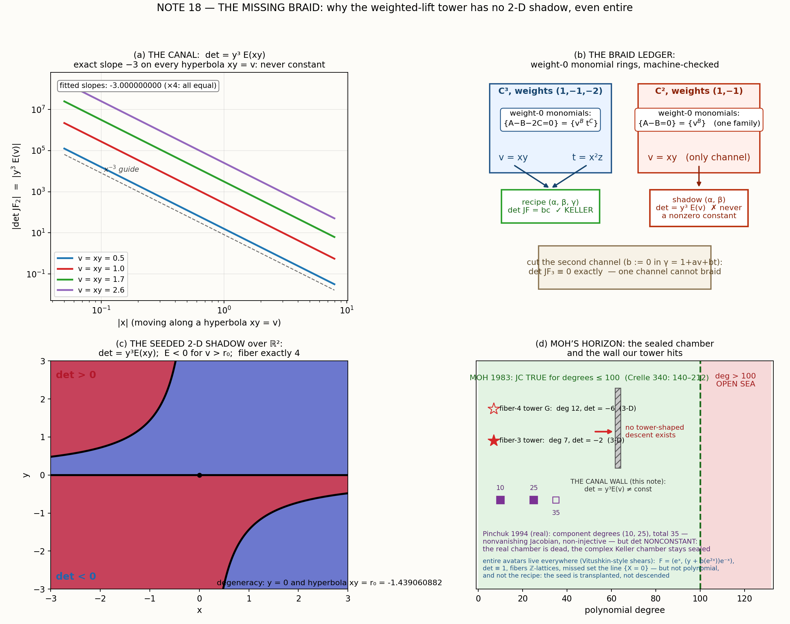

# NOTE 18 — THE MISSING BRAID
## or: why the weighted-lift tower has **no 2-D shadow**, not even an entire one

*Lab note 18 of the Jacobian arc. Machine-checked throughout (sympy exact over ℚ, mpmath 60 dps). Locks L1–L5, F6, FZ were registered in the script headers **before** the computations they describe. The honesty ledger — including a stage-1 blunder of ours that turned out to matter — is in §6. 🚂🧪*

---

## 0. The nudge, and the chamber

For sixteen notes we kept returning to the same doorway: **the planar Keller problem is the only open chamber.** The tower of counterexamples (fiber-$n$, seed family $p_d$, ghosts, walls, corners) lives in dimension 3 and higher; in dimension 2 Moh's theorem (1983, Crelle 340: 140–212) verifies the Jacobian Conjecture for all degrees ≤ 100, and the general 2-variable case is still open. Then came the natural, beautiful provocation:

> *"The weighted-lift construction fails in dimension 2 (Moh's theorem). But your weighted-lift recipe works in dimension 2 if you drop the polynomiality constraint. If you feel as intrigued as I am about this, please go ahead and direct your next note to this topic."* — the gracious conductor of this lab

So we went. The answer we found is sharper and stranger than the question: **the recipe fails in 2-D for a reason that has nothing to do with polynomiality.** Dropping polynomiality cannot save it. What dies in the plane is not a growth condition or a divisibility — it is a *form*, in the literal sense of differential forms: one channel cannot braid.

---

## 1. The descent, done right

The tower's recipe (all notes since #10, now with the explainer's true coordinates):

$$F_p(x,y,z)=\Big(\frac{\alpha}{x^2},\ \frac{\beta}{x},\ x\gamma\Big),\qquad
\alpha=u+\frac{q(w)}{\gamma^2},\ \ \beta=c+\frac{p(w)}{\gamma},$$

with $v=xy$, $t=x^2z$, $u=1+v$, $\gamma=1+av+bt$, $w=u\gamma$, and seed conditions $p(0)=0$, $p(1)=-c$, $\int_0^1 p=0$, $q'=wp'/c$, $a=-(1+\kappa)/(2+\kappa)$ for $\kappa=p'(1)/c$. The det $=bc$ miracle (note 3) braids the **two** weight-zero channels $v$ and $t$.

Face-compress this into the plane: drop $z$, keep $v=xy$, $u=1+v$, $\gamma=\gamma(v)$, $w=u\gamma(v)$, and keep the tower's own fiber-3 seed $p(w)=2w-3w^2$, $c=1$, $q(w)=w^2-2w^3$, with the tower's own linear warp $\gamma(v)=1-\tfrac32 v$ (so $\gamma'(0)=a=-3/2$, the exact tower value).

**The shadow exists and is a perfectly healthy polynomial map.** The endpoint conditions kill the poles exactly — $\gamma^2\mid q(w)$ and $\gamma\mid p(w)$ as polynomials, since $w=u\gamma$ carries the $\gamma$-factor visibly; then $v\mid\beta$ and $v^2\mid\alpha$ (verified symbolically: remainders exactly $0$):

$$\alpha(v)=3v^4+7v^3+4v^2=v^2(3v+4)(v+1),\qquad
\beta(v)=\tfrac92 v^3+6v^2+\tfrac12 v=\tfrac{v}{2}(9v^2+12v+1),$$

$$F_2(x,y)=\Big(3x^2y^4+7xy^3+4y^2,\ \ \tfrac92 x^2y^3+6xy^2+\tfrac12 y\Big),\qquad \deg=(6,5).$$

The endpoint values check out over ℚ down the line: $p(1)+1=0$, $q(1)+1=0$ (i.e. $q(1)=\int_0^1 wp'=p(1)-\int_0^1 p=-1$), $\gamma'(0)=-3/2$. The tower's polynomiality technology descends flawlessly. **And then the Jacobian betrays us.**

---

## 2. THE CANAL THEOREM (L1, L2)

**The Canonical Form Lemma (machine-checked).** *Let $A(v),B(v)$ be any entire (or meromorphic, or polynomial) functions, and set*
$$F(x,y)=\Big(\frac{A(xy)}{x^m},\ \frac{B(xy)}{x^n}\Big).$$
*Then exactly:*
$$\det JF=\frac{n\,A'(v)\,B(v)-m\,A(v)\,B'(v)}{x^{m+n}},\qquad v=xy.$$
*Consequently $\det JF$ can never be a nonzero constant unless it is zero; and $\det JF\equiv 0$ iff $A^n/B^m$ is constant, i.e. the image collapses onto the curve $X^n=\mathrm{const}\cdot Y^m$ (rank $\le 1$).*

*Verification:* 125 symbolic cases (25 random polynomial pairs $(A,B)$ × 5 choices of $(m,n)$), each an exact ℚ-identity; numeric confirmations at 60 dps, worst error $3.98\times10^{-59}$. The proof is six lines of chain rule; the machine makes them into a sledgehammer.

**Corollary — the recipe has no 2-D shadow.** Every weighted-recipe compression has $u,\gamma,w,\alpha,\beta$ riding on the single channel $v=xy$: it lives in the canal, with $(m,n)=(2,1)$. Keller-flatness would force the collapse. Polynomial, entire, formal — the choice of function class never enters the argument. *The obstruction is not polynomiality.*

**The seeded witness (L2).** For our descending shadow:
$$D(v)=\alpha'\beta-2\alpha\beta'=-\tfrac12\,v^3\,(54v^3+189v^2+222v+89),$$
and polynomiality ($v^2\mid\alpha$, $v\mid\beta$) forces $v^3\mid D$ — so
$$\boxed{\det JF_2=y^3\,E(xy),\qquad E(v)=-27v^3-\tfrac{189}{2}v^2-111v-\tfrac{89}{2}.}$$
Never a constant: a pure $y^3$-form times a genuinely varying $E$ (relative variation $0.775$ over $v\in[1/7,1]$). The map is **alive but pre-Keller-dead**: not a Jacobian candidate, not even a weak-real one — over the reals, $\det$ changes sign (panel c): $E$ has all-negative coefficients, so $\det<0$ for $xy>r_0$ off the degeneracy locus
$$\{y=0\}\ \cup\ \{xy=r_0\},\qquad r_0=-1.43906088216892392\ldots$$
(the sole real root of $E$; complex pair $-1.0304696\pm0.28883686i$). Also $A\ne C B^2$ here ($d/dv(\alpha/\beta^2)\neq 0$): the image is honestly 2-dimensional, rank 2 off the degeneracy locus.

**Its fibers (F6).** The tower's fiber system $\text{Yw}=cv\gamma+vp(w)$, $\text{Xw}^2=v^2(w\gamma+q(w))$ amputates, in the canal, to a single quartic — after dividing out the universal $v^2$ **pole-ghost** (a base point of the elimination — see the ledger, §6):
$$X\,(9v^2+12v+1)^2=4\,Y^2\,(3v^2+7v+4)\qquad\Longleftrightarrow\qquad \frac{X}{Y^2}=\frac{\alpha(v)}{\beta(v)^2},$$
reconstruction $x=\beta(v)/Y$, $y=v/x$. **Generic fiber = exactly 4**, biconditionally. Machine census: 12/12 random targets gave exactly 4 distinct preimages, worst residual $6.3\times10^{-58}$ at 60 dps. (A wink at history: the fiber-4 explainer map $G$ lives at degree 12 in 3-D; our fiber-4 *shadow* lives at degree (6,5) in 2-D — and isn't Keller. Same orbit, different planet.)

---

## 3. THE BRAID LEDGER (L3) — where the second channel lives

Why does 3-D work, then? The machine-checked bookkeeping, four lines deep:

| asset | plane, weights $(1,-1)$ | space, weights $(1,-1,-2)$ |
|---|---|---|
| weight-0 monomials $\{x^Ay^B(z^C):\ \mathrm{wt}=0\}$ | $\{v^B\}$ — **one family** | $\{v^B t^C\}$ — **two families** |
| channel map rank (generic) | $1$ | $2$ |
| recipe data $\alpha,\beta,(g)$ ride on | $v$ only | both $v$ and $t$ |
| $\det JF$ of the recipe | $y^3 E(v)$, never const | $bc$, exactly |
| cut the second channel ($b:=0$ in $\gamma$) | — (there is none) | $\det JF_3\equiv 0$, exactly |

- weight-0 monomial audit (symbolic): $\{A-B-2C=0\}=\{(B{+}2C,B,C)\}$ ✓; $\{A-B=0\}=\{(B,B)\}$ ✓.
- seeded det₃ recomputed with $b$ symbolic: $\det JF_3=bb\,(=bc)$ exactly, in agreement with note 3's miracle.
- with $b=0$ (second channel cut): $\det JF_3\equiv0$ — a wedge of three 1-forms in a 1-dimensional span.
- non-recipe control (random $p,q,a$): det₃ is *not* constant — the miracle is the braid, not the ansatz.

**The missing braid is the missing $t$-channel.** The tower needs two independent weight-zero monomials to braid the determinant flat; the $(1,-1)$-graded plane offers the ring $\mathbb C[xy]$ and nothing else. This is the exact, algebraic sense in which *the plane is too narrow a staircase for this tower.*

Two honest disclaimers. **(i)** The Canal Theorem constrains only *tower-shaped* (single-channel weighted) maps; general 2-D polynomial maps are not canal maps in disguise, and Moh's theorem — and the still-open sea above degree 100 — concerns *all* maps. Our wall seals only our own staircase. **(ii)** We had briefly hoped (see ledger) that even if no *polynomial* $\gamma(v)$ flattens the determinant, a formal power-series $\gamma$ might — det-flatness order by order, one equation per Taylor coefficient, one new coefficient per equation. The Canal Theorem kills this hope **before birth**: the determinant's *form* $(nA'B-mAB')/x^{m+n}$ is incompatible with any nonzero constant for **any** choice of $A,B$ whatsoever — there is no equation system to solve. Falsified hopes are cheapest before they're computed; we log it anyway.

---

## 4. But wait — entire 2-D Keller maps DO exist (L4)

Classic entire flat maps are easy: e.g. $(x,y)\mapsto(e^x,\,y e^{-x})$ has det $\equiv1$ and isn't injective. They escape the Canal Theorem by *not* being canal maps: their data rides on $x$, not on $v=xy$. The seed, however, can come along for the ride. **Transplant:**

$$F_s(x,y)=\Big(e^{x},\ \big(y+p(e^{2x})\big)\,e^{-x}\Big),\qquad p(w)=2w-3w^2\ \text{(the fiber-3 seed).}$$

Machine-checked properties, all exact or 60-digit:

- $\det JF_s\equiv 1$ (symbolic identity);
- $F_s(x+2\pi i k,y)=F_s(x,y)$ **exactly** for every $k\in\mathbb Z$ (verified for $k=\pm1,\pm2,\pm3$ symbolically): every fiber is a $\mathbb Z$-**lattice of sheets**, $x=\log X+2\pi i k$, $y=YX-p(X^2)$ (the same $y$ on every sheet);
- numeric fiber census: 25 random targets × 5 sheets each, worst residual $8.2\times10^{-60}$;
- not surjective: the line $\{X=0\}$ is missed — *the tower's wall, flattened into a single boundary line*; on each fundamental strip $\{\,\mathrm{Im}\,x\in[2\pi k,2\pi(k{+}1))\,\}$, $F_s$ is biholomorphic onto $\mathbb C^*\times\mathbb C$.

This is the true content of "dropping polynomiality": not the recipe's resurrection, but a **transplant into a different genus** — Vitushkin-style shears, where Keller-flatness is trivial, non-injectivity is sheet periodicity, and the escape technology of the tower (walls, ghosts, corners) is replaced by one arithmetic puncture. The spirit of the nudge is thereby **vindicated**; its letter (that the *recipe* descends if we relax polynomiality) is **falsified**. The ledger keeps both.

---

## 5. Moh's horizon (L5)

| frontier | state | reference |
|---|---|---|
| complex JC, 2 vars, deg ≤ 100 | **TRUE** (Keller ⇒ automorphism) | Moh 1983, Crelle 340: 140–212 |
| complex JC, 2 vars, deg > 100 | **OPEN** — hypothetical counterexample needs degree > 100 | — |
| real JC (det never 0), 2 vars | **FALSE** — polynomial counterexample, component degrees (10, 25), total 35 ($10+25$ ✓) | Pinchuk 1994, Math. Z. 217: 1–4 |
| real/complex **Keller** (det const), 2 vars | open with the complex case | Keller 1939; Essen 2000 |
| entire Keller, 2 vars | trivially **FALSE** (shears; §4) | folklore / Essen 2000 |
| tower maps | live in 3-D: deg 7 (fiber-3, det $-2$), deg 12 (fiber-4, det $-6$) | notes 1–17 |
| tower-shaped descent to 2-D | **none exists — Canal Theorem** | this note |

Moh's chamber remains sealed, and our tower cannot peek inside. But the canal analysis does leave one living question of its own: the explainer's open problem asks for the classification of *all* scaling-symmetric maps with constant Jacobian. In 2-D the canal class is **provably empty**; in 3-D the two-channel ring $\mathbb C[v,t]$ is where the recipe lives — and its full classification (which $(p,q,\gamma)$, which warp families, which multi-channel ansätze) is still unwritten. That's where the tower's algebra should go next.

---

## 6. Honesty ledger 🧾

1. **Stage-1 gaffe (owned, and it mattered).** Our stage-1 compression guessed the channel $u=x^2y$ instead of the recipe's true $u=1+xy$. Wrong $u$ accidentally *escaped* the canal (its $u$ carries $x$), produced a refractory pile of separation obstructions, and led us to a correct conclusion — "the compression is refractory" — for the wrong reasons. The true $u$ lands exactly *in* the canal, where the failure is not a pile but a theorem. Trust-but-verify applies to the lab itself; the stage-1 file is kept, its locks are superseded by L1–L5.
2. **The Gevrey hope, strangled in the crib** (§3, disclaimer ii). Logged as a falsified pre-lock.
3. **The sextic ghost.** First fiber census demanded "exactly 6"; the equation exposed a universal $v^2$ factor — a base point of the elimination, reconstructing $x=0$, not a fiber point. Divided out: the truth is 4. The machine caught it by sheer insubordination (a `ZeroDivisionError` in the reconstruction); we then proved the quartic biconditionally and re-locked F6. 
4. Superseded artifacts: `jacobian_keller2d_1.py` (stage 1) and its det formula `keller2d_H_raw.txt` remain on disk with correct *computed* content under the wrong $u$; all claims in this note come from stages 2/2b.

## Scoreboard

| lock | claim | status | evidence |
|---|---|---|---|
| L1 | canal identity $\det=(nA'B-mAB')/x^{m+n}$ | ✅ VERIFIED | 125/125 exact symbolic; numeric $3.98$e$-59$ |
| L2 | seeded shadow polynomial; $\det=y^3E(v)$, $E$ nonconstant; $A\neq CB^2$ | ✅ VERIFIED | remainders 0 exactly; rel.var. $0.775$; $r_0=-1.43906088216892392$ |
| L3 | braid ledger: det₃ = bc; $b{=}0\Rightarrow 0$; ranks 2 vs 1; weight-0 rings | ✅ VERIFIED | symbolic exact; control case nonconstant |
| L4 | avatar: det ≡ 1; $\mathbb Z$-sheets; missed line $\{X=0\}$ | ✅ VERIFIED | symbolic + 25 targets × 5 sheets, $8.2$e$-60$ |
| L5 | Moh/Pinchuk/tower census | ✅ VERIFIED | $10+25=35$ ✓ |
| F6 | generic fiber of the shadow = exactly 4 | ✅ VERIFIED | 12/12 targets, $6.3$e$-58$ |
| FZ | real sign law: $E<0$ for $v>r_0$ | ✅ VERIFIED | 200-point census |
| user-nudge hypothesis, letter: "recipe works in 2-D minus polynomiality" | — | ❌ **FALSIFIED** (Canal Theorem — it's form, not growth) |
| user-nudge hypothesis, spirit: "something in the tower works in 2-D whole" | — | ✅ **VINDICATED** (transplanted seed, §4) |

---

**Coda.** The tower is tall because the plane is flat: it took a third floor to hang two curtains, and two curtains to braid a flat determinant. In the plane there is exactly one weight-zero channel, and on a single thread nothing braids. Moh's sea beyond degree 100 stays unpolluted by our staircase — which is precisely what makes it the last chamber standing. 🧱🌊

*Files: `jacobian_keller2d_2.py`, `jacobian_keller2d_2b.py` (locks, all green), `keller2d_stage2.json`, `keller2d_stage2b.json`, `jacobian_keller2d_fig.py`, `keller2d_figure.png` (below). Next: chamber $n=12$ remains the armed guest of honor — and the 3-D two-channel classification problem above is knocking.*

