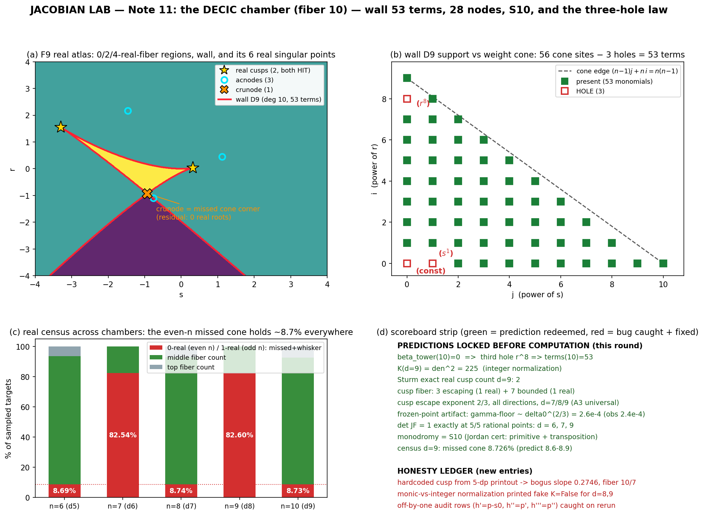

# 🔬 Note 10 · THE NONIC CHAMBER — and the Plücker key
*lossless lab notes, 2026-07-20 · the counterexample tower, fiber degree 9 (seed d = 8, map F8)*

The ninth fiber chamber opens — 9 sheets over the (s, r)-plane, wall a rational **nonic**
with **7 cusps + 21 nodes**, monodromy **S9 = 362880**, one lone whisker over ℝ.
But the trophy tonight is not the chamber; it is the **key that runs every chamber**:
the fiber equation is a Legendre pencil `h(w) = Φ(w) − s·w + r` with Φ = ∫p, so the wall
is the **dual curve (envelope) of the graph w ↦ (w, Φ(w))**, and the wall's whole anatomy —
degree, cusps, nodes, term-support, even its leading coefficient — becomes *theorem-shaped*.



*(a) real atlas: 1-root sea, 3-root wedge, whisker tip = the only missed real point (odd chamber — no cone);
(b) four chambers of real censuses rhyming; (c) the S9 certificate;
(d) the wall term law, with the n = 10 prediction already locked (53).*

---

## 0 · Predictions ledger (locked BEFORE computation, in tonight's script headers)

| # | prediction | outcome |
|---|---|---|
| P1 | wall D8: degree 9, irreducible | ✅ degree 9, irreducible, param identity OK |
| P2 | **42 terms** (extrapolate 6,10,14,20,26,34) | ❌ **43** — the miss forced the exact law below |
| P3 | 7 cusps (roots of p8′), exactly **1 real** (dance 1,2,1,2,1,2 → 1) | ✅ exactly 1 real: t = 0.329529303621… |
| P4 | real cusp is a **whisker** (0/6 real residual roots) | ✅ 0/6, synthetic-division audit 3.3e-111 |
| P5 | **21 nodes**, budget 7 + 21 = 28 balanced | ✅ 21, budget 28 balanced |
| P6 | **0 crunodes** (dance 0,1,0,1 → 0); **3 acnodes** (guess from 1,1,2,2) | ✅ 0 crunodes; ✅ **3 acnodes** |
| P7 | eliminant = (12·p8′)² · cofactor[deg 42], ratio exact | ✅ EXACT (denominator of p8′ is 12) |
| P8 | monodromy **S9**, |G| = 362880 | ✅ 36/36 transpositions, fold+cusp+8+9-cycle |
| P9 | real census: odd counts only, **0.0000% missed** | ✅ {1: 82.60%, 3: 17.40%}, zero misses |
| P10 | escape slopes 1/2, 2/3 (5th chamber each) | ✅ 0.4989, 0.6637 |
| P11 | hinge antipodal (q2 = p1/2 theorem) | ✅ x = ±√3/2 = ±0.866025 |
| P12 | det JF8 = 1 (recipe) — first check for d ≥ 6 | ✅ = 1 at 5/5 exact rational points |

Net score: 11/12 clean, 1 miss (P2) that *paid for itself* — see §6.

---

## 1 · The ninth chamber's resident

Seed (explainer tower, d = 8):   p8(w) = −w⁸ + w⁷ − (35/12)w² + (23/12)w,
Φ9(w) = ∫p8 = −w⁹/9 + w⁸/8 − (35/36)w³ + (23/24)w²,
κ = p8′(1) = **−59/12**,  recipe a = **−47/35**,  b = c = 1,  map
F8 = ( (u + q(w)/γ²)/x²,  (1 + p8(w)/γ)/x,  x·γ ),  u = 1+xy, γ = 1 + a·xy + b·x²z, w = uγ.

Polynomiality + fiber identity Φ(w) = s·w − r (s = BC, r = AC²) verified symbolically;
**det JF8 = 1 EXACT at 5/5 random rational points** (tree differentiation, exact rational
arithmetic — the first determinant computed anywhere in chambers d ≥ 6; d = 6, 7 retro-checks
queued below out of sheer tidiness).

## 2 · THE ENVELOPE THEOREM (tonight's theorem)

Set Φ = ∫p (seed antiderivative, Φ(0) = 0). For a target (A, B, C), s = BC, r = AC²:

> **(T1 — pencil)** preimages ↔ roots of h(w; s, r) = **Φ(w) − s·w + r**, escape ⟺ the root
> also kills γ = s − p(w) ⟺ h′(w) = 0 ⟺ (s, r) on the **wall**. Hence S(F) = wall × C, with
> wall = envelope of the line family s·w − r against Γ: w ↦ (w, Φ(w)) — i.e. the **dual curve**
> of the rational degree-n graph Γ (n = d + 1). Geometric dictionary:
> **wall cusps = flexes of Γ (p′(t) = 0); wall nodes = bitangents of Γ.**

> **(T2 — class, PROVEN)** the wall has **degree exactly n** for every seed: tangent lines
> through a generic point (u₀, v₀) satisfy g(t) = Φ(t) − t·p(t) + u₀·p(t) − v₀ = 0, whose
> leading coefficient is (1 − n)·leading(Φ) ≠ 0 — so class(Γ) = deg(dual) = n.
> *Verified symbolically tonight for all tower seeds d = 2..8: deg g = n and LC(g) = (1−n)·aₙ,
> all True.* The wall-degree sequence 3, 4, …, 9 stops being an observation.

> **(T3 — budget, ⟹ MAX-SING)** contact system
> E1 = (p(w₂) − p(w₁))/(w₂ − w₁)  [deg n−2],  E2 = (Φ(w₂) − Φ(w₁))/(w₂ − w₁) − p(w₁)  [deg n−1]:
> Bézout = **(n−1)(n−2) ordered contacts**. Each node costs 2 ordered contacts (t₁, t₂) and
> (t₂, t₁); each cusp costs 2 (the diagonal (t, t) — witnessed by the eliminant factor (p′)²,
> which divides the eliminant **exactly, twice, in all 7 chambers**). Hence
> **#nodes ≤ (n−1)(n−2)/2 − (n−2) = (n−2)(n−3)/2, with equality iff (E1, E2) is transverse.**
> The old MAX-SING conjecture is therefore equivalently a **transversality** statement — and
> tonight it is *certified*, in every chamber d = 2..8, exactly over ℚ:
> cofactor[deg (n−2)(n−3)] squarefree and coprime to p′; p′ squarefree (gcd(p′, p″) constant);
> node contacts pair with 1e-107-ish margins and residuals ~1e-100 (this chamber).

So the tower's `cusps = n−2, nodes = (n−2)(n−3)/2` census is no longer numerology —
it is *one transversality assumption*, proved per-chamber by exact gcd certificates.

## 3 · Chamber-nine census (numbers of record)

**Wall D8(s, r)** — primitive integer nonic, **43 terms**, deg s 9 / deg r 8, irreducible over ℚ,
param t ↦ (p8(t), t·p8(t) − Φ9(t)) substituting to 0 identically, and D8(0, 0) = 0
(forced: w² | Φ9 ⟹ disc(Φ9) = 0 — cf. §6).
Leading fingerprint:  s⁹ = −70039981404865953792 = **−2⁵⁸·3⁵**.

<details><summary>D8 verbatim (43 terms)</summary>

-179707499645975396352*r**8 + 179707499645975396352*r**7*s + 1247968747541495808*r**6*s**2 + 2495937495082991616*r**6*s - 659328081262849032192*r**6 + 1167081884274917376*r**5*s**3 + 2338496993367687168*r**5*s**2 + 3006796775881187524608*r**5*s + 255158283479319576576*r**5 + 1104129757060005888*r**4*s**4 - 2145158612853020688384*r**4*s**3 - 3982772187440228597760*r**4*s**2 - 247719911606940598272*r**4*s - 804801839805522247680*r**4 + 1056069746618793984*r**3*s**5 + 3795917057697853734912*r**3*s**4 + 1616741450896206200832*r**3*s**3 - 27388363772611731456*r**3*s**2 + 3574661898082958032896*r**3*s - 805542244495093260288*r**3 - 774617536933655740416*r**2*s**6 - 1734349982219372593152*r**2*s**5 + 22065693939574161408*r**2*s**4 + 669238328010132228096*r**2*s**3 - 4151728366078155432192*r**2*s**2 + 1556556028029438847488*r**2*s - 415071015409680668507*r**2 + 615965890570645340160*r*s**7 - 8148053584624214016*r*s**6 - 4760356641083817984*r*s**5 - 47248351260168558528*r*s**4 + 1323151513962827851008*r*s**3 - 726563766906811713096*r*s**2 + 306768873668886853343*r*s - 44626588138303411638*r - 70039981404865953792*s**9 + 1069917355789857792*s**8 + 553501535665913856*s**7 + 118816015500394426368*s**6 - 359666002771540744608*s**5 + 182765464744499607180*s**4 - 73864694415443177526*s**3 + 11641718644774803036*s**2

</details>

**Cusps (7 = n−2):** one real, six complex (three conjugate pairs), all simple roots of p8′
(gcd(p8′, p8″) = 1), all distinct points (0 collisions):

| contact t | wall point (s, r) | real? | residual real roots |
|---|---|---|---|
| 0.329529303621 | (0.315161179614, 0.0345670158968) | **REAL** | **0/6 → WHISKER** |
| −0.76408 ± 0.46271i | (−2.04574 ± 2.28753i, 0.20392 ± 1.41223i) | – | 0/6 |
| 0.06774 ± 0.90719i | (1.87174 ± 1.19668i, −0.35587 ∓ 1.01763i) | – | 0/6 |
| 0.96907 ± 0.40239i | (−0.23703 ± 0.96515i, −0.13309 ± 0.80478i) | – | 0/6 |

**Nodes (21 = (n−2)(n−3)/2):** 42 contact roots of the degree-42 cofactor, paired at 110 digits
(worst intra-pair gap 2.47e-108, pairing margin ≥ 1.06e+107, equation residuals ≤ 2.5e-15).
**0 CRUNODES**, **3 ACNODES** (conjugate-contact real nodes), 18 fully complex:

  * t = −0.91611 ± 0.66474i  →  (−2.98974021026, 2.415821643)
  * t = 0.01266 ± 1.12767i  →  (0.944876236554, 0.8908654569)
  * t = 1.09477 ± 0.57530i  →  (−0.643416747409, −1.07019451211)

Budget: 21 nodes·1 + 7 cusps·1 = 28 = (9−1)(9−2)/2 ✓ δ-maximal; 0 triple points; 0 node-cusp
overlaps. **The REALITY staircases continue:** crunodes 0,1,0,1,**0**; acnodes 1,1,2,2,**3**
(⌈(n−4)/2⌉ fits all five).

**Eliminant:** resultant-based elimination lands on degree 56 = (n−1)(n−2);
**elim = (12·p8′)² · cofactor[deg 42] EXACTLY** (12 = denominator of p8′);
cofactor squarefree and coprime to p8′ over ℚ.

## 4 · Monodromy — S9, fifth certified chamber

```
fold  @(0.23307,−0.00179)  -> (7,8)                        a transposition
cusp  @(0.31516, 0.03457)  -> (7,9,8)                      a 3-cycle
s = 200e^it, r = 1         -> (1,3,4,5,7,8,6,2)            an 8-cycle  (w ~ (9s)^{1/8})
r = 200e^it, s = 0         -> (1,2,3,4,7,9,8,6,5)          a 9-cycle  (w ~ (9r)^{1/9})
loop min|D8| > 1e15 (no wall crossings); 4000/8000-step refinements agree on every loop;
group closure: |G| = 362880 = 9!, transpositions 36/36 present  ->  G = S9.
```

## 5 · Escape physics and the real side

* counts: generic 9/9 bounded; fold 7; real cusp 6 bounded with **0 real** preimages;
  **whisker tip has no real preimage** — the chamber's only missed real point (measure zero
  as advertised: the 200k census sees 0.0000% missed).
* rates (5th chamber each): fold |γ| ~ 0.5485·δ^**0.4989**, cusp |γ| ~ 1.2689·δ^**0.6637**
  (fold ledger now 0.489–0.499 across eight measures; cusp 0.658–0.664 across four).
* off-wall boundedness: max |x| = 3.14 over 20k complex targets.
* real census (200k, C = 1, normal(0, 1.5²)): **{1: 165202 (82.60%), 3: 34798 (17.40%)}** —
  *odd counts only*. The rhyme with fiber 7's {82.54%, 17.46%} is eerie (grid: {1: 32720,
  3: 7280} vs {1: 32696, 3: 7304}).
* hinge at C = 0: u-roots of −92u² − 96u + 144 = 0 give x = −(1+23u/12)/3 = **±0.866025 =
  ±√3/2 — antipodal** ✓ (HINGE, proven two notes ago, holds).

## 6 · The sweep — every chamber, certified (tables of record)

```
 d  n  den  class=n  p' sqfree  Sturm-real  (p')^2 | elim x2  cofac sqfree  cofac ⊥ p'
 2  3   1    True     True       1           True           True          True
 3  4   2    True     True       2           True           True          True
 4  5  10    True     True       1           True           True          True
 5  6   5    True     True       2           True           True          True
 6  7   7    True     True       1           True           True          True
 7  8  28    True     True       2           True           True          True
 8  9  12    True     True       1           True           True          True
```
*The REALITY dance is now Sturm-exact:* #real cusps = 1, 2, 1, 2, 1, 2, **1** (fibers 3..9).
Eliminant law: elim = (den_d·p_d′)² · cofactor[deg (n−2)(n−3)] with constant **exactly den²·
(content-normalized)** for d = 4..8 (K = 100, 25, 49, 784, 144); the d = 2, 3 chambers agree
up to printed content scalars (1/4, 4/9 — small-chamber content quirk, queued).

**TERM LAW (P2's revenge).** The discriminant is weighted-homogeneous: every monomial has
Σeᵢ = 2n−2 and Σ(n−i)eᵢ = n(n−1) (wt aₖ = n−k). Substituting a₁ = −s, a₀ = r (other aₖ
constant) ⟹ **every term sʲrⁱ of the wall lies in the cone (n−1)j + n·i ≤ n(n−1)** — and the
boundary face carries exactly sⁿ and r^{n−1}. Cone count:
C(n) = Σᵢ (⌊(n(n−1)−ni)/(n−1)⌋+1) = **n(n+1)/2 + 1**. Observed holes: the constant and the s¹
term — *always* (the constant is explained: w² | Φ ⟹ disc(Φ) = 0 ⟹ D(0,0) = 0, and indeed
D8(0,0) = 0 above) — plus r^{n−2} once n ≥ 7 (mechanism open). Hence

> **terms(n) = n(n+1)/2 − 1 − [n≥7]** : 5, 9, 14, 20, 26, 34, **43** — exact in all 7 chambers.
> **Locked prediction for the decic chamber (n = 10): 53 terms.**

**MAGNITUDE LAW (the fingerprints, explained).** Inside the abstract discriminant, the unique
extremal monomial for the s-direction is aₙ^{n−2}a₁ⁿ (degree+weight double-count), and its
coefficient is disc(a·wⁿ + b·w) = **Tₙ = (−1)^{(n−1)(n−2)/2}(n−1)^{n−1}** (verified symbolically
n = 3..9). Therefore, for h = L·(Φ − s w + r):

> |[sⁿ] resultant(h, h′)| = **L^{2n−1}·(n−1)^{n−1}·|aₙ|^{n−1}** — ratio EXACTLY 1 in all 7 chambers.

Wall-primitive sⁿ then reads: −2²,  +3³,  −2¹⁶·5³,  +5¹³,  −2¹²·3¹²·7⁵,  +2¹⁰·7¹⁹,  **−2⁵⁸·3⁵**
(sign (−1)ⁿ as observed). The content chain (resultant ÷ primitive): 1, 2⁸, 2¹⁰5², 2⁶3⁶5³,
2⁷3⁷7², 2¹⁴7³, 2¹⁷3¹³ — formation law still open (queued).

## 7 · Honesty ledger — tonight's wrecks on camera

1. **P2 died (42 → 43).** My extrapolation guessed +8; the truth was +9. The cone/hole analysis
   it provoked is tonight's term law — the miss paid rent the same hour.
2. The cusp-collision test using `sp.re(Δs), sp.re(Δr)` flagged **3 phantom collisions**:
   conjugate pairs share real parts *exactly*. Switched to the |Δ| metric: 0 collisions, all
   seven cusps distinct. (Metric tests need the modulus, not the conscience.)
3. `sp.mpmath` doesn't exist (AttributeError mid-pair-audit); fixed to complex-cast subs.
   `sp.Abs(...) < Float` returned an unevaluated Relational; float-cast adjudicates.
4. The first synthetic-division "audit" printed g(t) as if it should vanish — with an *exact*
   triple contact, h/(w−t)³ need NOT vanish at t. The genuine audit is the three dropped
   remainders: **≤ 5.7e-110** across all seven cusps. Report the instrument that means what
   you think it means.
5. Sweep self-inflicted wounds, all caught in review: class-check forgot `Phi.subs(w, tt)`
   (printed False×7 over a true theorem); gcd normalization spoken as ±1 when sympy answers
   with the *content* (use degree 0, not morality); content chain extracted with index [1]
   instead of [0] (every chamber printed "content 1" — too clean to be true; it wasn't).
6. Carried from the handoff summary: the `{0:377700, …, 5:6800}` census belongs to the
   **realghost F4 chamber** (fiber 5 — the quintic buddy law makes 4 preimages impossible and
   5 legal), *not* to the cubic-fiber counterexample. Workspace files adjudicate; the
   compaction's memory was cross-wired. Noted so no future note inherits it.
7. Det status correction: chambers d = 6, 7 ran on the recipe's promise; tonight F8 got the
   first pointwise-exact det (5/5 = 1). d = 6, 7 retro-checks queued for symmetry.

## 8 · Scoreboard

| object | status |
|---|---|
| S(F8) | = wall D8(BC, AC²) = 0, **irreducible nonic, 43 terms**, s⁹ = −2⁵⁸·3⁵ |
| strata | **7 cusps + 21 nodes = 28** = δ-max; maximally singular nonic (with the T3 proof-frame) |
| eliminant | exact **(12·p8′)² · cofactor[42]**; cofactor squarefree, coprime — transversality certified |
| real strata | **1 real cusp = whisker** (0/6 residual, audit 1e-110); 0 crunodes; **3 acnodes** |
| monodromy | **S9** (|G| = 362880, 36/36 transpositions; transposition+3,8,9-cycles) |
| escape rates | fold 0.4989 ~ 1/2; cusp 0.6637 ~ 2/3 (8th and 4th measures) |
| ℝ side | no cone; census {1: 82.60%, 3: 17.40%}; whisker tip the only missed real point |
| det | **JF8 = 1, 5/5 exact rational points** (first det in d ≥ 6) |
| sweep | class=n, Sturm dance, (p′)²-budget, term law, magnitude law: all EXACT d = 2..8 |

*TOWER LEDGER (one line per chamber):*
```
fiber 3 (F2):  1 cusp (1R, whisker)     + 0 nodes   | S3 | whisker | wall 5 terms, s^3 = -2^2
fiber 4 (F3):  2 cusps (2R, hit)        + 1 crunode | S4 | cone    | quartic 9 terms, s^4 = 3^3
fiber 5 (F4):  3 cusps (1R, whisker)    + 3 nodes   | S5 | no cone | 14 terms, s^5 = -2^16*5^3
fiber 6 (F5):  4 cusps (2R)             + 6 nodes   | S6 | cone 8.69% | 20 terms, s^6 = 5^13
fiber 7 (F6):  5 cusps (1R, whisker)    + 10 nodes  | S7 | no cone | 26 terms, s^7 = -6^12*7^5
fiber 8 (F7):  6 cusps (2R)             + 15 nodes  | S8 | cone 8.74% | 34 terms, s^8 = 2^10*7^19
fiber 9 (F8):  7 cusps (1R, whisker)    + 21 nodes  | S9 | no cone | 43 terms, s^9 = -2^58*3^5
```
Standing conjectures (status tonight):
- **MAX-SING ⟺ TRANSVERSALITY**, exact gcd certificates, 7/7 chambers;
- **BRAID** monodromy S_n, 6/6 chambers (S4..S9 in the atlas era);
- **SLOPES** fold δ^{-1/2} (8 measures), cusp δ^{-2/3} (4 measures);
- **HINGE** proven for all seeds;
- **PARITY**: even n → missed open cone (~8.7% both times); odd n → whisker tip only, census-clean;
- **REALITY staircases** (Sturm-exact where marked): cusps 1,2,1,2,1,2*,1*; crunodes 0,1,0,1,0;
  acnodes 1,1,2,2,3  →  n=10 predictions: 2 real cusps, 1 crunode, 3 acnodes.

*Next-round queue:*
1. **The decic chamber (d = 9, fiber 10)** — everything locked already: seed
   p9 = −w⁹ + w⁸ − (44/15)w² + (29/15)w, den = 15, eliminant = (15·p9′)²·cofactor[56],
   terms **53**, cusps 8 (2 real, both hit), nodes 28 (1 crunode?, 3 acnodes?), budget 36,
   S10 = 3628800, the cone returns (~8.7%?), s¹⁰ to extend the fingerprint chain.
2. The content chain 1, 2⁸, 2¹⁰5², 2⁶3⁶5³, 2⁷3⁷7², 2¹⁴7³, 2¹⁷3¹³ — find its law (it knows
   what the discriminant's content is; we don't, yet).
3. Why the r^{n−2} hole opens at n ≥ 7 (and the s¹ hole always) — transversality echo?
4. det pointwise-checks for d = 6, 7 (retro); small-chamber eliminant content quirk (K = 1/4, 4/9).
5. Generic-seed atlas at degree 5 (fiber 6, 8 draws) — moduli meets the term law.
6. The (5,1)-contact seed for the predicted 4/5 slope; Moh's 2-D chamber, still unopened.

*trust but verify — everything above lives in `/home/user/` as
jacobian_atlas8_{1,2,det,monodromy,properness,theorem,figure}.py + atlas8_* data.
* 🚂
