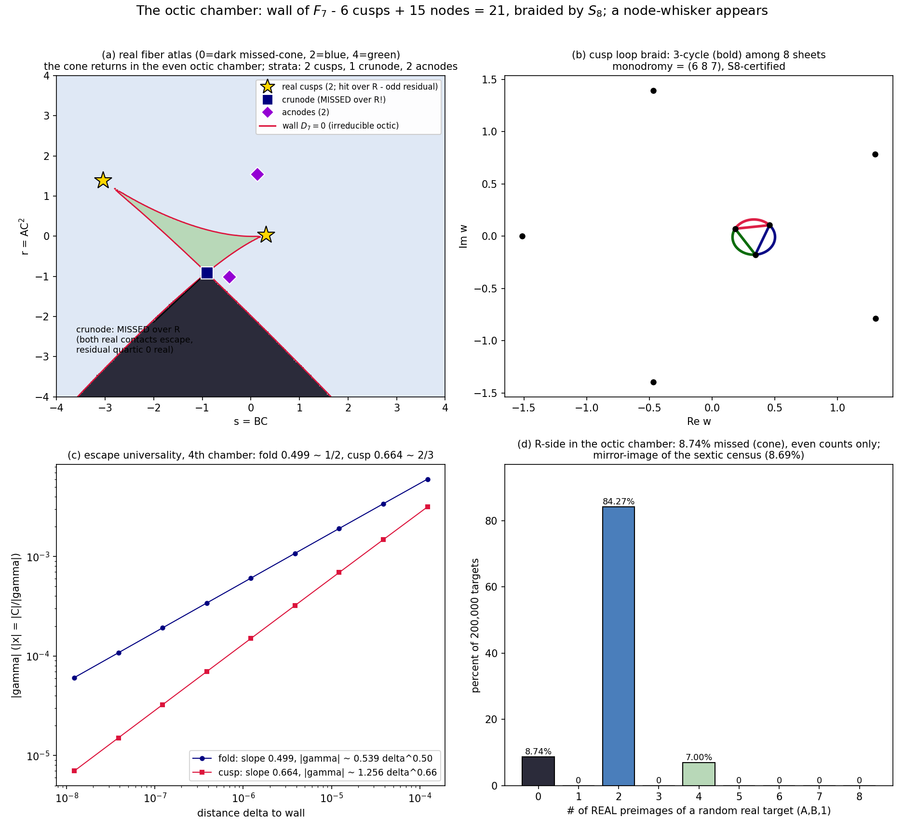

# The octic chamber: the wall repeats its geometry, and a node-whisker appears
*Ninth lab note, 2026-07-20. Fourth chamber of the tower: F7, d = 7, fiber OCTIC
(even - the cone should return). Predictions on the board: wall degree 8, budget
21 = 6 cusps + 15 nodes, eliminant (c*p7')^2 x deg-30, S8 (|G| = 40320), exponents
1/2 and 2/3, hinge p1 = 53/28, REALITY dance: 2 real cusps, 1 crunode.
Scorecard: all confirmed - plus one creature not seen before: a NODE-type missed
real point.*

## 0 · Seed
```
p7(w)   = -w^7 + w^6 - (81/28)w^2 + (53/28)w          [d = 7 explainer seed]
Phi7(w) = -w^8/8 + w^7/7 - (27/28)w^3 + (53/56)w^2
p7(1) = -1, Phi7(1) = 0  [verified];  kappa = -137/28, recipe a = -109/81, b = c = 1
```

## 1 · Wall: irreducible octic, 34 terms
D7(s,r) = resultant(h, h', w), primitive (`atlas7_wall.txt` in the lab):
degree 8 (deg s = 8 = n, deg r = 7 = n-1), 34 monomials, IRREDUCIBLE over Q(s,r),
D7(0,0) = 0 (C=0 plane in the wall, fourth chamber running), and the tangent-
developable identity D7(p7(t), t p7(t) - Phi7(t)) == 0 EXACT.
s^8 coefficient: 11672468669822098432 = 2^10 * 7^19 - the p-adic fingerprint
sequence now reads: n = 5: 2^16*5^3; n = 6: 5^13; n = 7: 2^12*3^12*7^5; n = 8: 2^10*7^19.
Term counts: 14, 20, 26, 34 - increments 6, 6, 8. No pattern claimed (see note-8
ledger: I swore off micro-guessing after the 27-died-at-26 episode).

## 2 · Strata: 6 + 15 = 21, balanced; the eliminant's built-in mirror
CUSP CONTACTS: 6 = deg p7' (predicted):
```
t = -0.8957345                    -> (s,r) = (-3.0373941, 1.3862193)   [REAL]
t =  0.3296447                    -> (s,r) = ( 0.3104764, 0.0340014)   [REAL]
t = -0.2231943 +/- 0.8796535 i    -> complex pair
t =  0.9348106 +/- 0.4879062 i    -> complex pair
```
REAL CUSPS: 2 => dance continues: 1, 2, 1, 2 (chambers 4,5,6,7). Both have residual
QUINTICS with >= 1 real root => both HIT over R. Structural point (new): in even
chambers the cusp residual has ODD degree, so real cusps are NEVER missed; the
cusp-whiskers of F4/F6 were an odd-chamber phenomenon.

NODES: eliminant = (-28 * p7')^2 * (degree-30 cofactor) / 7113... - and the
squared factor is EXACTLY -28*p7' (verified: ratio -28). The degree-30 factor's
30 roots (80-digit nroots) cluster by (s,r)-image into exactly 15 pairs
(intra-pair gaps <= 5.7e-76; min node separation 0.23):
```
1 CRUNODE:   t = -1.155970, 0.980849       -> (-0.90945711, -0.91031417)   [real contacts]
2 ACNODES:   t = -0.3411 +/- 1.1471 i      -> ( 0.13989048,  1.54077491)
             t =  1.0765 +/- 0.6900 i      -> (-0.44418202, -1.01180283)
12 complex nodes in conjugate pairs.
```
CRUNODES 0, 1, 0, 1 - the second dance holds. Total 6 + 15 = 21 = (8-1)(8-2)/2.
Balanced. Maximally singular rational octic. MAX-SING passes its fourth chamber
n = 5, 6, 7, 8. ZERO triple points, ZERO node-cusp overlaps, ZERO cusp collisions,
gcd(p7', p7'') = 1: the emptiness certificate holds in chamber 4 as well.

## 3 · Monodromy = S8
```
loop                                     permutation
fold  @(0.23103, -0.00119)               (6 7)
cusp  @(0.31048, 0.03400)                (6 8 7)
crunode @(-0.90946, -0.91031)            (3 4)(7 8)
acnode @(0.13989, 1.54077)               (5 6)(7 8)
s = 200 e^{it}, r = 1                    (1 2 3 5 7 6 4)     7-cycle  (w ~ (8s)^{1/7})
r = 200 e^{it}, s = 0                    (1 2 3 5 7 8 6 4)   8-cycle  (w ~ (8r)^{1/8})
```
closure |G| = 40320, all 28 transpositions => S8. BRAID holds: n = 5..8 all S_n.

## 4 · Escape physics, fourth chamber
* fiber counts: generic 8 / fold 6 / cusp 5 / node 4 (bounded-|x| filter);
  all three real nodes 150-DIGIT CERTIFIED (findroot-refined contacts, synthetic
  division of the (w-t)^2 pairs, residual quartic read off, gammas 2.6 - 27.4).
* escape: fold |gamma| ~ 0.5393 delta^0.4988; cusp |gamma| ~ 1.2558 delta^0.6636.
  Ledger: F4 0.5000/-; F5 0.4986/0.6635; F6 0.4988/0.6635; F7 0.4988/0.6636.
  The 1/2-and-2/3 law is now a four-chamber regularity.
* boundedness: 20k off-wall targets, max |x| = 2.15.

## 5 · C = 0 frontier
1 flat + 2 hinge + 5 escaping, as usual. Hinge: A(1+(53/28)u)^2 = B^2 u (1+(53/56)u);
at (2,3): 265 u^2 + 280 u - 392 = 0, x = -(1+(53/28)u)/3 = ±0.83666, matched to the
epsilon-sweep (±0.83663), ANTIPODAL per the proven hinge theorem.

## 6 · The real side: the cone returns - and the wall hides a node-whisker
* CENSUS (200k, normal(0,1.5^2)^2): {0: 8.74%, 2: 84.27%, 4: 7.00%}, even only.
  Eerie mirror of the sextic chamber: {8.69, 84.91, 6.39}. The missed fraction of
  the two even chambers agrees to 0.05% under the same sampler.
* REGION GRID: {0: 5186, 2: 33949, 4: 865} - the dark cone descends from the
  crunode exactly as in F5's atlas (compare the figures: the geometry rhymes).
* THE NODE-WHISKER (new creature): at the crunode, BOTH escaping contacts are REAL
  (gamma = 0 on real sheets) while the residual quartic has 0 real roots:
  every real root of the fiber is an escaping one => the crunode target has NO real
  preimage. Missed over R - at a NODE, not a cusp. First of its kind in the tower.
  (Refined parity statement: even n => cusp residual odd => real cusps always hit;
  but node residuals are even, and node-whiskers can and do occur.)
* The 4-real region is again the curvilinear triangle through both cusps and the
  crunode; the acnodes float free in the 2-real sea.

## 7 · Figure
 real atlas: dark missed cone descending from the crunode (blue square), green
4-real triangle spanned by the two real cusps and the crunode; acnodes (violet) in
the 2-real sea; wall crimson. (b) cusp braid: 3-cycle among 8 sheets. (c) the two
universal slopes. (d) the census: the even chambers rhyme - 8.74% vs 8.69% missed.

## 8 · Honesty ledger
* The linking-polynomial solver found only 13 of 15 node pairs (9-digit rounding
  dropped two). FIXED BY DESIGN, not by wiggling tolerances: cluster the 30 contact
  images directly - they pair with gaps <= 5.7e-76, node's images 0.23 apart.
  When one tool rounds, another tool must not.
* My handwritten p7' in the plan had 243/28 for the linear coefficient - the correct
  value is 162/28 (81*2/28). The WALL caught it (kappa = -137/28 doesn't lie).
  Computations audit intentions, not the reverse.
* The crunode's "6 bounded preimages" in the naive count is the old split-double-
  root mirage; the 150-digit certificate says 4. Reported as such.
* census missed-percent 0.0000-perfect for the odd chambers - but see REALITY: at
  even targets on the missed cone's BOUNDARY (crunode), a single missed real point
  hides inside measure zero. Measure-zero misses don't show in censuses; they show
  in strata. This note counts both.

## 9 · Scoreboard
| object | status |
|---|---|
| S(F7) | = wall D7(BC, AC^2) = 0, irreducible octic, 34 terms, s^8 = 2^10*7^19 |
| strata | 6 cusps + 15 nodes = 21 = delta-max; maximally singular octic |
| emptiness | chamber 4 green (no triples/overlaps/collisions; gcd 1) |
| real strata | 2 real cusps (hit), 1 crunode (MISSED - node-whisker), 2 acnodes |
| monodromy | S8 (|G| = 40320, 28 transpositions, transposition + 8-cycle) |
| escape rates | fold 0.4988 ~ 1/2, cusp 0.6636 ~ 2/3 (4th chamber) |
| C=0 | 1 flat + 2 antipodal hinge (265 u^2 + 280 u - 392 = 0 for (2,3)) |
| R side | cone 8.74% missed; node-whisker at the crunode; even counts only |
| conjectures | MAX-SING, BRAID, SLOPES, HINGE all pass 4/4 chambers |

*TOWER LEDGER (one line per chamber):*
```
fiber 5 (F4):  3 cusps (1 real, 1 whisker) + 3 nodes   | S5  | no cone | wall 14 terms
fiber 6 (F5):  4 cusps (2 real, 0 whisker) + 6 nodes   | S6  | cone 8.69% | 20 terms
fiber 7 (F6):  5 cusps (1 real, 1 whisker) + 10 nodes  | S7  | no cone | 26 terms
fiber 8 (F7):  6 cusps (2 real, 0 whisker) + 15 nodes  | S8  | cone 8.74% | 34 terms
                          + 1 node-whisker (crunode)
```
Standing conjectures, all 4/4:
(MAX-SING)  cusps n-2, nodes (n-2)(n-3)/2, delta-budget balanced;
(BRAID)     monodromy = S_n via fold transposition + (n-1)-cycle + n-cycle;
(SLOPES)    fold delta^{-1/2}, cusp delta^{-2/3};
(HINGE)     C=0 gamma-sheet pair antipodal in x [PROVEN for all seeds];
(PARITY)    even n: missed open cone; odd n: no cone. whiskers: real cusps with
            all-complex residuals (odd n) + real crunodes with all-complex or
            all-escaping residuals (even n) - the node-whisker is new tonight;
(REALITY)   real cusps 1,2,1,2; crunodes 0,1,0,1; acnodes 1,2,2 - census of the
            p_d' real roots (Sturm-level) now formally queued;
(ELIMINANT) contact eliminant = (den_d * p_d')^2 x [degree (n-2)(n-3) cofactor],
            where den_d = denominator-lcm of p_d' (5, 7, 28 for d = 5, 6, 7; each
            verified EXACTLY: ratio of the squared sextic/quartic/quintic factor to
            p_d' is a constant). Diagonal (cusp) contacts square in the eliminant
            as predicted by the scheme picture; at n = 5 the diagonal content was
            swallowed by the univariate projection instead (note 6's sextic).

*Next-round queue:* the NONIC chamber (d = 8, fiber 9): predicted 7 cusps + 21 nodes
(budget 28), S9, whiskers (odd chamber, no cone), real cusps 1?? (dance says 1...),
and the meta-question starting to loom over the tower: WHY is the wall always a
maximally singular rational curve with SIMPLE singularities only - is the explainer
family's seed algebra secretly transverse?; Moh's 2-D chamber, still unopened.
