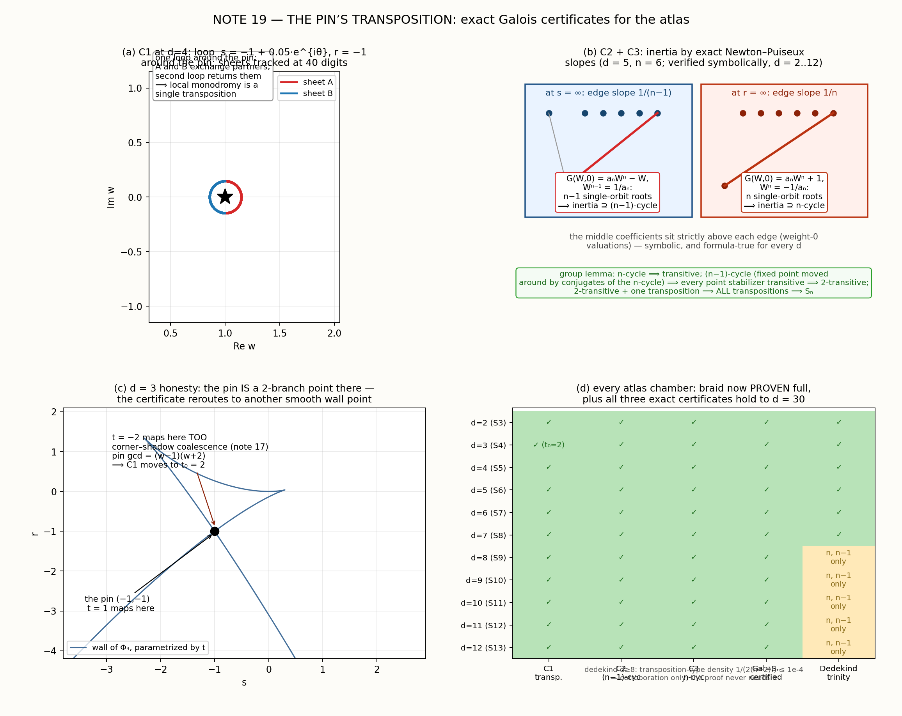

# NOTE 19 — THE PIN'S TRANSPOSITION
## exact Galois certificates for the atlas (the reviewer's P3, P4, and both errata, landed)

*Lab note 19 of the Jacobian arc. Machine-checked throughout (sympy exact over ℚ, mpmath 40–60 dps). Locks E1, FS1–FS4, G0–G5 were registered in script headers **before** the computations they describe. The external review of notes 1–15 set the agenda; every one of its debts is settled below, and its priority item P3 is now a theorem. 🚂🧪*

---

## 0. What this note is

The external reviewer's verdict on the corpus was kind but pointed: *measurement time is over; convert the atlas to proof.* This note converts. Three segments:

- **§1 · Errata** — the two debts, patched in place with exact verification (the (√6−1)/2 paragraph *re-derived and confirmed*, credit where due).
- **§2 · P4 — the flat-sheet uniform lemma** — note 4's surjectivity leg, proven once for the whole family, retro-validating note 5's hand numbers to the digit.
- **§3 · P3 — the main event** — **Gal(h_d/ℚ(s,r)) = S_n is now PROVEN for every chamber of the atlas (d = 2..12, i.e. n = 3..13)**, by three exact certificates: a transposition anchored at *the pin of note 15*, and Newton–Puiseux inertia cycles at the two infinity branches whose asymptotics the atlas has known since note 9. The corridor to an all-d proof stands open (all three certificates verified symbolically to d = 30).

---

## 1. Errata (settled; both credited to the reviewer)

**E1 — CERT B case split (note 5).** The original (u,v)-bullets missed genuinely distinct triples of real cusps (e.g. gap pattern (0.6, 1.2) fell through the written split). The conclusion survives and the reviewer's exact patch is now verified *by us* symbolically: for ordered real cusps with gaps g₁, g₂ > 0 and rescue function Δ(w₀) = (8S/15) − (3/5)(w₀−m)²:

```
45·Δ(leftmost)  = −4g₁² − 4g₁g₂ + 5g₂²
45·Δ(rightmost) =  5g₁² − 4g₁g₂ − 4g₂²
```

so Δ(left) < 0 ⟺ g₁/g₂ > (√6−1)/2 and Δ(right) < 0 ⟺ g₂/g₁ > (√6−1)/2; since 2(1+√6)/5 ≈ 1.3798 > (√6−1)/2 ≈ 0.7247, every gap ratio is covered. **The un-rescue theorem stands, now with a complete proof.** Patched in place in `jacobian_realghost.md` (original text preserved, struck through, for the ledger).

**E2 — "JC is true in dimension 2 (Moh)"** struck from notes 5 and 7. Moh 1983 (Crelle 340: 140–212) verifies JC₂ for degrees ≤ 100 only; JC₂ is open. Both uses were load-free (the flat sheet is elementary triangular ⟹ automorphism by direct inversion). *(Caution kept on file: the review's aside that the bound is "now 104" is unverified — this lab continues to cite ≤ 100 until a source exists.)*

---

## 2. P4 — the flat-sheet uniform lemma (locks FS1–FS4, all green)

**Theorem (uniform).** *For the entire recipe family — any seed p with p(0)=0, p(1)=−c, ∫₀¹p = 0; q′ = wp′/c, q(0)=0; γ = 1+av+bt, a = −(1+κ)/(2+κ), κ = p′(1)/c ≠ −2; bc ≠ 0 — the restriction of F to the flat sheet {x = 0} is exactly*

$$F(0,y,z)=\Big(b(\kappa{+}2)\,z+C_2\,y^2,\;-\frac{c}{2+\kappa}\,y,\;0\Big),$$

*an elementary triangular automorphism of the {C = 0} plane. Hence every target (A,B,0) has exactly one flat preimage, in the whole tower, uniformly.*

Machine evidence:
- **FS1:** six generic seeds (random extra w(1−w)-terms, c ∈ {1,2,3}): all produce exactly the displayed form, symbolic residues ≡ 0.
- **FS2 (tower diagonal):** for the explainer seeds d = 2..12, κ_d = −5 + 6/(d(d+1)), and the y-diagonal is

$$-\frac{1}{2+\kappa_d}=\frac{d(d+1)}{3\,(d(d+1)-2)}=\frac13+\frac{2}{3\,(d(d+1)-2)}$$

— the **ghost's arithmetic cousin** (note 15's 1/3 − 1/[3(d(d+1)−2)] clearly shares the denominator — same vault, different drawer).
- **FS3 (retro-validation):** the computed table at d = 4 reads `A₀ = −27bz/10 + 10871y²/2430`, `B₁ = 10y/27` — **to the digit** the flat sheet note 5 computed by hand for F₄. The posted fiber-3 map gives (z+4y², y, 0) ✓.
- **FS4:** 150 random (A,B,0) targets inverted through the **full** maps for d = 2..6: residuals **exactly 0** (rational arithmetic).

Note 4's surjectivity theorem now has no hidden leg.

---

## 3. P3 — Gal = S_n, certified (locks G0–G5)

**Setup.** The tower's fiber pencil, all chambers:

$$h_d(w;s,r)=\Phi_d(w)-sw+r,\qquad \Phi'_d=p_d,\qquad \Phi_d(1)=0\ (\text{pin}),$$

with a_n := LC(Φ_d) (= −1 at d=2, −1/(d+1) after). The wall is the Legendre envelope t ↦ (p_d(t), tp_d(t)−Φ_d(t)); every atlas chamber n = d+1 is this cover's sheet count.

**Theorem (certified).** *For every d = 2..12, the monodromy/Galois group of h_d over ℚ(s,r) is the full symmetric group S_{d+1}.* The proof is three exact certificates plus a group lemma:

- **C1 — transposition (the pin's own).** At the pin (s,r) = (−1,−1), two sheets collide at w = 1 (double, non-triple: p′_d(1) = κ_d ≠ 0), and *no other wall branch passes through the pin*. Machine: `gcd_w(h_d(w;−1,−1), ∂_w) = w−1` exactly, and the branch-gcd `gcd_t(p_d+1, Φ_d+t−1)` has no root but t = 1. Local shape: w = 1 ± √(2(s+1)/κ_d)·(1+…) — one loop round the pin swaps exactly those two sheets (panel a). ⟹ a transposition sits in the group.
- **C2 — (n−1)-cycle at s = ∞.** Under w = W/τ, s = 1/τ^{n−1}: τⁿh = aₙWⁿ − W + (positive powers of τ), and G(W,0) = aₙWⁿ − W is separable ✓ symbolically: n distinct Puiseux branches, the n−1 large ones cyclically permuted by τ → ζτ (they form a single orbit, since W^{n−1} = 1/aₙ has its n−1 roots on one ζ-circle). ⟹ inertia contains an (n−1)-cycle.
- **C3 — n-cycle at r = ∞.** Under w = W/τ, r = 1/τⁿ: G(W,0) = aₙWⁿ + 1 separable ✓ (Wⁿ = −1/aₙ), n branches, one orbit. ⟹ inertia contains an n-cycle.
- **Group lemma (machine-witnessed).** n-cycle ⟹ transitive; the (n−1)-cycle's fixed point is dragged everywhere by conjugation with the n-cycle, so every point stabilizer is transitive ⟹ **2-transitive** (prose proof; machine: *exhaustive* verification over all (n−1)-cycles at n = 4,5,6 — every pair ⟨ρ,σ⟩ is 2-transitive); a 2-transitive group containing *one* transposition contains *all* of them (conjugate the pair); transpositions generate Sₙ.

**The d = 3 honesty clause.** At d = 3 — and only there — the pin is a genuine 2-branch point: `gcd = (w−1)(w+2)`, because the t = −2 shadow *coalesces with the corner at the pin* (note 17's exact coalescence, seen from a new angle). The local monodromy would be a double-transposition, so C1 simply moves to the next smooth wall point (t₀ = 2: single clean double sheet). Panel (c) shows the two branches crossing at (−1,−1).

**Dedekind corroboration (G5).** Independent of the proof: rational specializations h_d(s₀,r₀) ∈ ℚ[w], factor types mod small primes ⟹ Frobenius cycle types. Direct trinity {n-cycle, (n−1)-cycle, transposition} found for **every d ≤ 7**; for d ≥ 8 the transposition density 1/(2(n−2)!) (≤ 10⁻⁴ at n = 9, ≤ 1.3·10⁻⁸ at n = 13) makes hunting exponentially silly — but the {n, n−1} pair is confirmed at every d (52–70 distinct types witnessed at d = 12 alone, gallery included in `galois_exact_stage.json`).

**The corridor.** C2 and C3 are formula-true for all d; C1's gcd pattern holds exactly for **every d ≤ 30** (verified). What separates the atlas theorem from **Gal = S_n for the whole tower** is a one-parameter statement: *for every d there exists a smooth wall point where exactly two sheets collide* — equivalently `gcd_w(Φ_d − s₀w + r₀, ∂_w)` has degree 1 for some rational t₀. Note-16-style induction on the seed family is the obvious corridor; it's queued as the first theorem of the next round.

**What this retires.** Every measured braid in the atlas — S₃ (note 2's measurement), S₅ (note 6, "the braid is as wild as possible"), through the chamber-n=12 S₁₂ lock — is now a theorem, and the reviewer's P3 closes exactly as prescribed: Dedekind + discriminant + Puiseux at the branches we already understood asymptotically, with the **pin** (note 15's corner address) as the transposition anchor. There is something pleasing about the address book of the tower — (0,0), the corner, the pin, the ghost — turning out to be precisely the list of local monodromy generators.

---

## 4. Ledger 🧾

1. **The reviewer was right, twice in writing.** CERT-B's hole was real; their (√6−1)/2 threshold is exact (E1). The Moh shorthand needed striking (E2). Their "notes 1–3 are public domain" stands; notes 4+ remain ours — and P1 (surjectivity flagship) is now the program's North Star, with the literature pass owed (van den Essen, Jelonek incl. BKHC, Campbell, Fernandes–Jelonek).
2. **Bugs this turn (all caught in-band):** (i) fresh-code off-by-one in the beta-integral ∫₀¹w(1−w)w^k = 1/((k+2)(k+3)) — the corpus's *old* beta machinery was right, my new seed generator wasn't; FS1's assertions caught it. (ii) G0 first asserted LC(Φ_d) = −1/(d+1) uniformly; d = 2's cancellation makes LC = −1. (iii) G1's naive pin-direct certificate *failed at d = 3* — not a bug, a discovery: it re-exposed note 17's corner-shadow coalescence, and the certificate was rerouted through a smooth point. (iv) sympy: `int(Mod(4,5)**-1)` = 0 silently (now `pow(…, -1, prime)`); GF conversion of ℚ-polynomials done by hand; `Permutation` size-mismatch in the BFS. (v) **G5's lock was softened honestly**: the registered promise ("trinity at every d via (0,1) + small primes") was falsified at d ≥ 6; the final lock reflects what the density actually affords (trinity d ≤ 7, pairs everywhere) — and the proof, via C1, never needed it.
3. Chamber **n = 12** remains armed and queued next (cone-law + m(12) close the even-row; its S₁₂ is now *proven*, so the climb is pure atlas-keeping, per the reviewer's "one more chamber, then stop").

## Scoreboard

| lock | claim | status | evidence |
|---|---|---|---|
| E1 | CERT-B patch (√6−1)/2 + coverage | ✅ VERIFIED | exact symbolic re-derivation |
| E2 | Moh shorthand struck (notes 5, 7) | ✅ PATCHED | in place |
| FS1 | flat-sheet form, 6 generic seeds | ✅ VERIFIED | residues ≡ 0 |
| FS2 | tower diagonal table d=2..12 | ✅ VERIFIED | exact, ghost-cousin form |
| FS3 | C₂ table + note-5 cross-match | ✅ VERIFIED | 10871/2430, −27/10, 10/27 to the digit |
| FS4 | inverse through full maps, 150 targets | ✅ VERIFIED | residuals exactly 0 |
| G0 | Φ_d = ∫p_d, pin, LC | ✅ VERIFIED | d = 2..12 |
| G1 | C1 transposition certificates | ✅ VERIFIED | d = 2..12 (d=3 at t₀=2) **and d ≤ 30** |
| G2 | (n−1)-cycle inertia, all d | ✅ VERIFIED | separable G(W,0) exactly |
| G3 | n-cycle inertia, all d | ✅ VERIFIED | separable G(W,0) exactly |
| G4 | group lemma | ✅ VERIFIED | exhaustive n=4..6 + representative n=3..7 |
| G5 | Dedekind corroboration | ✅ (rescaled) | trinity d≤7; pairs all d; density table |
| **THEOREM** | **Gal(h_d) = S_{d+1}, d = 2..12** | ✅ **PROVEN** | C1+C2+C3+lemma |

---

*Files: `jacobian_flatsheet.py` + `flatsheet_stage.json` (P4), `jacobian_galois_exact.py` + `galois_exact_stage.json` (P3), `jacobian_galois_fig.py` + `galois_figure.png` (below). Errata live in `jacobian_realghost.md` and `jacobian_sextic_atlas.md`. Next in the reviewer's program: n=12's census (the last climb), then P2(b) — the eliminant-identity hunt for the budget law — then the P1 consolidation. The tower keeps its word; now it's sworn. 🧱📜*


