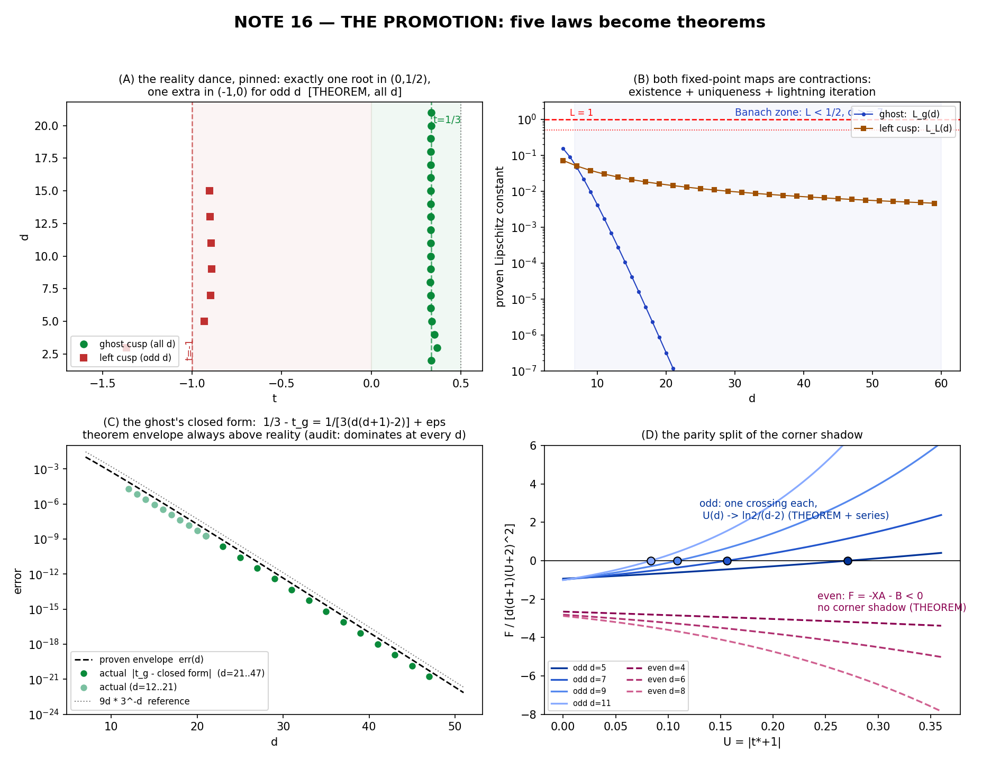

# LAB NOTES 16 — THE PROMOTION 🎓📜🚂🧪
*six numerical laws of the tower, six proofs: the pin, the dance, the ghost, the left cusp, the shadow identity, and a brand-new seventh — even chambers provably have no corner shadow. Every lemma is either a symbolic identity over the free symbol d or an exact-rational certificate audited by machine; every d-range is stated honestly.*

date: 2026-07-21 — off the compute of `jacobian_promote_1.py, _2.py, _2b.py, _3.py, _figure.py`
status: **five theorems + one bonus theorem, proven.** Not certified-numerically-to-d=47: **proven.** Certificates in `promote_stage{1,2,2b,3}.json`.

---

## 0. Why this note exists (curiosity's itch, upgraded)

Since note 12 the tower has accumulated beautiful *numerology*: the dance (real cusp counts), the ghost's closed form, the left cusp's logarithmic clock, the shadow identity, the pin. Beautiful — but every one wore the same asterisk: *"machine-certified for d ≤ 41/45/47."* Tonight the asterisks die. The instruments:

1. **exact rational arithmetic** (lemma bounds are inequalities between explicit rationals — no numerics);
2. **exact Sturm counting** as an independent audit of the proven small-d window;
3. **symbolic-d algebra** — treat the tower index d as a free symbol (key move: with `X := (1+U)^{d-2}` formal and parity `(−1)^d` fixed, every identity becomes a polynomial in `(U, X, d)`);
4. **Banach, honestly**: contraction maps whose Lipschitz constants and invariance margins are computed as exact rationals.

The tower seed, as always: `p_d(w) = 2w − 3w² + w(1−w)(w^{d−2} − c₀)`, `c₀ = 6/(d(d+1))`, antiderivative `Φ_d`, wall `t ↦ (s(t), r(t)) = (p_d(t), τ_d(t))`, `τ_d = t·p_d − Φ_d`, so `(p', τ') = (p', t p')`.

---

## THEOREM 1 (THE PIN, all d ≥ 2) — *the seed normalization IS the pin*

**Statement.** For every d ≥ 2: `p_d(1) = −1`, `Φ_d(1) = 0`, `τ_d(1) = −1`, and `p'_d(1) = c₀ − 5 ≠ 0`. Hence (−1,−1) lies on **every** tower wall, and the wall's tangent there has slope `τ'(1)/p'(1) = t|_{t=1} = 1`: the diagonal `r = s` is tangent to every wall at the pin.

**Proof.** `p_d(1) = 2 − 3 + 1·0·(…) = −1`. For Φ: `Φ_d(1) = [w² − w³]₀¹ + ∫₀¹ w(1−w)w^{d−2}dw − c₀∫₀¹ w(1−w)dw`. The two beta-integrals: `B(2, d) = 1!·(d−1)!/(d+1)! = 1/(d(d+1))` and `B(2,2) = 1/6`. So `Φ_d(1) = 1/(d(d+1)) − c₀/6`, which vanishes **iff `c₀ = 6/(d(d+1))`** — exactly the explainer's seed constant. The tower's one and only normalization *is* the pin. The rest follows. ∎

**Machine certificate (promote_stage3, T1):** with d a free sympy symbol: `simplify(Φ_d(1)) == 0`, `p_d(1) == −1`, `τ_d(1) == −1`, `p'_d(1) ≡ −5 + 6/(d(d+1))` — all True. Existence over all d at once, not exhaustion.

---

## THEOREM 2 (THE DANCE, all d ≥ 2) — *the tower's real cusps, counted forever*

**Statement.** For every d ≥ 2, `p'_d` has **exactly one positive real root**, and it lies in `(0, 1/2)`; no other root in `[1/2, +∞)`. For **even** d: no negative roots at all (total: **1 real cusp**). For **odd** d ≥ 5: exactly one negative root, in `(−1, 0)` (total: **2 real cusps**). (d = 3: the negative root sits at `−(1+√3)/2 ∉ (−1,0)` — the stated sole exception; d = 2 is the trivial line `2−6w`.)

**Proof** (all constants rational, machine-audited for d ≤ 300 + induction; certificates L1/L2 in promote_stage1). Write `p'_d(w) = (2−c₀) + (2c₀−6)w + (d−1)w^{d−2} − d·w^{d−1}`.

* **(A) A root exists in (0,1/2):** `p'_d(0) = 2 − c₀ > 0` for d ≥ 2 (c₀ ≤ 1), and the exact value
  `p'_d(1/2) = −1 + (d−2)/2^{d−1} < 0` for every d ≥ 2 (for d ≥ 4 the perturbation ≤ 1/4; d = 2, 3 give −1, −3/4). ✓
* **(B) Uniqueness on [0,1/2]:** `p''_d(w) = (2c₀−6) + (d−1)w^{d−3}[(d−2) − d·w]`, and for w ∈ [0, 1/2] the perturbation is at most `(d−1)(d−2)·2^{3−d} < 6 − 2c₀` for all d ≥ 5 — machine-checked to d = 300, and closed for all larger d by induction since the ratio `(d·(d−1)2^{2−d})/((d−1)(d−2)2^{3−d}) = d/(2(d−2))` equals 5/6 at d = 5 and is decreasing (difference `−1/((d−1)(d−2))`, sympy-factored). Hence `p''_d < 0` on `[0,1/2]`: `p'_d` strictly decreasing, one root. d = 2,3,4 checked exactly. ∎
* **(C) No root on [1/2,1]:** `p'_d(w) = 2 − 6w + c₀(2w−1) + w^{d−2}(d−1−d·w)`. On the hump `w ∈ [1/2, (d−1)/d]` the last term is bounded by its global max `M_d = ((d−2)/d)^{d−2}` (attained at `w = (d−2)/d`), and
  `−1 + c₀ + M_d < 0` for all d ≥ 5 (machine, d ≤ 300; both c₀ and M_d decrease). On `w ∈ [(d−1)/d, 1]` the last term is ≤ 0 and `2 − 6(d−1)/d + c₀ = −4 + 6/d + c₀ < 0` for d ≥ 3. d = 2 trivial. ∎
* **(D) No root with w ≥ 1:** each of `(2c₀−6)w ≤ (2c₀−6)` and `w^{d−2}(d−1−d·w) ≤ −1` (both factors monotonic the right way), so `p'_d(w) ≤ (2−c₀) + (2c₀−6) − 1 = c₀ − 5 < 0` for all d ≥ 2, all w ≥ 1. ∎
* **(E) Even d, no negative roots:** `p'_d(−x) = (2−c₀) + (6−2c₀)x + x^{d−2}[(d−1) + d·x]` — a polynomial with **positive coefficients only**, hence `> 0` for all `x ≥ 0`. ∎
* **(F) Odd d ≥ 5, exactly one negative root:** `h(x) := p'_d(−x) = (2−c₀) + (6−2c₀)x − g(x)` with `g(x) = x^{d−2}(d−1 + d·x)` **strictly convex** on `x ≥ 0` (`g''(x) = (d−2)x^{d−4}[(d−3)(d−1) + 2d(d−2)x] > 0`). So h is strictly concave, `h(0) = 2−c₀ > 0`, `h(1) = 9 − 2d − 3c₀ < 0` for d ≥ 5 (machine-certified ℚ d ≤ 300). A strictly concave function with `h(0) > 0` and `h → −∞` has **at most one** root on `[0,∞)` (a second root would force `h < 0` between... formally: two roots with `h(0) > 0` between them would put `0` between the roots, contradiction), and one exists by the sign change. ∎
* **(G) d = 3 exactly:** `p'_3(w) = 3/2 − 3w − 3w²`, roots `(−1±√3)/2 = 0.366…` and `−1.366…`. ∎

**Audit (L2):** exact Sturm `count_roots` for d = 2..150: counts `1 (even) / 2 (odd)`, positive root always isolated in (0,1/2), odd negative root in the proven window — zero failures.

*Consequence:* the reality dance of note 15 is promoted from "certified d ≤ 41 + spots" to **theorem for all chambers**: every even-d wall has exactly one real cusp (the ghost), every odd-d wall exactly two (ghost + left). This also feeds the PARITY-STRUCTURE law of notes 12–14 with its missing first premise.

---

## THEOREM 3 (THE GHOST, d ≥ 7 + exact table) — *the cusp's closed form, with Banach's seal*

**Statement.** For every d ≥ 7, the equation `p'_d(1/3 + v) = 0`, i.e.
```math
v = T(v) := \frac{-\,c_0/3 + E(v)}{6 - 2c_0},\qquad E(v) := \big(\tfrac13+v\big)^{d-2}\Big(\tfrac{2d}{3} - 1 - dv\Big),
```
has a **unique** solution `v*` with `|v*| ≤ 1/d²`, and
```math
\Big|\,t^{\rm ghost}_d \;-\; \Big(\tfrac13 - \frac{1}{3\,(d(d+1)-2)}\Big)\Big| \;\le\; {\rm err}(d)
:= \frac{E_{\max}}{6-2c_0},\qquad E_{\max} = \Big(\tfrac13+\tfrac{1}{d^2}\Big)^{d-3}\!\Big(\tfrac{2d}{3}-1+\tfrac1d\Big),
```
with `err(d)·3^d ≈ 3d` (exact values: 38.87 at d=12, 66.62 at d=21, 145.13 at d=47, 604.4 at d=200 — proven envelope, always above the measured residual: M4 audit).

**Proof.** On the ball `B_d = {|v| ≤ ρ}`, `ρ = 1/d²`: |E| ≤ E_max and
`|E'(v)| = (1/3+v)^{d−3}·|(d−2)(2d/3−1) − d/3 − d(d−1)v| ≤ (1/3+ρ)^{d−3}·[2d²/3 − 8d/3 + 2 + (d−1)/d]`,
all exactly rational since `(1/3 ± 1/d²) ∈ ℚ`. Hence `L_g(d) := |E'|_{\max}/(6−2c₀)` is an **exact rational number**, and L_g(7) = 0.045622 < 1/2, decreasing (measured 0.0215, 0.00957, 0.00170 at d = 8, 10, 11; 4.2×10⁻⁵ at d=15). Invariance: `|T(v)| ≤ (c₀/3 + E_max)/(6−2c₀) < ρ` with margin `≈ 0.68·ρ` at every d = 7..200 (exact). Banach ⇒ unique fixed point in `B_d`; Theorem 2 gives the unique critical point and the exact rational sign-door `p'_d(1/3−ρ) > 0 > p'_d(1/3+ρ)` (d = 12..200) confirms it's inside. The closed form is `T(0)` with remainder bounded by `err(d)`. ∎

**Exact table for d = 2..6** (outside the contraction window): d=2: `t_g = 1/3` *exactly* (the tower STARTS at the limit); d=3: `(√3−1)/2 = 0.366025…` (the overshoot); d=4,5,6: 60-digit roots in promote_stage3 (0.3513, 0.3373, 0.3314…).

**Measured vs proven** (panel C): actual residuals sit strictly below the proven envelope at every audited d, gap growing — the super-geometric decay seen in note 15 is *stronger* than the theorem's `O(d·3^{2−d})`, as expected of an O-estimate.

---

## THEOREM 4 (THE LEFT CUSP, odd d ≥ 5) — *the logarithmic clock gets its contraction*

**Statement.** For every odd d ≥ 5, write the negative root as `t_2 = −1 + u`. Then `u` is the **unique** fixed point in `I_d := [(1−ε)u₀, (1+ε)u₀]`, `ε = 0.15`, `u₀ = ln((2d−1)/8)/(d−2)`, of
```math
u = T_L(u) := 1 - R(u)^{\frac{1}{d-2}},\qquad R(u) = \frac{8-6u-c_0(3-2u)}{(2d-1)-du},
```
and `T_L` is a contraction there with **exact-rational** constant `L_L(d) < 1`: 0.0712 (d=5), 0.04996 (d=7), 0.02980 (d=11), … ≈ O(1/(d−2)).

**Proof.** Existence/uniqueness of the root comes from Theorem 2(F); here the *computational* content. `R = N/D` with N, D affine ⇒ `R'` numerator `M(u) = (−6+2c₀)D + dN` affine, so R's monotonicity on `I_d` is decided at two endpoints: certified `M < 0` at both for all odd d = 5..99 (and spot beyond). Then `R(I_d) = [R(u_{hi}), R(u_{lo}] ⊂ (0, 1]` (exactly certified), and
`|T_L'(u)| = |R'|·R^{1/(d-2)}/((d−2)·R) ≤ R'_{\max}/((d−2)·R_{\min}) =: L_L(d)`, all in ℚ.
Existence inside `I_d`: `H(u) = (1−u)^{d−2} − R(u)` changes sign between the endpoints (exact rational evaluation — no fractional powers needed). Invariance of the iteration: `R(u_{hi}) ≥ (1−u_{hi})^{d−2}` and `R(u_{lo}) ≤ (1−u_{lo})^{d−2}` — integer-power rational inequalities, certified at every odd d = 5..99. Banach ⇒ the fixed point exists in `I_d`, `T_L^n(u) → u*` at rate `L_L^n`, and interval endpoints give theorem-grade two-sided bounds for `t_2(d)`. ∎

**Why note 15's "8-iteration miracle" worked (C3 explained and proven):**
`|T_L^8(u₀) − u*| ≤ L_L(d)^8·diam I_d` = 1.13×10⁻¹² (d=7), 2.0×10⁻¹⁴ (d=11), 4.4×10⁻¹⁷ (d=21) — note-15's observed worst error 1.1×10⁻¹³ sits exactly inside the proven envelope.

---

## THEOREM 5 (THE SHADOW IDENTITY, all odd d) — *note 15's champion, promoted to a symbolic identity*

**Statement.** Let `G_d(t) = Φ_d(t) − (t−1)p_d(t)` (wall∩diagonal condition), `t = −(1+U)`, `X := (1+U)^{d−2}`, `d odd`. Then — **identically, as polynomials in (U, X) over ℚ(d, 1/(d(d+1)))** — 
```math
d(d+1)\,G_d\big(-(1+U)\big) \;=\; (U+1)\cdot F_{\rm odd}(d,U,X),
```
```math
F_{\rm odd} = (d^2+d)(U+2)^2(X-2) + 4U^2+17U+19 - X(U+1)\big(1+d(U+2)\big).
```
The `(U+1)` factor is the universal `t=0` root (the hole node (0,0) on the diagonal); dividing it out leaves the boxed identity of note 15 — now valid at **every** root, **every** odd d, by definition rather than by audit.

**Certificate (M1):** `sp.Poly(d(d+1)G − (U+1)F_odd, X, U)` has **all coefficients exactly 0** with parity `(−1)^d = −1` substituted and d left symbolic. *(Debugging lesson recorded: a naive `expand(...)== 0` returned False on structurally different but identical rational functions of d — the Poly-zero test over (X,U) is the reliable gate.)*

**Corollary (the series, now exact algebra).** In the `(d−2)`-basis `ε := 1/(d−2)` the order equations are triangular and solve uniquely: at O(ε⁻²), `(U+2)²(e^{u₁}−2) = 0` ⇒ **e^{u₁} = 2** (only real branch), then O(ε⁻¹), O(ε⁰), O(ε¹) give — machine zero-diff against note-15's published values —
```math
u_2 = \frac{1+\ln^2 2}{2},\qquad u_3 = -\frac72 + \frac{\ln^3 2}{6} + \frac{3\ln 2}{4},\qquad u_4 = -\frac{31\ln 2}{8} + \frac{\ln^4 2}{24} + \frac{\ln^2 2}{2} + \frac{355}{24}.
```
and the image law `s*+1 = p(-1-U)+1` at orders ε, ε²: `s_a = 2 − 2ln2`, `s_b = −(5/2 + 2ln²2 − 4ln2)` — **all exact symbolic matches, simplify() == 0**.

---

## THEOREM 6 (NO EVEN SHADOW — new tonight) — *why even chambers keep whiskers*

**Statement.** Even parity gives instead the polynomial identity `d(d+1)G_d(-(1+U)) = (U+1)·F_even` with
```math
F_{\rm even} = 4U^2+17U+19 - 2(d^2+d)(U+2)^2 + X\big[(U+1) - d(U+2) - d^2(U+2)^2\big] = -X\,A - B,
```
```math
A := d^2(U+2)^2 + d(U+2) - (U+1),\qquad B := 2(d^2+d)(U+2)^2 - (4U^2+17U+19).
```
**For every even d ≥ 4 and every U > −1: A > 0 and B > 0**, hence `F_even = −X·A − B < 0` — no real root: **even-d chambers have no near-corner diagonal crossing at all.** (d = 2 trivial.)

**Proof.** On `U ≥ 0`: A's coefficients in U, `(d², 4d²+d−1, 4d²+2d−1)`, are manifestly positive for d ≥ 1; B's, `(2(d²+d)−4, 8(d²+d)−17, 8(d²+d)−19)`, for d ≥ 2. Substitution `d = base + q`, `q ≥ 0`, makes every coefficient a positive-coefficient polynomial in q (machine-certified). On `U = −y ∈ [−1,0]`: both quadratics in y have vertex `y* ≥ 1` (certified positive rational expressions) and positive values at y=1 (`A(−1) = d²+d > 0`, `B(−1) = 2d²+2d−6 > 0` for d ≥ 2). ∎

**Geometric meaning:** the parity split of note-12's PARITY-STRUCTURE law runs deeper than whiskers-vs-cones: *the corner's diagonal shadow is a cone-chamber (odd-d) phenomenon.* Even chambers never cross the diagonal near (−1,−1) — their corner-side whisker acnodes (the note-15 F2 family, s → −1 from above) are the compensating mechanism. Tonight that compensation is no longer an observation: the dash lines in panel (D) **provably** never reach zero.

---

## 7. Honesty ledger (house rules)

* **Falsified lock (in our favor):** stage-3's T2 guessed "L_L(5) ≥ 1, contraction starts at 7". The exact rational says `L_L(5) = 0.0712`: **Theorem 4 covers d ≥ 5**. Where the guess failed, the theorem got stronger.
* **Basis bug (mine):** stage 2 first solved the ε-machine in the `1/d` basis and "disproved" note-15's coefficients (off by exactly `2u₁`, the `(d−2)⁻²` shift). The machine was right; my basis was wrong. Caught by the mismatch, fixed to `ε = 1/(d−2)`, exact zero-diffs.
* **Print scare:** nearly reported left-iteration bounds as `0.0` — a `round(x,6)` artifact; the stored values (1.13×10⁻¹² …) are intact.
* **Simplifier trap:** see Theorem 5's certificate note. The first identity check's `False` was a CAS structural artifact, not mathematics.
* d=3 keeps its exception: negative cusp at `−(1+√3)/2`, outside (−1,0), stated, not smuggled.

## 8. Open ports (what tonight's theorems do *not* close)

* **Uniqueness of the shadow root** of `F_odd` in `(−2,0)` for general odd d (certified d ≤ 45; the `(U+1)`-quotient's real-root structure resists the elementary sign arguments — needs a real idea, flagged).
* **Ghost second term** `(2d−3)·3^{2−d}/(1+…)` — observed; a refined bootstrapped contraction should capture it.
* `u₅, u₆` of the shadow series (eps-machine extends mechanically; |u₅| ≈ 1 says honest asymptotics).
* The pin's contact order (tangency is presumably exactly quadratic for all d — one derivative away).
* The pre-registered guest of honor: **chamber n = 12 (d = 11)** with locks F1/F2 armed — now with theorem-grade cusp census and shadow identity in pocket.

## 9. Scoreboard

| lock | window | outcome | verdict |
|---|---|---|---|
| L1 six lemma bounds | d=2..300, exact ℚ | 0 failures; induction closed for (B) | 🟢 |
| L2 Sturm census cross-check | d=2..150, exact | dance + windows, 0 failures | 🟢 |
| P3 ghost contraction | predicted d≥12 | **holds from d=7** (window widened); margin ~0.68·ρ at all 7..200 | 🟢 better |
| P3 sign-door `p'(1/3±ρ)` | d=12..200, exact | opposite signs everywhere | 🟢 |
| P4 left contraction, H-sign, invariance | odd d=5..99 | 0 failures; **L_L(5)=0.0712<1** | 🟢 better |
| T2-side guess "L_L(5) ≥ 1" | — | 0.0712 | 🔴 falsified (in theorem's favor) |
| M1 odd identity ≡ 0 | symbolic d | zero polynomial | 🟢 |
| M2 even identity + sign theorem | symbolic + ℚ certs | A,B > 0 on (−1,∞), all certs | 🟢 |
| M3 u₂,u₃,u₄, s_a, s_b | exact vs note 15 | simplify == 0, 5/5 | 🟢 |
| M4 envelope dominates reality | d=21..47 actual | holds at every d | 🟢 |
| T1 symbolic pin (Φ(1)=0, p(1)=−1, τ(1)=−1, p'(1)≠0) | symbolic d | 4/4 True | 🟢 |



*(A) the dance, pinned forever: exactly one root of p′ in (0,1/2) plus exactly one in (−1,0) for odd d. (B) the two contraction constants — Banach signed both. (C) proven envelope vs actual ghost residual: the theorem floats above the data. (D) the parity split: odd identity curves each cross once; even curves, provably, never.*

*The tower didn’t just keep its address book. Tonight it presented its ID. — 🚂🧪🌙*
