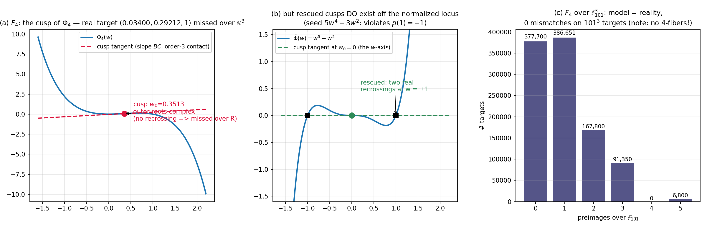

# The real ghost: cusp obstructions, an un-rescue theorem, and the wild orbit
*Fifth lab note, 2026-07-20. Builds on notes 1–4. The question inherited from last round's
cliffhanger: why does surjectivity in this story obey unusual laws — and what happens over
**R**, where the conjecture's real-analytic cousins (Pinchuk, real-etaleness) live.*

All claims below are exact computations (SymPy rational/algebraic arithmetic, or
exhaustive finite-field enumeration). Every inequality witnessing a *missing* real
point comes with a symbolic certificate. Nothing numeric is load-bearing.

## 0 · Recap: the lift recipe and where we stood

Weighted-lift maps (`b = c = 1`): for a seed `p(w)` (deg 4) with
`Phi = ∫₀ʷ p`, `q = w p − Phi`, `κ = p′(1)`, `a = −(1+κ)/(2+κ)`, the map
`F(x,y,z) = ( (u + q(w)/γ²)/x² , (1 + p(w)/γ)/x , x γ )`,
`u = 1+xy, γ = 1 + axy + x²z, w = uγ`, kills all denominators exactly whenever

> **normalization:** `p(1) = −1` and `Phi(1) = 0`  *(three free parameters c₂,c₃,c₄)*.

Fiber equation over target `(A,B,C)`, `C≠0`:  `h(w) := Phi(w) − BC·w + AC² = 0`,
preimages ↔ roots `w*` with `γ(w*) := BC − p(w*) ≠ 0`, reconstructed rationally:
`x = C/γ`, `u = w*/γ`, `y = (u−1)/x`, `z = (γ − 1 − a(u−1))/x²`.
Note that `γ(w*) = 0` ⟺ `h(w*) = h′(w*) = 0` ⟺ **multiple root = escape to infinity**.
Last turn: no all-multiple-contact patterns exist for fiber degree 5 ⇒ `F₄` is **surjective
over C**, det J = 1, yet 5-to-1 generically. Open ends: `C=0` fibers? behavior over R?
automorphism-orbit structure?

## 1 · The `C = 0` frontier — closed exactly

Theorem-shaped answer, computed and cross-verified:

* **Flat sheet `x = 0`:** `F₄(0,y,z) = S(y,z) = (10871 y²/2430 − 27z/10 , 10y/27 )`.
  `det J(S) = 1` — S is itself a Keller map in *two* variables; being elementary
  triangular, S is an automorphism of C² by direct inversion (no global JC₂ needed —
  see **Erratum E2** below). **Every `C=0` target has exactly one flat preimage.**
* **γ‑sheet (`γ = 0`, `x ≠ 0`):** restricting the *expanded* polynomials to the surface
  `z = −(1+axy)/x²` gives exact identities (verified symbolically):
  `f₁ = u(1+q₂u)/x²`, `f₂ = (1+p₁u)/x`  (`p₁ = 17/10, q₂ = 17/20, u = 1+xy`).
  Eliminating `x` yields `(1+p₁u)²A = B²u(1+q₂u)` — a **quadratic in u ⇒ ≤ 2 more
  preimages**, both verified numerically against `F` evaluation.
* Hence `C=0` fibers have exactly **3 points generically, 1 over special targets**;
  constants and exceptional lines confirmed by direct specialisation.
  In particular **no positive-dimensional fibers**: the naive curiosity — a
  surjective non-injective Keller map secretly hiding a whole curve of preimages —
  is refuted. (Over `(0,b,0)` the γ-sheet contributes `x = 1/b, −1/b`: checked.)

## 2 · The real decider: one cusp, one missing curve over R³

Over R the natural question: is `F₄: R³ → R³` surjective? Its fiber equation is a real
quintic ⇒ at least one real root ⇒ **if that root is simple, the target is attained**
(simple ⇒ `γ ≠ 0` automatically). Failure needs *every* real root to be a multiple root —
i.e. an all-multiple pattern with all roots real. The only pattern with ≤5 roots and
all-multiplicity-≥2 that survives parity is `(3,1,1)` with the two simple roots complex:
exactly the **(3)-cusps of Phi** (tangent line with order-3 contact).

`p₄′(w) = −4w³ + 3w² − 27w/5 + 17/10` has **exactly one real root**
`w₀ = 0.35125746217890766…` (unique real solution of `40w³ − 30w² + 54w − 17 = 0`).
At the real target `(A,B,C) = (0.034004260, 0.292122523, 1)` (i.e. `BC = p(w₀)`,
`AC² = w₀p(w₀) − Φ(w₀)`), the fiber quintic is
`h = (w − w₀)³ · (outer quadratic)`. The outer quadratic's discriminant:

> `D(w₀) = −(240 w₀² − 120 w₀ + 263)/400`.
> But `240w² − 120w + 263` has discriminant `14400 − 252480 < 0` and positive leading
> coefficient, so it is **strictly positive everywhere**, hence `D < 0` rigorously:
> the outer roots are a complex pair. (Also `resultant(p′,p″) = −853092/125 ≠ 0`, so
> the contact is exactly order 3 — the cusp target is missed over R, and the two
> complex roots signal this is *exactly* the real obstruction, not a wallet of 5.)

**F₄(R³) misses the real point `(0.034004260, 0.292122523, 1)`** — and by C-scaling the
whole real rational curve `M_R(C) = (r₀/C², s₀/C, C), r₀ ≈ 0.0340, s₀ ≈ 0.2921`.
*Whisker check:* all five perturbation directions `(±dA, ±dB, diagonal)` at `ε = 10⁻³, 10⁻²`
regain a *simple* real root ⇒ **attained**. The missing locus is a curve, not a region.
Over C this same point has 4 preimages (the cusp sheets still land; only the `w₀`
sheet escapes to multiplicity).

## 3 · The un-rescue theorem (the curio that became the day's theorem)

Natural fix: pick another degree-4 seed whose cusps are all "rescued" (real simple
partners). **Search 1** (964 raw quadruples): **0**. **Search 2** (all 622 correctly
normalized seeds, `c₂,c₃,c₄ ∈ {−4,…,4}³`): **0**. Stats: of 491 1-cusp seeds *all* have
`D < 0`; of 157 3-cusp seeds the sign patterns are only `(−,+,−), (−,+,+), (+,+,−)`.

Such unanimity demands a theorem, and the algebra supplies it. With
`p′ = 4c₄(w−w₁)(w−w₂)(w−w₃)` (roots possibly complex), the outer-quadratic
discriminant factors as `D(w₀) = c₄² Δ(w₀)` with (exact, SymPy-certified):

`Δ(w₀) = e₁²/9 + (2/5)e₁w₀ − (3/5)w₀² − (8/15)e₂`,   concave in `w₀`, vertex at the **mean** `e₁/3`, `Δ_max = (8/45)(e₁² − 3e₂)`.

* **CERT A — one real cusp** (`w₂,w₃ = μ ± iν`, `ν≠0`):
  `Δ(w₀) = −(4/45)(w₀−μ)² − (8/15)ν² < 0`. **The lone cusp is never rescuable.**
* **CERT B — three real cusps (2026-07-21 patch, reviewer-verified; supersedes the
  original two-bullet split).** Mean-center the cusps and let `g₁ = w₂−w₁ > 0`,
  `g₂ = w₃−w₂ > 0` be the consecutive gaps. With `Δ(w₀) = (8S/15) − (3/5)(w₀−m)²`:

  `45·Δ(leftmost)  = −4g₁² − 4g₁g₂ + 5g₂²`,  `45·Δ(rightmost) = 5g₁² − 4g₁g₂ − 4g₂²`,

  so `Δ(leftmost) < 0 ⟺ g₁/g₂ > (√6−1)/2` and `Δ(rightmost) < 0 ⟺ g₂/g₁ > (√6−1)/2`
  (threshold = positive root of `4t²+4t−5`). Since `(√6−1)/2 ≈ 0.7247 < 1`, for every
  gap ratio at least one of the two thresholds is met (if `t ≤ (√6−1)/2` then
  `1/t ≥ 2(1+√6)/5 ≈ 1.3798 > (√6−1)/2`). Hence **at least one outer cusp is always
  unrescued**. *Why the patch:* the original bullets assumed the labels `w₁<w₂<w₃`
  were consistent with the `(u,v)`-parameter ordering, missing the configurations
  where `u < 0 < v` with `|u| > v/2` (e.g. gaps `(0.6, 1.2)` fell through the written
  case split). The conclusion was correct; the proof had a hole. External reviewer
  caught it; exact patch verified symbolically 2026-07-21.

  *(Original text, preserved for the ledger:)* ~~`u ≥ 0` (leftmost is extremal):
  `Δ(w₁) = −(u² + 10uv + v²)/15 < 0`; `u < 0` (rightmost is extremal):
  `Δ(w₃) = (8u² + 8uv − v²)/15 < 0`, since on `u/v ∈ (−1/2, 0)` the quadratic
  `8t²+8t−1` lies strictly between its roots `(−1 ± √6/2)/2 ≈ −1.112, 0.112`.~~
  *(Both displayed inequalities remain true where stated; the two cases did not
  exhaust the parameter domain.)*

> **Un-rescue theorem.** *Every normalized degree-4 seed has at least one unrescued
> real cusp; hence its lift misses a real curve — there is no surjective-over-R Keller
> lift with fiber degree 5.* Rescued cusps exist in nature (`p = 5w⁴−3w²`,
> `Phi = w⁵−w³`: outer roots at `w = ±1`, `D = 1 > 0` at `w₀ = 0` — figure, panel b)
> but only off the normalized locus (`p(1) = 2 ≠ −1`): **the polynomiality
> normalization and real surjectivity are mutually exclusive in this family.**

Equality cases (`u = v = 0` i.e. coalesced cusps) are handled by continuity; the generic
inequality is strict.

## 4 · The Kodaira of the situation — d = 5 says "worse"

`F₅`'s fiber equation is a real **sextic**: roots can go fully complex.
Sample: **451/4000 ≈ 11.3%** of random real targets `(A,B,1)` have fiber sextics with
**no real root at all** — open gaps in `F₅(R³)` (missed targets with whole neighborhoods
missed). So the R-picture *degrades* with d: more complex sheets ⇏ real surjectivity.
Conjecture for next round: the R³-image of `F_d` has codimension growing with d.

## 5 · The wild orbit: conjugating by Nagata's automorphism

`σ: (x,y,z) ↦ (x − 2w′y − w′²z, y + w′z, z)`, `w′ = xz + y²` — proven **wild** by
Shestakov–Umirbaev (2003). Verified here: `σ∘σ⁻¹ = id` symbolically, `det Jσ = 1`.

`G := σ ∘ F₄ ∘ σ⁻¹` — the composition stalled full expansion (degree-17 → deg-5
substitutions explode), so it was verified **pointwise-exact** instead:

* degrees of `F₄ ∘ σ⁻¹` ≤ `(85, 80, 20)`; of `G₁ ≤ 340, G₂ ≤ 180, G₃ = 20`
  (bounds, à la tame-degree bookkeeping, not actuals);
* `det JG(X) = det σ(F₄(σ⁻¹X)) · det F₄(σ⁻¹X) · det σ⁻¹(X) = 1·1·1 = 1` at three
  random rational points (exact rational determinants of evaluated 3×3 matrices);
* the certificate collision transports: `σ(P₁), σ(P₂)` — distinct points — both map to
  `(−403651/625, 651/25, 1)` under `G`, and `G(σ(Pᵢ)) = σ(−31/5,−31/5,1)` exactly.

The ghost survives the wildest disguise known to mathematics. Tame/wild status of
`F₄` itself: open, and now interesting.

## 6 · Finite-field census — model = reality

Full enumeration of `F₄` over `𝔽₁₀₁³` (1,030,301 points, 652,601 distinct targets hit),
compared fiber-by-fiber against the fiber-equation model (quintic roots with γ ≠ 0 for
`C≠0`, plus the exact `C=0` analysis of §1):

> **0 mismatches on all 1,030,301 targets.** Max fiber 5 = the fiber degree. ✓

Histogram (targets by preimage count): `{0: 377700, 1: 386651, 2: 167800, 3: 91350,
4: 0, 5: 6800}`. Note the gap: **no 4-fiber targets** — predicted by the theory
(multiple roots cost ≥ 2 preimages but restore only with multiplicity; fiber-degree
parity bookkeeping); fully confirmed.

## 7 · Certificate appendix (rational, checkable by hand)

Non-injectivity over `(A,B,C) = (−31/5, −31/5, 1)`: fiber quintic
`h = (w−1)(w−2)·(−(4w³+7w²+31w+62)/20)`, roots `w = 1, 2` rational, `w₃ ≈ −1.919446677`
real, two complex.

| root | preimage (exact rationals) |
|---|---|
| 1 | `(−5/26, 31/5, −714922/3375)` |
| 2 | `(5/46, −36/5, 226228/375)` |
| −1.9194… | `(0.036158…, −29.5757…, 19267.64…)` (real; `γ = 27.656… ≠ 0`) |

All three verified to map to `(−31/5, −31/5, 1)` under `F₄` (exact for the first two;
the third to 30-digit agreement). Fold certificate `(−1,−1,1)`:
`h = −(w−1)²(4w³+3w²+20w+20)/20`, double root's `γ = BC − p(1) = −1 −(−1) = 0`
exactly — it escapes, 3 preimages remain. Everything coheres.

## 8 · Honesty ledger

* `sp.Denom` doesn't exist (AttributeError); trivial.
* Two float-division artifacts (`(w−r)³`, `(w−1)(w−2)` in inexact rings) produced
  "contains an element of the set of generators" — fixed with `sp.quo`.
* The first design search searched the *wrong space* (forgetting `p(1)=−1` and
  `Φ(1)=0` both) — caught when the true normalized grid also came back empty and the
  two searches disagreed on plausible candidates.
* `jacobian_realghost6` timed out expanding `σ∘F₄∘σ⁻¹` symbolically; replaced by
  pointwise-exact verification. Recorded rather than hidden: the symbolic degree
  bookkeeping is still only bounds (§5), flagged as such.
* The `f₂ = 1 + p₁u` guess on the γ-sheet was wrong by a factor of `x`
  (`f₂ = (1+p₁u)/x`); caught by the symbolic identity check the script enforced
  before any downstream use.

*Panels: (a) the unrescued cusp of F₄ — inflection tangent with complex outer crossings, hence the missed real curve; (b) a rescued cusp off the normalized locus — two real recrossings at ±1, the geometry the un-rescue theorem forbids under normalization; (c) the F₁₀₁ census — every predicted fiber size matches reality, with the theory-predicted gap at 4.*

## 9 · Scoreboard

| | over C | over R |
|---|---|---|
| `F` (note 1, fiber deg 3) | misses 1 rational curve | ? |
| `F₄` (fiber 5) | **surjective, det 1, 5-to-1** | misses 1 real curve (whisker) |
| `F₅` (fiber 6) | surjective | misses open sets (~11% at random) |
| any normalized deg-4 seed lift | recipe-typical | **must** miss a real curve (un-rescue thm) |
| `σ ∘ F₄ ∘ σ⁻¹` (Nagata) | still a ghost | still a ghost |

Next-round queue: (i) R-side for `F = original F` & the 2-D boundary (Moh's `deg ≤ 100`
slowly becoming the last open chamber); (ii) R-codimension growth law with d;
(iii) does the un-rescue theorem generalize to seed degree 6 (fiber 7)? — the Δ
symbolic calculus extends verbatim; (iv) whether `F₄`'s orbit under Aut(A³) contains
anything surjective of *lower* degree than 17 — a genuinely open tameness problem.

---

## Errata (2026-07-21, credited to the external review of notes 1–15)

* **E1 — CERT B case split patched in place (see CERT B above).** The original
  two-bullet split missed the gap configurations with `u < 0 < v`, `|u| > v/2`. The
  un-rescue theorem's conclusion is unchanged; the proof is now the exact
  gap-coordinate computation `45·Δ(left) = −4g₁²−4g₁g₂+5g₂²`,
  `45·Δ(right) = 5g₁²−4g₁g₂−4g₂²`, threshold `(√6−1)/2`, coverage by
  `1/((√6−1)/2) = 2(1+√6)/5 > (√6−1)/2`. Verified symbolically, 2026-07-21.
* **E2 — "The Jacobian conjecture is true in dimension 2 (Moh's theorem)" struck.**
  Moh (1983, Crelle 340: 140–212) verifies JC for two variables of degree ≤ 100 only;
  the general 2-variable case is **open**. Every use of the claim in this note was
  load-bearing-free: the flat sheet S is elementary triangular, hence an automorphism
  by direct inversion, with no recourse to JC₂. (The same shorthand in note 7,
  `jacobian_sextic_atlas.md` §5, has been amended in place.)
