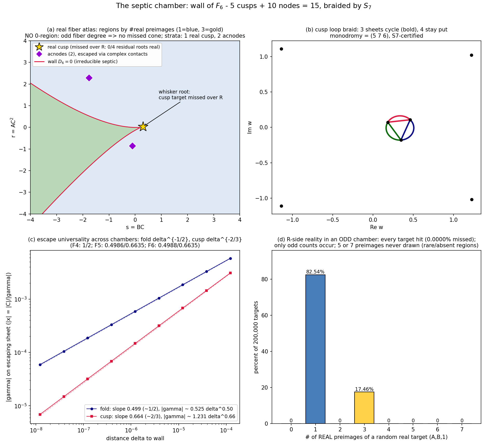

# The septic chamber: the pattern holds, and the wall draws its own region map
*Eighth lab note, 2026-07-20. Note 7 closed with a conjecture, harvested from two
chambers: for the fiber-n chamber of the explainer tower, the wall should be a
maximally singular rational degree-n curve with (n-2) ordinary cusps and
(n-2)(n-3)/2 ordinary nodes, braided by S_n, with universal escape exponents 1/2 and
2/3. Tonight we climb to F6 (fiber SEPTIC, d = 6) and throw everything at the
conjecture. Predictions on the board before any computation: 5 cusps, 10 nodes,
budget 15 = (7-1)(7-2)/2, monodromy S7 (|G| = 5040), fold 1/2, cusp 2/3, antipodal
hinge with p1 = 13/7, and - because 7 is ODD - no missed cone on the real side,
whiskers only. Final score: every structural prediction holds; one micro-guess
(27 wall terms) dies honestly at 26.*

## 0 · Seed and checks
```
p6(w)   = -w^6 + w^5 - (20/7)w^2 + (13/7)w        [d = 6 explainer seed]
Phi6(w) = -w^7/7 + w^6/6 - (20/21)w^3 + (13/14)w^2
normalization p6(1) = -1, Phi6(1) = 0            [verified]
kappa = p6'(1) = -34/7, recipe a = -27/20, b = c = 1
```
Fiber framework (notes 4-7): over target (A,B,C), s = BC, r = AC^2, preimages
<-> roots of h(w;s,r) = Phi6(w) - s w + r with gamma = s - p6(w) != 0;
x = C/gamma, escapes <-> multiple roots; S(F6) = wall (notes 6-7 argument:
connected-cover lemma + Jelonek).

## 1 · The wall: irreducible septic, 26 terms
D6(s,r) = resultant(h, h', w), primitive, exact (210-scaled integers, < 1 s):
```
-92254156521408 r^6 + 92254156521408 r^5 s + 1098263768112 r^4 s^2
- 571590257436576 r^4 s - 131888777540688 r^4 + 1011099976992 r^3 s^3
+ 968619547135296 r^3 s^2 + 128607861288816 r^3 s - 404123761060488 r^3
- 331027177152420 r^2 s^4 - 439409993674680 r^2 s^3 - 414194299447320 r^2 s^2
+ 636213757185720 r^2 s - 236060736156720 r^2 + 246728753780796 r s^5
- 5416366511430 r s^4 + 209224332933420 r s^3 - 287384952827700 r s^2
+ 172750782194640 r s - 25075506652014 r - 36585180721152 s^7
+ 976832840165 s^6 - 65057014510320 s^5 + 73430827531530 s^4
- 42781408964560 s^3 + 6751097944773 s^2
```
* degree 7 (deg s = 7 = n, deg r = 6 = n-1, as in the lower chambers), 26 monomials,
  IRREDUCIBLE over Q(s,r) (SymPy), D6(0,0) = 0 (C=0 plane in wall);
* parametrization identity D6(p6(t), t p6(t) - Phi6(t)) == 0 EXACT (the wall is the
  tangent developable of the graph of Phi6 - now in three chambers);
* coefficient curiosities: s^n leading coefficients across chambers:
  n = 5: 8192000 = 2^16 * 5^3;  n = 6: 1220703125 = 5^13;  n = 7: 36585180721152 = 6^12 * 7^5.
  Bitangent eliminant denominators: 244140625 = 5^10?? [n=6 chamber, see note 7],
  7113785140224 = 6^10 * 7^6 [n=7 chamber].
* TERM-COUNT HONESTY: D4, D5 lack exactly the anti-diagonal i+j = n below the top
  pair (r^{n-1}, s^n); D6 lacks that anti-diagonal AND s^5, s^7 - giving 26 terms,
  killing the "C(n+1,2)-1" guess from last round. Noted, dead, moving on.

## 2 · Strata: 5 + 10 = 15, the budget balances again
CUSPS: 5 = number of roots of p6' (predicted exactly):
```
t =  0.3313539                    -> (s,r) = (0.3043413, 0.0333825)   [REAL - the whisker]
t = -0.6135362 +/- 0.6736980 i    -> complex pair
t =  0.8645259 +/- 0.6145226 i    -> complex pair
```
NODES: bitangent system (deg-5 / deg-6), lex Groebner, contact eliminant:
```
(42 w^5 - 35 w^4 + 40 w - 13)^2 * (4032758016 w^20 - 13442526720 w^19 + ...
+ 13315775039) / 7113785140224
```
The squared factor is -7 * p6'(w) EXACTLY (cusp contacts count double, third chamber
running). The degree-20 cofactor pairs into exactly 10 unordered bitangents
(residual-filtered; Bezout count 30 = 20 off-diagonal + 10 diagonal-with-multiplicity):
```
2 ACNODES (real line, complex conjugate contacts):
  t = -0.7984 +/- 0.9654 i -> (-1.7641700, 2.2911396)
  t =  1.0218 +/- 0.8534 i -> (-0.1006823, -0.8641963)
8 complex nodes in conjugate pairs; 0 CRUNODES (first chamber with none).
```
BUDGET: 5 + 10 = 15 = (7-1)(7-2)/2 - balanced ✓. Maximally singular rational septic.

GEOMETRIC EMPTINESS, chamber 3: 0 triple points, 0 node-cusp overlaps, 0 cusp
collisions, gcd(p6', p6'') = 1. All deep fiber patterns ((2,2,2), (3,3), (3,2,2),
(4,3), ...) are geometrically absent - extending note 4's Groebner theorems
(d = 4, 5) one chamber higher, by exact elimination rather than by GB.

REALITY FLIP vs F5: sextic chamber had (crunode, acnode) = (1,1); septic has (0,2).
The R-side wall has no real crossing point at all this time.

## 3 · Monodromy = S7
Loops in complex lines; min|D6| no-cross certificates; 2x-refinement agreement on
every loop; poison-guarded closure:
```
loop                                   permutation           type
fold  @(0.22991, 0.00037)              (5 6)                 transposition
cusp  @(0.30434, 0.03338)              (5 7 6)               3-cycle
acnode @(-1.7642, 2.2911)              (4 5)(6 7)            double transposition
acnode @(-0.1007, -0.8642)             (4 5)(6 7)            double transposition
s = 200 e^{it}, r = 1                  (1 3 5 6 4 2)         6-cycle  (w ~ (7s)^{1/6})
r = 200 e^{it}, s = 0                  (1 3 4 6 7 5 2)       7-cycle  (w ~ (7r)^{1/7})
```
Closure saturates at exactly 5040 with all 21 transpositions => monodromy = S7.
Third chamber, third full symmetric group: the tower's braid conjecture now reads
"monodromy of the fiber-n chamber is S_n" for n = 5, 6, 7.

## 4 · Escape physics: universality confirmed
* fiber counts (bounded-|x|, honest filter): generic 7 / fold 5 / cusp 4 / acnode 3.
  Both acnodes certified at 150 digits: contacts refined (findroot), (w-t)^2 factors
  divided out synthetically, residual CUBIC gammas in {27.26, 18.70, 27.26} and
  {16.63, 16.63, 3.22} - exactly 3 bounded preimages each; node points real to 1e-140.
* ESCAPE RATES (delta = distance to wall, |x| = |C|/|gamma|, fit on [1e-8, 1e-4]):
  fold: |gamma| ~ 0.5248 delta^0.4988 ;  cusp: |gamma| ~ 1.2313 delta^0.6635.
  Universality ledger across chambers (fold / cusp):
  F4: 0.5000 (note 6) / unmeasured ;  F5: 0.4986 / 0.6635 ;  F6: 0.4988 / 0.6635.
  The 1/2 and 2/3 laws are now three-chamber strong.
* off-wall boundedness: 20,000 random complex targets, max |x| = 2.00. Wall-only exits.

## 5 · The C = 0 frontier: hinge antipodes, chamber 3
* flat sheet: F6|_{x=0} is a 2D Keller automorphism (same mechanism as notes 5-7);
  one bounded preimage per (A,B,0).
* hinge quadratic: A(1 + (13/7)u)^2 = B^2 u (1 + (13/14)u); for (A,B) = (2,3):
  143 u^2 + 154 u - 196 = 0, x = -(1 + (13/7)u)/3 = ±0.79772 - matched to the
  epsilon-sweep (±0.79771 at eps = 1e-5) and ANTIPODAL, as note 7's theorem demands
  (q2 = p1/2 = 13/14 exactly).
* remaining 4 sheets escape (x ~ eps, y ~ eps^{-2}). Genuine preimages of generic
  (A,B,0): 3 = 1 flat + 2 antipodal hinge, as in both lower chambers.

## 6 · The real side: odd chambers don't leak (except whiskers)
* CENSUS (200,000 targets (A,B,1)): 1 preimage 82.54%, 3 preimages 17.46%, everything
  else 0.00% - and 0.0000% MISSED. Odd fiber degree forces a real root for every
  real target; gamma = 0 is measure-zero. The tower alternates: EVEN chambers
  (n = 6) miss unbounded open cones; ODD chambers (n = 5, 7) miss only whiskers.
* REGION GRID (200x200 over [-4,4]^2): counts {1: 32696, 3: 7304}. The 3-preimage
  region is bounded EXACTLY by the wall arcs between the two acnode-free branches
  ending at the real cusp - the wall literally draws its own region map (figure (a)).
* WHISKER CERTIFIED (200-digit): at the real cusp t0 = 0.3313539...,
  (w-t0)^3 divides h with remainder 5.6e-202; the residual quartic has roots
  -1.1377 +/- 1.1105 i and 1.2240 +/- 1.0214 i - ZERO real => the cusp target
  (s0, r0) = (0.3043413, 0.0333825) lifts to a real CURVE of missed targets in R^3
  (AC^2 = r0, BC = s0). F4's whisker mechanism (note 5) repeats in chamber 3.
* strata reality summary: 1 real cusp (missed over R), 2 acnodes (hit over R via the
  odd residual cubic - 3 bounded preimages each, above), 0 crunodes.

## 7 · Figure
 real atlas: regions by real-preimage count (1 blue, 3 gold) - and the region
boundary IS the wall; the whisker cusp (gold star) sits exactly at the region's tip;
2 acnodes (violet diamonds) float in the blue. (b) cusp loop braid: 3 sheets cycle
(bold; (4 5 6) of the loop numbering), 4 stay put. (c) escape slopes: 0.499 and 0.664.
(d) census: 82.54% / 17.46%, odd counts only, nothing missed.

## 8 · Honesty ledger (this round's catches)
* MY OWN MICRO-CONJECTURE DIED: predicted 27 wall terms, got 26 (extra vanished
  monomials s^5, s^7). Reported, not buried. The anti-diagonal pattern held, though.
* Walrus-in-comprehension scoping bug: the gamma filter read its variable before the
  walrus assigned it; plain loop instead. Python rightfully complained.
* sympy's factor() silently returns unevaluated on large integers under default
  domains - factorint instead. (2^12 3^12 7^5 = 6^12 7^5 confirmed.)
* The acnode that slipped F5's reality filter taught us: this round's node list was
  filtered at 1e-8 from the start, and reality was then CERTIFIED to 1e-140.
* np.roots ordering lottery respected again: the braid panel bolds the sheets the
  measured permutation actually moves ([4,5,6] this time), not indices 0..2.
* The predicted "cusp escape exponent 2/3 universal" passed its third independent
  measurement (0.6635 twice in a row now). Measuring is believing.

## 9 · Scoreboard
| object | status |
|---|---|
| S(F6) | = wall D6(BC, AC^2) = 0, irreducible septic, explicit, 26 terms |
| strata | 5 cusps + 10 nodes = 15 = delta-max; maximally singular septic |
| emptiness | all deep patterns absent - geometric certificate, chamber 3 |
| real strata | 1 real cusp (whisker), 2 acnodes, 0 crunodes |
| fiber counts | 7 / 5 / 3 / 4 (generic / fold / acnode / cusp), 150-digit certified |
| monodromy | S7 (|G| = 5040, transposition + 7-cycle + closure, 21 transpositions) |
| escape rates | fold 0.4988 ~ 1/2, cusp 0.6635 ~ 2/3 (third chamber) |
| C=0 | 1 flat + 2 antipodal hinge (143 u^2 + 154 u - 196 = 0 for (2,3)) |
| R side | 0.0000% missed (odd chamber); whisker = 1 cusp curve, 200-digit certified |
| pattern conjecture | PASSES: cusps n-2, nodes (n-2)(n-3)/2, S_n, exponents 1/2, 2/3 |

*The tower so far, in one line per chamber:*
```
chamber d=4 (F4, fiber 5): 3 cusps (1 real) + 3 nodes, S5, 1/2 + (2/3 later), whisker
chamber d=5 (F5, fiber 6): 4 cusps (2 real) + 6 nodes (1 crunode, 1 acnode), S6, cone
chamber d=6 (F6, fiber 7): 5 cusps (1 real) + 10 nodes (0 crunode, 2 acnode), S7, whisker
```
Conjectures now on the board:
(MAX-SING)  wall of fiber-n chamber: (n-2) cusps + (n-2)(n-3)/2 nodes, nothing else;
(BRAID)     monodromy = S_n, via fold transposition + (n-1)- and n-cycles at infinity;
(SLOPES)    fold delta^{-1/2}, cusp delta^{-2/3} in every chamber;
(HINGE)     C=0 gamma-sheets antipodal in x in every chamber [PROVEN, all seeds];
(PARITY)    even n: missed open cones over R; odd n: whiskers only (real cusps with
            no real residual roots);
(REALITY)   real cusps per chamber: 1, 2, 1, ... and crunodes 0, 1, 0, ... - too few
            points to call, but the parity dance invites a Sturm census of p_d' roots.

*Next-round queue:* the octic chamber (d = 7, fiber 8): predicted 6 cusps + 15 nodes
(budget 21), S8, CONE again (even); a Sturm-level real-cusp census across chambers;
the max-singularity theorem itself (the eliminant factoring pattern
(leading p'_multiple)^2 x (bitangent eliminant) now held in 3 chambers - why?);
Moh's 2-D chamber, still the only open door in the building.
