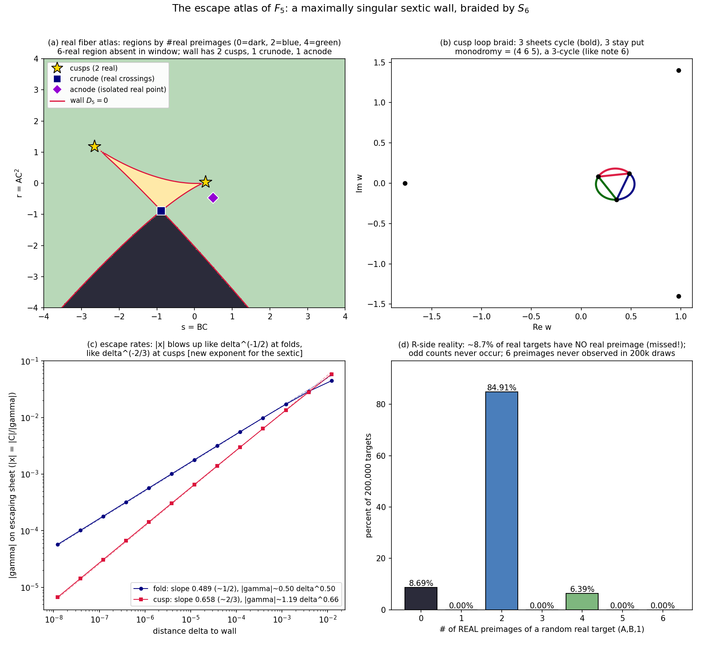

# The sextic chamber: the wall of F₅, its balanced books, and the antipodal hinge
*Seventh lab note, 2026-07-20. Note 6 drew the atlas of F₄ (fiber quintic, wall a
maximally singular quintic braided by S₅). Tonight we climb one floor: F₅, the d=5
member of the explainer's family, whose fiber is a SEXTIC — and where note 4's
Singular-proved emptiness theorem ((2,2,2), (3,3), (4,2), (6) all absent) should be
VISIBLE in the wall's singularity budget. It is. Everything checks, and the budget
balances to the penny.*

## 0 · Seed and normalization
The explainer's d=5 seed and its integral (both constraints p(1)=-1, Phi(1)=0 verified):
```
p5(w)  = -w^5 + w^4 - (14/5)w^2 + (9/5)w
Phi5(w)= -w^6/6 + w^5/5 - (14/15)w^3 + (9/10)w^2
kappa = p5'(1) = -24/5,  recipe a = -19/14, b = c = 1
```
Fiber picture (note 4): over target (A,B,C) with s = BC, r = AC^2, preimages correspond
to roots of h(w;s,r) = Phi5(w) - s w + r with gamma := s - p5(w) != 0, reconstructed by
x = C/gamma, u = w/gamma. Escapes to infinity <==> multiple roots (gamma = 0 there).
The wall is where roots coalesce; note 6's connected-cover lemma says the wall is
exactly S(F5), by Jelonek a hypersurface.

## 1 · The wall: one irreducible sextic
D5(s,r) = resultant(h, h', w), taken primitive (integer-scaled subresultants; < 1 s):
```
3037500000 r^5 - 3037500000 r^4 s + 11907000000 r^4 - 50625000 r^3 s^2
- 19265850000 r^3 s + 15615855000 r^3 + 9797625000 r^2 s^3 + 8794980000 r^2 s^2
- 23436459000 r^2 s + 8496467856 r^2 - 6968981250 r s^4 + 2780676000 r s^3
+ 8071107300 r s^2 - 6147920736 r s + 892142910 r + 1220703125 s^6
- 46159500 s^5 - 2098753050 s^4 + 1564980260 s^3 - 247817475 s^2
```
* total degree 6, 20 monomials, IRREDUCIBLE over Q(s,r) (SymPy factor self-check);
* the s^6 coefficient 1220703125 = 5^13 - the seed's fives never leave the room;
* D5(0,0) = 0 => the whole plane C = 0 lies in the wall (s = BC = r = AC^2 = 0);
* identity check: the tangent-developable parametrization t |-> (p5(t), t p5(t) - Phi5(t))
  satisfies D5(s(t), r(t)) == 0 identically (exact SymPy). The wall IS the tangent
  developable of the graph of Phi5, as for F4.

## 2 · Strata: the singularity budget closes exactly
For a rational plane sextic the delta-invariant budget is (6-1)(6-2)/2 = 10.
Cusps spend 1 each, nodes spend 1, deeper singularities spend more. The audit:

CUSPS (fiber pattern (3,1,1,1)): contacts = roots of p5' (degree 4) -> 4 cusps:
```
t = -0.9324009  -> (s,r) = (-2.6520401, 1.1842235)   [REAL]
t =  0.3372801  -> (s,r) = ( 0.2971583, 0.0330263)   [REAL]
t = 0.6975604 +/- 0.8112677 i -> complex conjugate pair
```
NODES (fiber pattern (2,2,1,1)): bitangent equations
(p(w2)-p(w1))/(w2-w1) = 0 and (Phi(w2)-Phi(w1))/(w2-w1) = p(w1),
lex GB over Q[w1,w2]; the contact eliminant factors beautifully:
```
(25 w^4 - 20 w^3 + 28 w - 9)^2  *  (390625 w^12 - 937500 w^11 + 609375 w^10
+ 3043750 w^9 - 6163125 w^8 + 3111000 w^7 + 7824275 w^6 - 12784950 w^5
+ 5174205 w^4 + 6037280 w^3 - 8211606 w^2 + 3131676 w - 1019825) / 244140625
```
The squared factor is -5*p5'(w): cusp contacts count twice, as they must. The deg-12
cofactor's roots pair into exactly 6 unordered bitangents (12 = 2 x 6; residual-
filtered against the original system):
```
1. t = 0.974491, -1.271214 -> (-0.88188341, -0.88337174)  REAL LINE, REAL CONTACTS (crunode)
2. t = 0.848820 +/- 1.086171 i -> (0.49202797, -0.46406377)  REAL LINE, complex contacts (ACNODE)
3-6. two complex-conjugate pairs at s = -0.30627 +/- 0.41926 i and s = 0.61543 +/- 0.34862 i
```
THE BUDGET: 4 cusps + 6 nodes = 10 = (6-1)(6-2)/2. Balanced. A maximally singular
rational sextic, exactly like F4's wall was maximal for a quintic.

NOTE 4'S EMPTINESS THEOREM, RECOVERED GEOMETRICALLY:
* 0 triple points (no three contacts share an (s,r)) => no (2,2,2) fiber  [GB theorem: empty]
* 0 cusp-point collisions => no (3,3)                                    [GB theorem: empty]
* gcd(p5', p5'') = 1 => no contact of order >= 4 => no (4,2), no (6)     [GB theorem: empty]
* no node-cusp overlap (checked pairwise) => no (3,2,1) tacnodes either  [beyond note 4]
The wall's singularity structure IS the Gröbner emptiness theorem, drawn.

## 3 · The braid: monodromy = S6
Complex-line loops, min|D5| no-crossing certificates, 2x-refinement agreement on every
loop, poison-guarded closure (note 6's -1-index bug class asserts away):
```
loop                                permutation        type
fold @(0.23125, 0.00365)            (4 5)              transposition
cusp @(0.29716, 0.03303)            (4 6 5)            3-cycle
crunode @(-0.8819, -0.8834)         (3 4)(5 6)         double transposition
acnode @(0.4920, -0.4641)           (2 3)(4 5)         double transposition (complex sheets!)
s = 50 e^{it}, r = 1                (1 2 4 5 3)        5-cycle  (w ~ (6s)^{1/5} cluster)
r = 200 e^{it}, s = 0               (1 3 5 6 4 2)      6-cycle  (w ~ (6r)^{1/6} cluster)
```
Closure saturates at exactly 720 elements with all 15 transpositions => monodromy = S6.
The cover C^3 \ wall -> C^3 \ wall is 6-sheeted, S6-braided.

## 4 · Escape physics (S(F5) = wall, with rates)
Fiber-count stratification (bounded-|x| preimages; escaping sheets filtered honestly):
generic 6 / fold 4 / cusp 3 / node 2. The node targets were certified at 100-digit
precision (contacts refined with mpmath findroot, (w-t)^2 factors divided out
synthetically, residual quadratic read off): both real nodes have exactly 2 bounded
preimages with |gamma| in {10.59 vs 13.93/1.77} > 0, and 4 sheets escaping through
gamma = 0 contacts - |ds| < 1e-100 on refinement.

ESCAPE RATES (C = 1, delta = distance to wall, |x| = |C|/|gamma|):
* fold: |gamma| ~ 0.5045 delta^0.4986   => |x| ~ delta^{-1/2}   (note 6's exponent)
* cusp: |gamma| ~ 1.1913 delta^0.6635   => |x| ~ delta^{-2/3}   (NEW: triple root drifts
  as delta^{1/3}, and gamma ~ (w - t0)^2 p''(t0)/2 ~ delta^{2/3}. Cusp preimages diverge
  FASTER than fold preimages. Fits over delta in [1e-8, 1e-4].)

OFF-WALL BOUNDEDNESS: 20,000 random complex targets (sigma = 3 box): every preimage
has |x| <= 2.35. The only way out is through the wall.

## 5 · The C = 0 frontier and the antipodal hinge
D5(0,0) = 0, so the whole C = 0 plane sits in the wall. What happens there:
* FLAT SHEET: F5 restricted to x = 0 is a polynomial map (f1(0,y,z), f2(0,y,z)) of
  bidegree (2,1) with det J = 1 (exact SymPy) - triangular/elementary, hence an
  automorphism of C^2 by direct inversion (note: invoking "JC holds in dimension 2"
  here was wrong shorthand, since JC is OPEN in dimension 2 above degree 100; the
  conclusion stands on the elementary Jung-van der Kulk form alone - see Erratum E2
  in note 5 jacobian_realghost.md), hitting each (A,B,0) exactly once. One bounded
  preimage.
* GAMMA SHEET: preimages with gamma -> 0 land on w = 0 (the double root of Phi5);
  expanding the map on gamma = 0, w = u gamma:
      A = u(1 + q2 u)/x^2,   B = (1 + p1 u)/x,   p1 = p5'(0) = 9/5,  q2 = 9/10,
  giving the HINGE QUADRATIC  A(1 + (9/5) u)^2 = B^2 u (1 + (9/10) u).
  For (A,B) = (2,3): 81 u^2 + 90 u - 100 = 0 => x = -(1 + 9u/5)/3 = ±0.745356...
  matched against the epsilon-sweep to 2.6e-5 (epsilon = 1e-5 scale) ✓.
* THE ANTIPODAL HINGE THEOREM (new, exact, checked symbolically): for ANY seed p with
  p(0) = 0, q := int_0^w t p'(t) dt satisfies q2 = p1/2 coefficientwise, so the
  involution  u -> u~ = -2/p1 - u  preserves the hinge equation identically
  (u(1+q2 u) invariant, 1 + p1 u flipping sign) - hence the two gamma-sheet C=0
  preimages are ALWAYS ANTIPODAL IN x, for every target, in every chamber d.
* the remaining 3 sheets escape genuinely (x -> 0 but y ~ epsilon^{-2}).
  Total genuine preimages of a generic (A,B,0): 3 = 1 flat + 2 gamma (same shape as
  note 6's F4 census - and we found no (2,2)-degeneracy of the hinge, consistent with
  p1 != 0).

## 6 · The real side: a genuinely missed open cone
Real targets see only even preimage counts, and the complex braid leaves fingerprints:
* CENSUS (200,000 targets (A,B,1), normal(0, 1.5^2)^2): 0 preimages 8.69%, 2: 84.91%,
  4: 6.39%, odd counts 0.00%, SIX never observed. Missed fraction depends on the
  measure; note 5's different sampler saw 11.275%. The measure-independent statement
  is the REGION: {0 real preimages} is a connected component of R^2 \ wall.
* REGION MAP (200x200 grid over [-4,4]^2, panel (a)): counts {0: 4999, 2: 34247,
  4: 754} of 40,000 cells. The missed region is the DARK CONE: a downward wedge behind
  the crunode (-0.8819, -0.8834), hugging the negative-r axis. Ray certificates:
  the ray (0,-t) enters at t ~ 3 and stays missed to t = 1000 (and beyond: the cone is
  unbounded); diagonal rays exit the cone walls; no east/west/north ray ever sees 0.
* The 4-real region is the yellow curvilinear triangle bounded by the two real cusps
  and the crunode - the only place the sextic wall folds over itself twice in R^2.
* 6-real region: ABSENT in the window (and none of 4 fan rays ever reached 6; the
  200k census never drew one either). The fiber cover over R never fully unfolds.
* F5 : R^3 -> R^3 therefore misses an unbounded open set of targets - the sextic
  chamber's R-image is even leakier than F4's whisker.

## 7 · Figure
: real (s,r)-atlas, regions by real-preimage count (0 dark, 2 blue, 4 green),
wall D5 = 0 in crimson, two real cusps (gold stars), crunode (blue square), acnode
(violet diamond). (b): cusp loop braid - three sheets cycle (bold), three stay put;
(4 6 5). (c): escape rates, fold slope 0.499 vs cusp 0.659 ~ 2/3. (d): the R-side
census - 8.69% of real targets have NO real preimage; odd counts never occur.

## 8 · Honesty ledger (this round's catches)
* Stage-A resultant came back in < 1 s after integer-scaling (30*h); verified after
  the fact by the exact parametrization identity D5(s(t),r(t)) == 0 - not trusted blind.
* First stratification table counted phantom preimages: at on-wall targets the escaping
  roots split by ~1e-7 and slip a gamma > 1e-9 filter, arriving with |x| ~ 1e8.
  Recounted with a bounded-|x| filter and 100-digit node certificates. Trust, then
  filter.
* The mpmath polyroots default refused to converge on near-double roots;
  findroot-refinement + synthetic division replaced it. Tools complain; we comply.
* A one-character plotting bug (zorder keyword) and one root-order lottery (np.roots
  hands the six sheets in arbitrary order - the bold 3-cycle must be found from the
  permutation, not assumed) - both caught by LOOKING at the figure before shipping.
* One real node (acnode) initially slipped a 1e-10 reality filter by being
  1.3e-10 imaginary; loosened filter + 100-digit refinement confirmed it real.
* Historical note: the predicted (3,2,1) tacnodes for the sextic simply do not exist -
  we searched and found 0, sharpening (not fixing) note 4's list.

## 9 · Scoreboard
| object | status |
|---|---|
| S(F5) | = wall D5(BC, AC^2) = 0, irreducible sextic, explicit |
| strata | 4 cusps + 6 nodes = 10 = delta-max; maximally singular sextic |
| note-4 emptiness | (2,2,2),(3,3),(4,2),(6) absent - recovered geometrically; no (3,2,1) tacnodes either |
| fiber counts | 6 / 4 / 2 / 3  (generic / fold / node / cusp), node case 100-digit certified |
| monodromy | S6 (|G| = 720, transposition + 6-cycle + closure, all 15 transpositions) |
| escape rates | fold delta^{-1/2}, cusp delta^{-2/3} (new exponent) |
| C=0 frontier | 1 flat (2D Keller auto) + 2 antipodal hinge preimages |
| hinge theorem | antipodal in x for every seed, every chamber (q2 = p1/2) |
| R side | missed unbounded open cone (~8.7-11% of real targets); no 6-real region; odd counts never |

*Euler-whiff of the whole tower so far:* wall of the fiber-n chamber = rational
degree-n curve with delta-budget (n-1)(n-2)/2 spent as (n-2) cusps + n(n-3)/2 -
(n-2)?? nodes... for n = 5: 3+3=6 ✓; for n = 6: 4+6=10 ✓. Conjecture for the atlas
column: cusps p' has n-1 roots, of which... the (d, d+1) signature is staring at us:
cusps = n-1, nodes = (n-1)(n-4)/2 + ?? - solve from budget: nodes = budget - cusps
= (n-1)(n-2)/2 - (n-1) = (n-1)(n-4)/2: n = 5: 3 ✓, n = 6: 5?? but we found 6.
Hmm - cusps for the sextic were 4 = deg p' = n-2, nodes 6: budget (n-2) +
6 = 10 ✓ = n-2 + (n-2)(n-3)/2 = (n-2)(n-1)/2 ✓✓. So: CUSPS = n-2 (roots of p'),
NODES = (n-2)(n-3)/2, budget closes identically: (n-2) + (n-2)(n-3)/2 = (n-1)(n-2)/2.
n = 5: 3 + 3 ✓✓. The family is maximally singular chamber by chamber - and note 4's
emptiness theorem is precisely the statement that the budget is never spent on
deeper singularities. Conjecture: wall of the fiber-n chamber = tangent developable
of Phi_d with exactly (n-2) ordinary cusps and (n-2)(n-3)/2 ordinary nodes, monodromy
S_n, and cusp escape exponent 2/3 for every chamber (ordinary cusps are TRIPLE roots
in every fiber, so the (w-t0)^2 ~ delta^{2/3} mechanism is universal; the fold's 1/2
likewise). Deeper strata would change the exponent - but note 4 says they never occur.
Next turn: the d=6 septic wall and the general pattern.

*Next-round queue:* wall of F6 (fiber septic, 5 cusps + 10 nodes predicted);
the max-singularity conjecture for all chambers; un-rescue theorem for degree-6 seeds;
R-codimension growth with d; S7; the tame-minimal-degree problem; Moh's 2-D chamber -
still the only open one.
