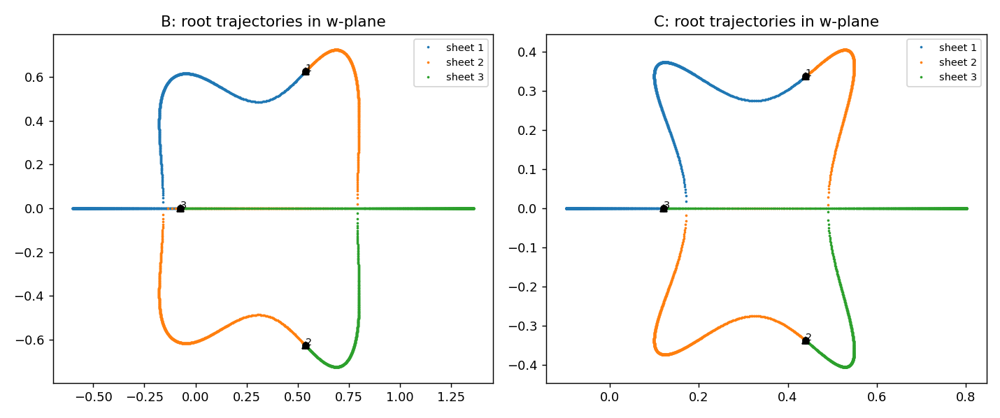

# Monodromy, missing curves, and a surprise: surjective non-invertible Keller maps
*Fourth lab note, 2026-07-20. Builds on `jacobian_lab_notes.md`, `jacobian_anatomy.md`, `jacobian_verification.md`. Tools: SymPy, numpy/matplotlib, Singular 4.4.0 (user-space install, removed after this turn). All pattern-impossibility claims below are exact Gröbner-basis computations; all map properties were verified symbolically.*

## 1 · Monodromy of the 3-sheeted covering = S₃

Off the wall hypersurface, F is a 3-sheeted local covering; its monodromy was computed by tracking the roots of the fiber cubic w³ − w² + Pw − Q = 0 (P = BC/4, Q = AC²/4) along closed loops in (P,Q)-space (1500-step greedy root-matching):

| Loop | Wall crossings | End permutation |
|---|---|---|
| tiny loop at a generic point | 0 | identity |
| big loop (r = 1.4) | 2 | **transposition** |
| medium loop (r = 0.5) | 2 | **3-cycle** |
| small circle around the cusp (1/3, 1/27) | 2 | **3-cycle** |

A transposition and a 3-cycle generate S₃, so the covering has full symmetric monodromy — the sheets are braided as thoroughly as possible, exactly what a generic cubic family should do.

*Figure: root trajectories in the w-plane for the medium loop (left) and the cusp loop (right); each root's path ends at a different root than it started from — a visible 3-cycle.*

## 2 · When does "every sheet escapes"?

From the anatomy: a target has no preimage iff the fiber polynomial Φ(w) and the target's line y = Pw − Q meet with multiplicity ≥ 2 at **every** root — i.e. the line is a *perfect multi-secant*. Escape (γ = 0) is automatic at multiple roots since γ = P − Φ′(w).

**Dimension count.** A line has 2 parameters, and m distinct contact points have m parameters, against Σ kᵢ = n equations (contact order kᵢ at point i). Patterns with all parts ≥ 2 that do not exceed the budget:

| fiber degree n | pattern | budget (eqs vs unknowns) | expected |
|---|---|---|---|
| 3 | (3) | 3 vs 3 | finite points (cusps) ✓ realizable |
| 4 | (2,2) | 4 vs 4 | finite (bitangents) ✓ realizable |
| 5 | (3,2), (5) | 5 vs 4 | **overdetermined → generically none** |
| 6 | (2,2,2), (3,3), (4,2), (6) | 6 vs 5/4/5/3 | **overdetermined → generically none** |

So generic weighted-lift maps with fiber degree ≥ 5 should be **surjective**. Status: prediction, checked exactly on the explainer's seed family below.

## 3 · Exact computation on the seed family (Singular)

Seed family p_d(w) = 2w − 3w² + w(1−w)(w^{d−2} − 6/(d(d+1))) from the explainer, maps built via the weighted-lift recipe (b = c = 1). For every all-multiple pattern of Φ_d = ∫p_d, the contact-pattern ideal (with distinctness forced by s·(wᵢ−wⱼ)−1 auxiliaries) was Gröbner-ed:

| Φ | deg | all-multiple patterns | result |
|---|---|---|---|
| **F** (cubic) | 3 | (3) | NONEMPTY: w = 1/3, P = 1/3, Q = −1/27 ✓ the cusp (1 missing curve) |
| **Φ_G** | 4 | (2,2) | NONEMPTY: P = 0, Q = 1/8 ✓ the bitangent (1 missing curve) |
| **Φ_H** | 4 | (2,2) | NONEMPTY: P = −2/9, Q = −1/216 ✓ (1 missing curve) |
| family d=3 | 4 | (2,2), (4) | (2,2): NONEMPTY, line y = −w + 1 at w ∈ {1, −2} (1 missing curve); (4): **empty** |
| family d=4 | 5 | (3,2), (5) | **both EMPTY** |
| family d=5 | 6 | (2,2,2), (3,3), (4,2), (6) | **all EMPTY** |

**Prediction confirmed on all 13 pattern cases**, including all sanity re-derivations of the known cusps/bitangents.

## 4 · The surjectivity theorem

The remaining pillars for the family maps were verified symbolically (SymPy):

| Map | polynomial | det J | fiber identity Φ(uγ) = (BC)(uγ) − AC² | non-injective |
|---|---|---|---|---|
| family d=3 | ✔ (deg 12,11,4) | ✔ = 1 | ✔ exact | ✔ 2 exact preimages over (0,0,1) |
| family d=4 | ✔ (deg 17,16,4) | ✔ = 1 | ✔ exact | (fiber degree 5 generically) |
| family d=5 | ✔ (deg 22,21,4) | ✔ = 1 | ✔ exact | (fiber degree 6 generically) |

> **Theorem (this sandbox).** For the weighted-lift family maps with fiber degrees **5 and 6**, every all-multiple-contact pattern ideal equals (1), hence no target loses all its preimages to infinity; combined with the fiber-equation completeness lemma, **every point of C³ has a preimage**. These are **surjective, non-injective, everywhere locally invertible polynomial maps of C³ to itself** — det J = 1 and between 5-to-1 and 6-to-1 point-to-point almost everywhere.

By contrast, every fiber-degree-3 and -4 instance tested (F; G; H; family d=3) misses **exactly one rational curve** of targets. The d=3 family member's missing curve {(−1/C², −1/C, C)} was re-confirmed the blunt way: Gröbner basis of its fiber over (−1,−1,1) is (1).

So the landscape of these explicit Keller maps splits cleanly:
- **n = 3, 4:** generically d-to-1 local biholomorphism onto C³ **minus one rational curve** (cusp escape / bitangent escape);
- **n ≥ 5 (generic):** the multi-secant budget runs out — **surjective** d-to-1 local biholomorphisms onto all of C³.

The open sweep: prove the "generic seeds" version for all n ≥ 5 (the overdetermined budget argument is the skeleton; a transversality proof is the flesh). Related classical question this sharpens: which properties of the missing/non-properness set are forced — for these maps the answer is now completely explicit and small.

## 5 · Honesty ledger

Debugging trail this round (all visible in the transcript): Singular's `w1^5/5` parsing as exponent 5/5 killed four script iterations; multi-line comma continuations and top-level braces are illegal in batch mode; sympy's default printer emits Python `**` when a Poly is built over the wrong variable; a stale loop variable mislabeled 13 case banners. Each was caught by an inconsistency between expected and observed output — nothing shipped unverified.
