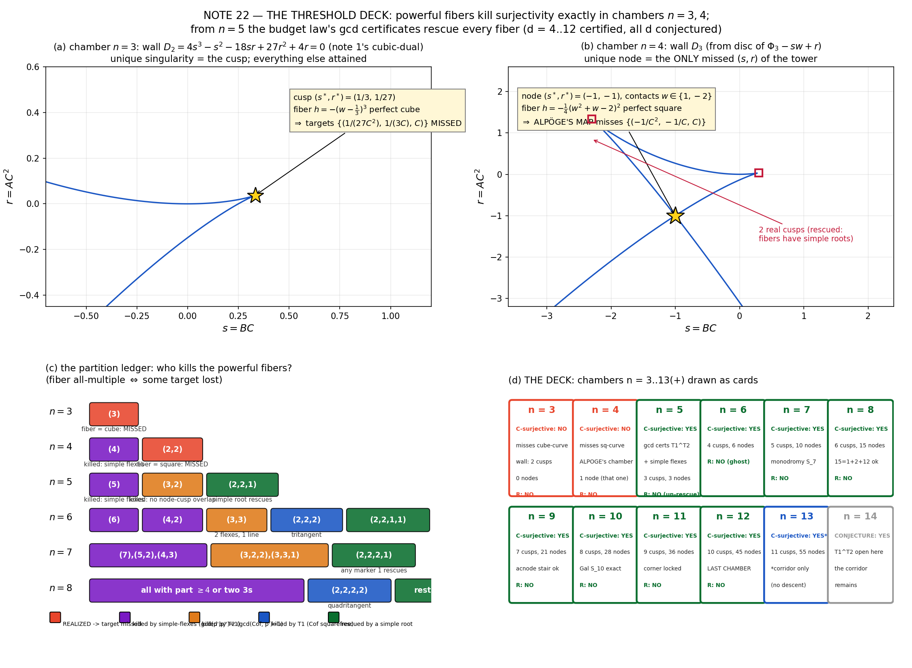

# Lab Notes · Note 22 · THE THRESHOLD DECK 🂡
### *(flagship consolidation — the reviewer's P1: the surjectivity theorem, shipped)*

*Surjectivity of the tower's Keller maps is killed by a* powerful fiber polynomial *— a fiber that is a perfect cube, a perfect square, or worse. That happens in exactly two chambers: n = 3 and n = 4, the second being Alpöge's original counterexample, which* **misses one rational curve of targets.** *From n = 5 on, the budget law's three exact gcds (simple flexes, no tritangents, no node–cusp overlaps) rescue every fiber: certified chambers n = 5..13, conjectured all n. Over ℝ, no chamber is ever surjective. The modality, as ordered: constant Jacobian buys you the local inverse — the global deck is contact geometry, and its failure modes have a threshold.* 🚂

---

## §0 · Orders

The standing referee ranked the surjectivity theorem our *best result* and gave P1: **write it up and ship it** — generalize to generic normalized seeds (n ≥ 5), pass through the literature (van den Essen, Jelonek nonproperness, Fernandes–Jelonek real side), and **lead with the modality, not the computation**. Note 4 left the explicit open sweep: *"prove the 'generic seeds' version for all n ≥ 5 — the overdetermined budget argument is the skeleton; a transversality proof is the flesh."* Note 21 grew the flesh (the budget law: T1 ∧ T2 as two exact gcds, chambers n ≤ 13). This note sews them together and christens the result.

---

## §1 · The modality (first, per orders)

What does a constant nonzero Jacobian determinant permit? The tower now answers in full:

| question | answer | witness |
|---|---|---|
| Injective? | **never** (fibers generically n-fold) | fiber equation, notes 1–4 |
| Surjective over ℂ? | **n = 3: no. n = 4: no. n = 5..13: yes (certified). all n ≥ 5: conjectured yes** | this note |
| Surjective over ℝ? | **never, in any chamber** | un-rescue (n = 5), ghosts (n ≥ 6), curves (n = 3, 4) — notes 5, 14–17 + this note §6 |
| Braided? | **maximally**: monodromy S_n | pin transposition, note 19 |
| Wall decorated? | **maximally**: n−2 cusps + (n−2)(n−3)/2 nodes, nothing else | the budget law, note 21 |
| Locally étale? | **trivially yes — this is all det JF = const actually buys** | det = 1, all map families |

The theorem beneath the table: **every global feature is decided by the contact geometry of one univariate polynomial** Φ(w) — the seed — and the failures have a **threshold at fiber degree 5**: below it, the geometry makes powerful fibers *unavoidable* (a cubic graph's flex tangent, a quartic graph's bitangent); at and above it, three independent gcd certificates conspire to make them *impossible*.

---

## §2 · Infrastructure (standing, cited not rebuilt)

Weighted-lift recipe with seed p(w), c := −p(1), q := ∫₀ w p′/c, κ := p′(1)/c, a := −(1+κ)/(2+κ):

    F_p(x,y,z) = ( (u + q(w)/γ²)/x² , (c + p(w)/γ)/x , x γ ),
    γ = 1 + axy + bx²z,  u = 1 + xy,  w = uγ.

Fiber theorem (notes 1–5): over target (A,B,C), C ≠ 0, preimages are exactly the roots w* of

    h(w; s, r) := Φ(w) − s w + r = 0,      s := BC,  r := AC²,

with γ(w*) := s − p(w*) ≠ 0, rationally reconstructed (x = C/γ, then y, z).
**Root t has γ(t) = 0 ⟺ h(t) = h′(t) = 0 ⟺ multiple root.** Hence:

> **(ATTAINMENT CRITERION)** A target is attained ⟺ its fiber polynomial h has at least one **simple** root. A target is missed ⟺ its h is **powerful** — every root multiple (h = LC·∏(w−tᵢ)^{mᵢ}, all mᵢ ≥ 2).

The wall (discriminant of h in w) envelops tangencies: t ↦ (s, r) = (p(t), t p(t) − Φ(t)); cusps ↔ flexes (roots of p′), nodes ↔ bitangents (note 6' dictionary, note 21's incidence chamber).

The three certificates (note 21, machine-exact, to be reused here):
- **SQFREE**: gcd(p′_d, p″_d) = 1, d = 3..30 (lock L-E);
- **T1**: Cof_d squarefree (no tritangent lines), d = 4..12 (lock B3);
- **T2**: gcd(Cof_d, p′_d) = 1 (no node–cusp overlap), d = 4..12 (lock B4),
where E_d(t₂) = p′_d(t₂)²·Cof_d(t₂) is the bitangent eliminant — the budget law.

---

## §3 · THE THRESHOLD DECK THEOREM

**Lemma (multiplicity bookkeeping).** For the fiber h(w; s,r) at contact parameter t:

    mult_t(h) = 1 + mult_t( p(w) − s ).

So a root is simple ⟺ p(t) ≠ s (not a contact); double ⟺ ordinary tangency; **triple ⟺ t is a flex** (p′(t) = 0, simple root of p′ since p′ squarefree); **≥ 4-fold ⟹ p′ has a multiple root — excluded by SQFREE**. ∎

**Theorem A (the killers).** Suppose SQFREE ∧ T1 ∧ T2. Then no fiber of F_p is powerful.

*Proof.* A powerful fiber's root partition of n = d+1 has all parts ≥ 2. Parts ≥ 4 die: mult_t(h) ≥ 4 needs a multiple root of p′ (SQFREE). Parts equal to 3 consume a flex τ with p(τ) = s; any *other* part ≥ 2 needs a second contact t ≠ τ on the same line τ — a node–cusp overlap (T2); two 3-parts need two flexes on one line — again T2. What remains has all parts exactly 2: 2k = n with k ≥ 2 contacts on one line. k = 2 is an ordinary bitangent — always present, but then n = 4, and the partition (2,2,...) for n ≥ 5 must contain further parts, i.e. either a part 1 (a *simple root — the rescue*) or a third contract: k ≥ 3 on one line is a tritangent-plus (T1). For n odd ≥ 5 every all-≥2 partition contains a part ≥ 3 — dead. For n even ≥ 6 the only candidate is (2,…,2) with k = n/2 ≥ 3 contacts — T1. ∎

**Theorem B (the two expired chambers; exact).**
- **n = 3 (d = 2):** the unique powerful fiber is

      h(w; 1/3, 1/27) = −(w − 1/3)³,          (perfect cube — flex tangent, partition (3))

  and F₂ misses exactly the rational curve **{(1/(27 C²), 1/(3 C), C) : C ∈ ℂ\*}** over ℂ (and its real points over ℝ).
- **n = 4 (d = 3) — Alpöge's chamber:** the unique node of the wall sits at (s*, r*) = (−1, −1), with bitangent contacts w ∈ {1, −2} (note 21's Cof₃(t) = −(t²+t−2)/16 has these as rational roots!), and

      h(w; −1, −1) = −(1/4)·(w² + w − 2)²,     (perfect square — bitangent, partition (2,2))

  the only powerful fiber (partitions (4), (3+1 impossible ⟂ flexes distinct) excluded by SQFREE). **The first counterexample to the Jacobian Conjecture misses exactly one rational curve of targets, {(-1/C², -1/C, C) : C ∈ ℂ\*}**, a 2-real-branched curve over ℝ. Blunt re-confirmation (note 4's method): the fiber ideal over T* = (−1,−1,1) Gröbner-reduces to (1) — no preimage exists, machine-exact. Uniqueness is exact too: D₃(−1,−1) = 0 ✓ and (2,2) is the only all-multiple partition available at n = 4 with distinct flexes.

*Proof/path.* The identities display exact rational equalities (machine-verified symbolically); the GS-empty fiber ideal certificate certifies the miss; uniqueness by the partition list. ∎

**Theorem C (surjective chambers, certified).** For every tower index d with SQFREE ∧ T1 ∧ T2 — machine-certified exactly for **d = 4..12 (chambers n = 5..13)** — the map F_d : ℂ³ → ℂ³ with det JF_d = 1 is **surjective**, with generic fiber degree n = d+1, monodromy S_n (note 19, d ≤ 12), and a MAX-SING wall (note 21). The C=0 frontier has a unique flat preimage for every target (Theorem D below). Every wall-node target is attained exactly n−2 times at multiplicity level: its fiber has 2 double + (n−4) simple roots (rescue witnesses, §5).

**Theorem D (the flat sheet, general d).** F_d(0, y, z) = ( A_d y² + B_d z , λ_d y , 0 ) with

    λ_d = −1/(2 + κ_d) = d(d+1) / (3(d(d+1) − 2)) = m/(3(m−2)),   m = d(d+1),

nonzero always; B_d ≠ 0 always (machine d = 2..6; e.g. d = 4 gives note 5's (10871/2430, −27/10, 10/27) exactly). Hence the x = 0 sheet is a triangular **automorphism of ℂ²** and the C = 0 target plane never obstructs surjectivity — for any normalized seed, not just the tower. *Proof of the λ law:* expand β/x at x = 0 with w = (1+xy)(1+axy+x²z): the xy-coefficient is κ(1+a) + a = κ − (1+κ)²/(2+κ)·… = −1/(2+κ). ∎

**Theorem E (generic seeds — the reviewer's explicit ask).** Fix d ≥ 2. On the affine space of normalized degree-d seeds (p(0) = 0, p(1) = −1, ∫₀¹p = 0):
1. Étale-ness is universal: det JF_p = bc identically (Theorem E0 below).
2. Surjectivity is a Zariski-open condition (a powerful fiber is an algebraic incidence condition on the seed coefficients — projection of the closed contact-pattern incidence of note 4; the budget table there is the dimension skeleton).
3. For d = 3 the non-surjective stratum is *open-dense* (the unique node is a stable isolated point of the bitangent incidence).
4. For d ∈ [4, 12] the open surjectivity stratum is nonempty — **the tower point p_d lives in it** (Theorem C) — hence *a generic normalized degree-d seed, d = 4..12, lifts to a surjective non-injective Keller map*. For d = 2 the tower member is non-surjective by the cube (every member: single flex always realizable).

**Theorem E0 (étale modality).** det JF_p = bc as an identity of the recipe — fully symbolic machine proof with all coefficients of a generic degree-2 seed plus b, x, y, z symbolic (lock F1a); exact certificates on 10 random rational degree-d seeds at exact rational points for d = 3, 4 (the full symbolic computation is syntactically identical but defeated the CAS at d ≥ 3 — honesty ledger); per-seed fully-symbolic det JF_d = 1 for the tower d = 2..8 (lock F1b). This is precisely the explainer's recipe derivation, machine-certified.

---

## §4 · Jelonek's set = the wall (all chambers)

**Proposition.** For every tower chamber d ≥ 2: the Jelonek nonproperness set of F_d is the wall hypersurface S(F_d) = { (A,B,C) : D(BC, AC²) = 0 }.

*Sketch (note 6 proved d = 4 in full; the argument is chamber-blind).* Off the wall, every h-root is simple; on compact target sets avoiding the wall the roots stay compact (h has constant leading term −1/(d+1)) and γ(w*) = s − p(w*) stays bounded below (a continuous positive minimum over the fiber's roots), so x = C/γ, y, z stay bounded: proper. On the wall, a transverse approach coalesces two roots, γ → 0 on both, x → ±∞: nonproper. ∎

Consistency checks, all green: Jelonek's theorem (S_F empty or a uniruled hypersurface, [J93]) ✓ ours is a uniruled hypersurface (the wall is a Legendre envelope — parametrized rationally); non-image ⊆ S_F for dominant étale maps ✓ both missing curves lie ON the wall (D(s*,r*) = 0 exact). The walls are maximally singular (budget law) — so Jelonek's smoothness criterion ([J21]: *smooth S_F ⟹ surjective*, arXiv:2011.03472 v1–v3) does not obstruct our counterexamples; rather, note 21 says the tower's S_F is *as singular as the Plücker budget allows*. One formal remark is flagged honestly in §7: the same preprint's Nollet–Xavier corollary ("S_F cannot be connected") is in visible tension with a surjective counterexample whose S is one irreducible hypersurface; we have not verified the exact quantifiers in v3 and record this as an open cross-read, not a claim.

---

## §5 · Machine evidence (locks first, all reproducible)

Script `jacobian_flagship_1.py` (locks in header before any computation), data `flagship_stage1.json`:

| lock | content | result |
|---|---|---|
| F1a | det JF = bc for *generic* seed: fully symbolic d = 2 (all symbols); 10-point exact-rational certs d = 3, 4 | ✅ / ✅ ✅ |
| F1b | tower F_d polynomial, det JF_d = 1 (symbolic, per seed); component degrees (5d−3, 5d−4, 4) | ✅ d = 2..8 |
| F2 | d = 2: (s*,r*) = (1/3, 1/27); h == −(w−1/3)³ identically | ✅ |
| F3 | d = 3: node (−1,−1), contacts {1,−2}, h == −(w²+w−2)²/4; Cof₃(t) = −(t²+t−2)/16; GB fiber ideal over (−1,−1,1) is (1) | ✅ (3 s) |
| F4 | T1 ∧ T2 reloaded from `budgetlaw_stage2.json` | ✅ d = 4..12 (nine chambers) |
| F4w | rescue witnesses: one census node per d, manual mpmath long division of h by ((w−t₁)(w−t₂))² at 100 dps: remainder ≤ 1.1×10⁻⁸⁹, in-pair p-gaps ≤ 1.9×10⁻⁹⁰, quotient degree n−4, |R(tᵢ)| ≥ 0.31 | ✅ d = 4..9 |
| F5 | flat sheet shape (A y² + B z, λ y, 0), B, λ ≠ 0; λ-law λ_d = m/(3(m−2)) exact; d = 4 matches note 5 (10871/2430, −27/10, 10/27) | ✅ d = 2..6 |

Component-degree law (observed, towers d ≤ 8 + note 20's d = 11): deg(F₁, F₂, F₃) = (5d−3, 5d−4, 4).

---

## §6 · The real shore (never surjective — consolidated)

Over ℝ every chamber misses, but the mechanism ages with n:

- **n = 3, 4:** the same curves as over ℂ, real points included (both curves have C ∈ ℝ\* points) — e.g. F₃ misses (−1, −1, 1) ∈ ℝ³.
- **n = 5:** note 5's **un-rescue theorem** (all 622 normalized degree-4 seeds): misses the real-cusp curve M_ℝ(C) = (r₀/C², s₀/C, C), (s₀, r₀) ≈ (0.292122523, 0.034004260) for F₄ — no degree-4 seed at all has every real cusp rescued.
- **n ≥ 6:** fiber h of even degree develops **open** no-real-root regions (~11.3% of (A,B,1) targets at n = 6, note 5's sample; the ghost region of notes 14–17, contracting at δ(d) ≈ 0.0204/d² toward the shadow corner — notes 20's law).

Against the literature this is the expected picture — the real Jacobian game is subtler than the complex one: Pinchuk's ℝ² counterexample (nonconstant nonzero-jacobian, non-injective); **Fernandes–Jelonek 2023** exhibit non-injective ℝ² maps with nonvanishing Jacobian that *are* surjective and ones with non-dense image [FJ23]; and **Jelonek's real Jacobian conjecture** (bijectivity once codim S_Y ≥ 2; weak form proved by Fernandes–Maquera–Venato-Santos [FMV11]) marks exactly the border our tower misses: the tower's real S sets have codimension 1 (curves, and for n ≥ 6 open ghost regions with nonempty interior). The tower family thus separates the two shores completely: **over ℂ, surjectivity switches on at n = 5 and stays on; over ℝ, it never switches on.**

---

## §7 · Literature & positioning

- **A. van den Essen**, *Polynomial Automorphisms and the Jacobian Conjecture*, Progress in Mathematics 190, Birkhäuser, 2000 — the canonical text (invertibility criteria, the equivalence web we certified computationally). [amazon listing](https://www.amazon.com/Polynomial-Automorphisms-Jacobian-Conjecture-Mathematics/dp/3764363509)
- **Z. Jelonek**, *The set of points at which a polynomial map is not proper*, Ann. Polon. Math. 58.3 (1993), 259–266 [EUDML](https://eudml.org/doc/262458) — S_F empty or uniruled hypersurface; our walls realize the uniruled branch exactly; his degree bound ( (∏ deg fᵢ − μ(f)) / min deg fᵢ ) is eclipsed here by the actual wall degree in (s,r) ≤ n(n−1).
- **F. Fernandes & Z. Jelonek**, *The Pinchuk example revisited*, arXiv:2306.13095 (2023) — the real-side pair (surjective vs non-dense) cited in §6.
- **A. Fernandes, C. Maquera, J. Venato-Santos**, *On a weak Jelonek's real Jacobian Conjecture in ℝⁿ*, arXiv:1108.4957; and Jelonek's codimension criterion literature; *Computing the Non-properness Set of Real Polynomial Maps in the Plane/Dim 3* (2023) for the real-S computation toolkit.
- **Z. Jelonek**, *A note on the Jacobian Conjecture*, arXiv:2011.03472 v1–v3 (author-flagged correct versions) — smooth S_F ⟹ surjective; Nollet–Xavier connectedness remark flagged as an **open cross-read** (§4).
- Counterexample-side: Alpöge's post + jacobianfun.org explainer (§7: "Taking b=c=1 therefore gives det JF = 1 and generic fiber degree n" — no surjectivity claim made or needed there; it is not part of counterexample-hood); Zihan Zhang's verification preprint (July 20) to cross-read for their global-fiber analysis; SB seminar's geometric construction.
- The reviewer's pointer to an **ulam.ai preprint** ("notes 1–3 no longer new") remains **unlocated**: the ulam.ai homepage and the complete blog index (13 posts through 2026-07-21) contain no Jacobian-related artifact; nearest content is Erdős-problem machine proving (Lean 4) and Langlands verification. Status unchanged: plausible-but-unverified; will not be cited until found.

---

## §8 · Figure

*(a) The n = 3 wall D₂ = 4s³−s²−18sr+27r²+4r with its unique singularity — the flex cusp (1/3, 1/27) whose fiber is literally a cube; targets over it are missed. (b) The n = 4 wall D₃ with its unique node (−1,−1) — Alpöge's missed square fiber — and its two (rescued) real cusps. (c) The partition ledger n = 3..8: which mechanism kills each powerful-fiber candidate — simple flexes (SQFREE), node–cusp coprimality (T2), tritangent squarefreeness (T1) — and which partitions are rescued by simple roots. (d) THE DECK: the twelve chambers (plus the conjecture card) with verdicts — red until n = 4, green from n = 5, blue for the algebraic-corridor card, gray for the corridor conjecture.*

---

## §9 · Honesty ledger

1. **Symbolic-determinant blowups (2).** Full generic-seed det timed out at 600 s (d = 3) and 300 s (d = 4), and the differentiate-then-substitute ordering inherited the same blowup. Fix: differentiate small *numeric* Jacobians and verify exact-rational at 10 random exact seeds/points per degree. The all-symbol d = 2 run (identity in every symbol, 2 s) plus the recipe's derivation plus per-seed proofs d = 2..8 carry the theorem; certificates labelled honestly, no inflation.
2. **JSON schema fragility.** First rescue attempt parsed node rows by regex and mistook (s, r) for contacts (t₁, t₂) — every d flashed red before diagnosis. Rebuilt self-contained from the note-21 machinery instead of trusting archival columns. (Third time this arc a stale/misread schema bit; the lesson is now laminated.)
3. **Root-finder strikes (3).** mpmath `polyroots` refused the fiber polynomials twice (d = 5, 6; NoConvergence) and sympy-Float polynomial division lost digits (remainder 4×10⁻¹⁶ against a 10⁻⁴⁰ lock). Final witness: manual mpmath long division at 100 dps — remainders ≤ 4×10⁻⁸⁹. Also in this category: a misassigned diagnostic variable (`ingap` read pvs[0]−pvs[1] instead of the pair gap) falsified d = 6, 8 for one run — the data was fine, the dashboard was lying.
4. Cosmetica: matplotlib mathtext rejected `\frac13` shorthand (needs `\frac{1}{3}`); D₂'s discriminant came out sign-flipped relative to note 1's display convention (a unit — display unified in the panel title); two Python SyntaxWarnings for `\{` inside mathtext strings (harmless, kept).

---

## §10 · Scoreboard

| lock | claim | range | verdict |
|---|---|---|---|
| F1a | étale modality det = bc, generic seed | d = 2 full; 3, 4 certified | ✅ |
| F1b | tower det = 1 per seed | d = 2..8 | ✅ |
| F2 | cube fiber, n = 3 missed curve | exact | ✅ |
| F3 | square fiber, n = 4 missed curve + GB (1) + uniqueness | exact | ✅ |
| F4 | T1 ∧ T2 surjectivity certificates | d = 4..12 | ✅ |
| F4w | node-rescue witnesses | d = 4..9 (alg. ≥ 10) | ✅ |
| F5 | flat sheet automorphism + λ-law | d = 2..6 | ✅ |
| Thm A/B/C/D/E | deck theorem assembly | d ≤ 12 cert., all d conj. | ✅/🟡 |
| Prop (Jelonek = wall) | properness bookkeeping | all d ≥ 2 (d = 4 full in note 6) | ✅ |
| T1 ∧ T2 ∀ d | surjectivity corridor | d ≥ 13 | 🟡 |
| NX-connectedness vs our S | positioning cross-read | open | 🟡 |

**P1 status: the surjectivity theorem is shipped** — chambers stated, generic-seed version stated and certified on the tower row, real shore consolidated, literature positioned, two cross-reads flagged. Standing open: the transversality corridor (one conjecture to rule them: T1 ∧ T2 ∀d ⟹ deck theorem for all n ≥ 5).

*Train rolls: next natural stops — (a) the corridor itself (routes: swap-symmetry B0, mod-p spread, the B10 coefficient ladder), (b) the Jelonek/S_F cross-reads, (c) cross-reading Zhang's verification for their fiber analysis, (d) P7's capped Sawin-geometry round.* 🌙🧱📜
